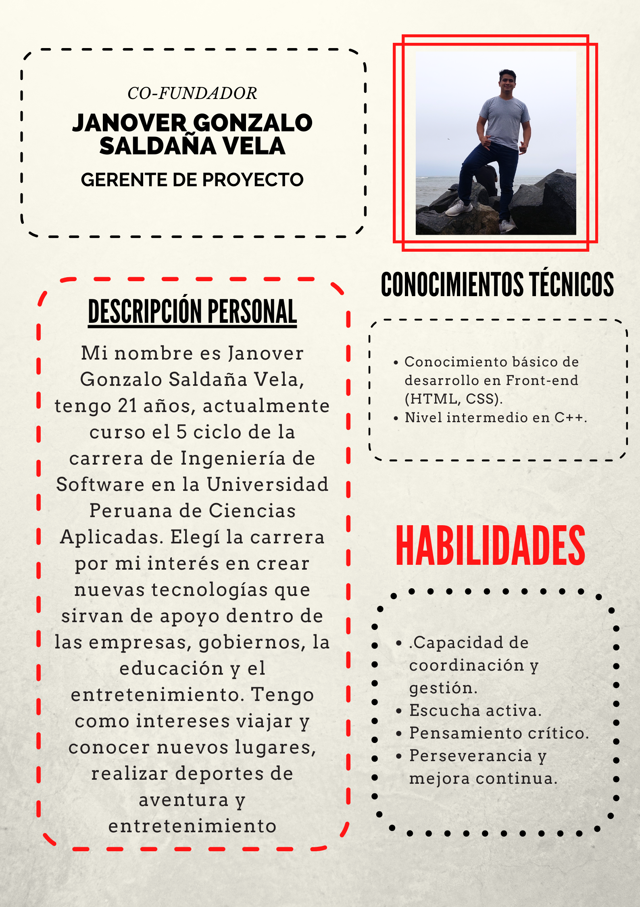
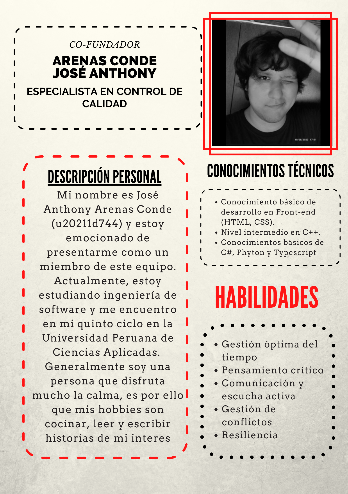
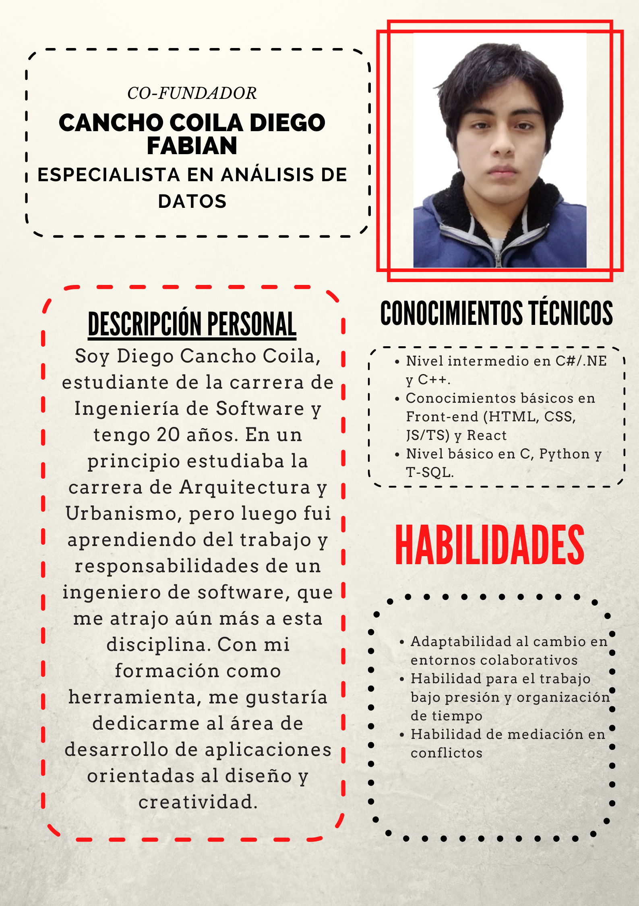

# 1.1.1 Descripción de la startup  

DevInvent es un startup que se dedica al desarrollo de software enfocada en brindar soluciones personalizadas y de alta calidad. La empresa fue fundada por estudiantes de ingeniería de software de la Universidad Peruana de Ciencias Aplicadas. 

DevInvent adopta un enfoque orientado al cliente y trabaja en estrecha colaboración con los estos para tener una mejor comprensión de sus necesidades comerciales y competitivas para desarrollar soluciones de software que cumplan con sus requisitos específicos. El equipo de desarrollo de está conformado por programadores, diseñadores creativos, analistas de negocios altamente capacitados y experimentados que trabajan en conjunto para crear soluciones personalizadas y escalables. DevInvent se esfuerza por mantenerse al informado de las últimas tecnologías y tendencias del mercado para brindar soluciones de software innovadoras y escalables que ayuden a sus clientes a alcanzar sus objetivos comerciales.

**Misión de DevInvent:**
Desarrollar soluciones de software personalizadas y de alta calidad en colaboración con nuestros clientes para impulsar su éxito empresarial.

**Visión de DevInvent:**
Convertirnos en líderes reconocidos en el desarrollo de software personalizado y ser el socio de confianza para empresas que buscan soluciones tecnológicas innovadoras.

# 1.1.2 Perfiles de integrantes del equipo

