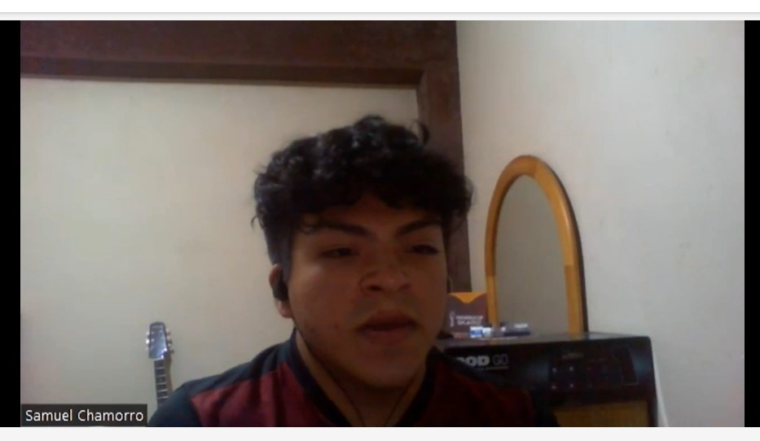
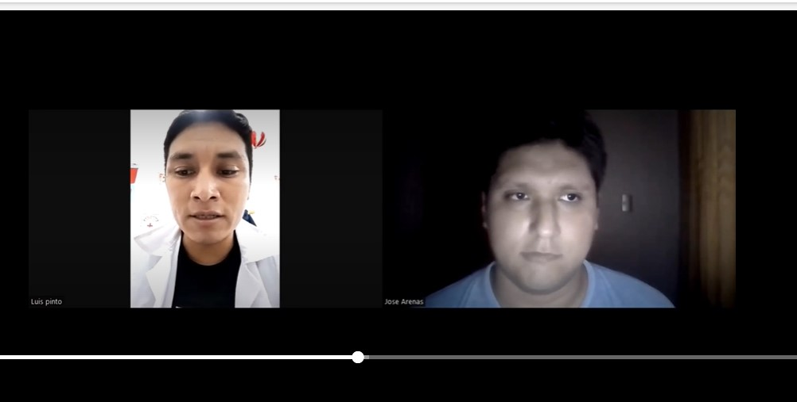
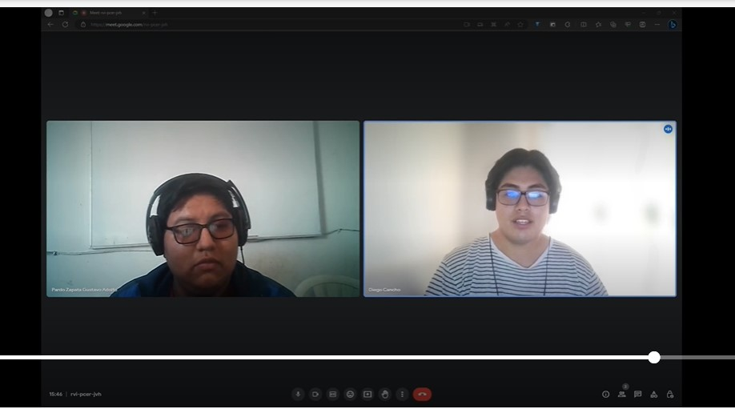

### 2.2.1 Diseño de entrevistas

#### Guía de preguntas para usuarios que desean reparar su dispositivo

1. ¿Cuál es tu nombre?

2. ¿Cuántos años tienes?

3. ¿Dónde vives?

4. ¿A qué te dedicas?

5. ¿Cuándo fue la última vez que llevaste algún dispositivo como celulares o tablets a reparación? (En caso dijera que no, cerrar la entrevista) ¿Qué problema tuvo?

6. ¿Sueles tener problemas con tus dispositivos? ¿Con qué frecuencia?

7. Al llevar tu dispositivo a ser reparado ¿el servicio fue eficiente?

8. ¿La reparación fue rápida? De haber sido más larga o compleja ¿cuánto tiempo tardó?

9. Durante el proceso de atención ¿se te mantuvo informado(a) adecuadamente de cómo iba la reparación? Por ejemplo, solicitaron piezas adicionales o de recambio, preguntas acerca del uso que se le dio al dispositivo o accidentes, etc.

10. Al momento de recoger el dispositivo ¿hubo algún tipo de inconveniente? De haberlo ¿podrías describirlo?

11. Acerca del costo final ¿consideras que fue justo?

12. ¿Crees que si te hubieran explicado el problema adecuadamente y el proceso de reparación hunbiera sido más convincente el precio acordado?

13. Durante alguna experiencia ¿hubieron inconvenientes con el proceso de reparación? ¿Podría detallarlo? (En base a la respuesta dada, hacer las preguntas necesarias para obtener información relevante al proyecto)

14. ¿Recomendarías al técnico o centro de servicio técnico? ¿Lo hiciste? ¿Conoces la experiencia de la persona a la que le recomendaste?

#### Preguntas sobre el proyecto a usuarios que desean reparar el dispositivo:

1. ¿Conoces alguna plataforma o aplicación que te pueda ayudar a encontrar un profesional o centro de servicio técnico?
   
   > *En caso de una respuesta negativa, terminar la entrevista*

2. Además de acercarte al servicio técnico ¿la aplicación ayudó en el seguimiento de la reparacoón?

3. ¿Qué otra funcionalidad considerarías necesaria en la aplicación?

#### Guía de preguntas para usuarios que desean reparar su dispositivo

1. ¿Cuál es tu nombre?

2. ¿Cuántos años tienes?

3. ¿Dónde vives?

4. ¿A qué te dedicas?

5. ¿Tienes añgún tipo de formación especializada en la reparación de dispositivos móviles? ¿Cuál?

6. ¿Cuánto tiempo tienes de experiencia en este oficio?

7. ¿Cómo sueles llevar a cabo la reparación? ¿Cómo te organizas al hacerlas?

8. ¿Cuáles son los problemas más comunes o las soluciones más comunes de varios problemas? ¿Varía mucho el tiempo entre cada reparación?

9. En promedio ¿cuánto es el tiempo de una reparación típica de celular o laptop? ¿Y cuánto duró la reparación más larga que hayas efectuado?

10. ¿Cómo manejas situaciones en las que una reparación se vuelve más compleja de lo esperado o requiere piezas adicionales? ¿Informas al cliente sobre estos cambios y obtienes su aprobación antes de proceder? ¿O al momento de acercarse el cliente a solicitar la reparación queda implícito que estás autorizado a hacer todos los recambios que se puedan necesitar?

11. ¿Qué enfoque tomas en términos de comunicación con los clientes durante el proceso de reparación? ¿Les mantienes informados sobre el progreso y los posibles retrasos?

12. ¿Has tenido casos en los que los clientes hayan expresado insatisfacción con una reparación realizada? ¿Cómo abordas estas situaciones y buscas resolver los problemas?

13. ¿Cómo determinas el costo de una reparación? ¿Qué factores consideras al establecer el precio para los clientes?

14. ¿Has notado que la explicación detallada del problema y el proceso de reparación influyen en la percepción del cliente sobre el precio acordado? ¿En qué medida crees que esto puede afectar la satisfacción del cliente?

15. ¿Has recibido recomendaciones por parte de clientes satisfechos? En caso afirmativo, ¿puedes compartir algunas experiencias en las que hayas tenido un impacto positivo en la satisfacción del cliente?

16. En tu opinión, ¿qué hace que un centro de servicio técnico sea exitoso en términos de satisfacción del cliente? ¿Cuáles son los aspectos clave que contribuyen a una experiencia positiva para quienes buscan reparaciones de dispositivos?

#### Preguntas sobre el proyecto a los técnicos:

1. ¿Conoces alguna plataforma o aplicación que te permita registrarte para ofrecer tus servicios? ¿Cuál?

2. ¿Cómo impacta esta en tu negocio (o impactaría)?

3. ¿Qué funcionalidades adicionales propondrías para la aplicación

### 2.2.2. Registro de entrevistas

A continuación, se presenta la transcripción, evidencia y síntesis de cada una de las entrevistas llevadas a cabo tanto con los usuarios como con los técnicos de los servicios dedicados a la reparación de dispositivos móviles. 

**Segmento 01: Usuarios de Dispositivos móviles**

**Entrevista 01**

Entrevistado 1: 

Nombre y apellidos: Juan Vasquez 

Edad: 20 años

Ubicación: Cedros de Villa

Evidencia de la reunión:

  

Inicio: 00:01   

Fin: 04:49

**Enlace de entrevista:** [https://upcedupe-my.sharepoint.com/:v:/g/personal/u20211d744_upc_edu_pe/ESAUjqvzcjxLhCYcFYsTHvkB3JnPNtk6klQx-GvVJbaJAQ?e=2ZProM](https://upcedupe-my.sharepoint.com/:v:/g/personal/u20211d744_upc_edu_pe/ESAUjqvzcjxLhCYcFYsTHvkB3JnPNtk6klQx-GvVJbaJAQ?e=2ZProM)

**Resumen de la entrevista:**

Preguntas principales: 

**¿Cuándo fue la última vez que llevaste algún dispositivo como celulares o tabletas a reparación? (En caso dijera que no, cerrar la entrevista) ¿Qué problema tuvo?**

Mi celular el año pasado sufrió una caída al agua. 

**¿Sueles tener problemas con tus dispositivos? ¿Con qué frecuencia?**

No suelo tener problemas con mis dispositivos. 

**Al llevar tu dispositivo a ser reparado ¿el servicio fue eficiente?**

Si fue muy rápido y eficiente. 

**¿La reparación fue rápida? De haber sido más larga o compleja ¿cuánto tiempo tardó?**

Aproximadamente al rededor de una hora. 

**Durante el proceso de atención ¿se te mantuvo informado(a) adecuadamente de cómo iba la reparación? Por ejemplo, solicitaron piezas adicionales o de recambio, preguntas acerca del uso que se le dio al dispositivo o accidentes, etc.** 

Para nada solo la repararon. 

**Al momento de recoger el dispositivo ¿hubo algún tipo de inconveniente? De haberlo ¿podrías describirlo?** 

No hubo ningun inconveniente. 

**Acerca del costo final ¿consideras que fue justo?** 

No sabria decirte si fue justo, si supiera como se manejan esos precios podría contestarte a la pregunta. 

**¿Crees que si te hubieran explicado el problema adecuadamente y el proceso de reparación hubiera sido más convincente el precio acordado?** 

Si, claro. 

**Durante alguna experiencia ¿hubo inconvenientes con el proceso de reparación? ¿Podría detallarlo? (En base a la respuesta dada, hacer las preguntas necesarias para obtener información relevante al proyecto)** 

No no tuve inconvenientes. 

**¿Recomendarías al técnico o centro de servicio técnico? ¿Lo hiciste? ¿Conoces la experiencia de la persona a la que le recomendaste?** 

Si lo recomendaría. 

**¿Conoces alguna plataforma o aplicación que te pueda ayudar a encontrar un profesional o centro de servicio técnico?** 

No conozco alguna aplicación o plataforma que me brinde eso 

**Entrevista 02**

Nombre y apellidos: Gissell Palomino

Edad: 20 años

Ubicación: San Juan de Miraflores

Evidencia de la reunión:

  

Inicio: 04:50     

Fin: 12:22

**Enlace de entrevista:** [https://upcedupe-my.sharepoint.com/:v:/g/personal/u20211d744_upc_edu_pe/ESAUjqvzcjxLhCYcFYsTHvkB3JnPNtk6klQx-GvVJbaJAQ?e=2ZProM](https://upcedupe-my.sharepoint.com/:v:/g/personal/u20211d744_upc_edu_pe/ESAUjqvzcjxLhCYcFYsTHvkB3JnPNtk6klQx-GvVJbaJAQ?e=2ZProM)

**Resumen de la entrevista:**

Preguntas principales: 

**¿Cuándo fue la última vez que llevaste algún dispositivo como celulares o tabletas a reparación? (En caso dijera que no, cerrar la entrevista) ¿Qué problema tuvo?** 

Hace unos cuatro meses aproximadamente, su celular estaba teniendo fallas al momento de cargar, así que luego de hacer algunas pruebas para saber lo que estaba fallando, es decir, si era el cargador o el propio celular, descubrió que el celular era la falla. 

**¿Sueles tener problemas con tus dispositivos? ¿Con qué frecuencia?** 

Generalmente, debido a la antigüedad de su celular, suele sucedes máximo dos veces al año. 

**Al llevar tu dispositivo a ser reparado ¿el servicio fue eficiente?** 

Sí, la atención fue rápida debido a que ya tenía una idea de la falla del celular, así que solo le dijo al técnico lo que pensaba. 

**¿La reparación fue rápida? De haber sido más larga o compleja ¿cuánto tiempo tardó?** 

El técnico tuvo el celular alrededor de cuatro o cinco horas, para poder repararlo 

**Durante el proceso de atención ¿se te mantuvo informado(a) adecuadamente de cómo iba la reparación? Por ejemplo, solicitaron piezas adicionales o de recambio, preguntas acerca del uso que se le dio al dispositivo o accidentes, etc.** 

No le preguntó nada, debido que ya sabía la razón de la falla. 

**Al momento de recoger el dispositivo ¿hubo algún tipo de inconveniente? De haberlo ¿podrías describirlo?** 

La transacción fue fluida, solo fueron, dejaron el teléfono por unas horas, luego regresaron, realizaron el pago y si hicieron las pruebas de que el dispositivo estaba funcionando correctamente. 

**Acerca del costo final ¿consideras que fue justo?**

No sabría decirte si fue justo, pero si le pareció un poco elevado. 

**¿Crees que si te hubieran explicado el problema adecuadamente y el proceso de reparación hubiera sido más convincente el precio acordado?**

Sí, si le hubiera explicado el porqué del precio y el procedimiento. 

**Durante alguna experiencia ¿hubo inconvenientes con el proceso de reparación? ¿Podría detallarlo? (En base a la respuesta dada, hacer las preguntas necesarias para obtener información relevante al proyecto)** 

Probablemente si, debido al tiempo del uso del dispositivo y al poco mantenimiento que le brindó a su dispositivo. 

**¿Recomendarías al técnico o centro de servicio técnico? ¿Lo hiciste? ¿Conoces la experiencia de la persona a la que le recomendaste?** 

En su caso, su celular tiene un buen funcionamiento hasta ahora, así que recomendaría el servicio del técnico al que acudió. 

**¿Conoces alguna plataforma o aplicación que te pueda ayudar a encontrar un profesional o centro de servicio técnico?** 

No, no conoce alguna aplicación similar. Asimismo, cuenta que al momento de buscar un técnico le fue muy difícil de hacer, ya que había poca información sobre ellos, como los precios o similares. Además, siente que es necesaria una aplicación que le ayude a encontrar un técnico o servicio de reparación, ya que como contó anteriormente le fue muy difícil encontrar a alguien para que repare su celular en su momento. 

 

**Segmento 02: Técnico de dispositivos móviles**

**Entrevista 01**

Nombre y apellidos: Franco Chavez

Edad: 24 años

Ubicación: Chorrillos, Lima

Evidencia de la reunión:

  

Inicio: 12:23     

Fin: 19:52

**Enlace de entrevista:** [https://upcedupe-my.sharepoint.com/:v:/g/personal/u20211d744_upc_edu_pe/ESAUjqvzcjxLhCYcFYsTHvkB3JnPNtk6klQx-GvVJbaJAQ?e=2ZProM](https://upcedupe-my.sharepoint.com/:v:/g/personal/u20211d744_upc_edu_pe/ESAUjqvzcjxLhCYcFYsTHvkB3JnPNtk6klQx-GvVJbaJAQ?e=2ZProM)

**Resumen de la entrevista:**

Preguntas principales:  

**¿Tienes algún tipo de formación especializada en la reparación de dispositivos móviles? ¿Cuál?**  

Si, tengo una formación especializada en reparación de dispositivos móviles, complete un curso certificado en una academia reconocida que cubre reparación de hardware y software.  

**¿Cuánto tiempo tienes de experiencia en este oficio?**  

Llevo trabajando como técnico en reparación de dispositivos móviles durante 5 años.  

**¿Cómo sueles llevar a cabo la reparación? ¿Cómo te organizas al hacerlas?**  

Cuando recibo un dispositivo para reparar, primero realizo un diagnóstico para identificar el problema, luego sigo con un proceso realizado que incluye desmontaje, remplazo de componentes dañados, ensamblaje y pruebas exhaustivas.  

**¿Cuáles son los problemas más comunes o las soluciones más comunes de varios problemas? ¿Varía mucho el tiempo entre cada reparación?** 

Los problemas más comunes suelen ser pantallas rotas, baterías agotadas y problemas de carga, las soluciones incluyen reemplazar las piezas dañadas, realizar actualizaciones de software, el tiempo de reparación varía según el problema, pero en promedio una reparación simple puede llevar un poco más de una hora.   

**En promedio ¿cuánto es el tiempo de una reparación típica de celular o laptop? ¿Y cuánto duró la reparación más larga que hayas efectuado?**  

El tiempo promedio para reparar un teléfono es de aproximadamente entre 2 a 3 horas, la reparación más larga que he recibido fue una laptop con múltiples problemas, me tomo alrededor de 2 días debido a su complejidad.   

**¿Cómo manejas situaciones en las que una reparación se vuelve más compleja de lo esperado o requiere piezas adicionales? ¿Informas al cliente sobre estos cambios y obtienes su aprobación antes de proceder? ¿O al momento de acercarse el cliente a solicitar la reparación queda implícito que estás autorizado a hacer todos los recambios que se puedan necesitar?** 

Absolutamente, siempre informo al cliente si la reparación se vuelve más compleja o requiere piezas adicionales, les proporciono a detalle sobe los cambios necesarios, el costo adicional y luego obtengo su aprobación antes de proceder.   

**¿Qué enfoque tomas en términos de comunicación con los clientes durante el proceso de reparación? ¿Les mantienes informados sobre el progreso y los posibles retrasos?** 

Mantengo una comunicación abierta con los clientes, les informo sobre el progreso de la reparación y cualquier posible retraso que pueda surgir. La transparencia es clave para mantener a los informados y satisfechos.  

**¿Has tenido casos en los que los clientes hayan expresado insatisfacción con una reparación realizada? ¿Cómo abordas estas situaciones y buscas resolver los problemas?**  

Si, ha sucedido en raras ocasiones, cuando un cliente expresa insatisfacción, escucho sus preocupaciones y ofrezco soluciones para rectificar la situación, si es necesario, vuelvo a revisar y corregir los problemas sin costo adicional.  

**¿Cómo determinas el costo de una reparación? ¿Qué factores consideras al establecer el precio para los clientes?**  

El costo se basa en la gravedad del problema y los componentes necesarios para la reparación, considero el costo de las piezas, el tiempo de trabajo y la complejidad general del proceso.  

**¿Has notado que la explicación detallada del problema y el proceso de reparación influyen en la percepción del cliente sobre el precio acordado? ¿En qué medida crees que esto puede afectar la satisfacción del cliente?**  

Definitivamente, una explicación detallada puede ayudar en intentar comprender la labor involucrada y justificar el precio. La transparencia puede aumentar la satisfacción del cliente al mostrarles el valor de la reparación.   

**¿Has recibido recomendaciones por parte de clientes satisfechos? En caso afirmativo, ¿puedes compartir algunas experiencias en las que hayas tenido un impacto positivo en la satisfacción del cliente?**  

Si, recibido recomendaciones, una vez un cliente quedo muy satisfecho con la reparación de su teléfono antes de un viaje importante y recomendó mis servicios a sus amigos.   

**En tu opinión, ¿qué hace que un centro de servicio técnico sea exitoso en términos de satisfacción del cliente? ¿Cuáles son los aspectos clave que contribuyen a una experiencia positiva para quienes buscan reparaciones de dispositivos?**  

La atención al cliente, la calidad de la reparación, la transparencia en la comunicación y la honestidad son clave para brinda un servicio al cliente confiable y resolver los problemas de manera efectiva, son fundamentales.  

**¿Conoces alguna plataforma o aplicación que te permita registrarte para ofrecer tus servicios? ¿Cuál?**   

Si, conozco la plataforma “fixnow” que permite a los técnicos registrarse y ofrecer sus servicios en la reparación.    

**¿Cómo impacta está en tu negocio (o impactaría)?**  

Yo considero que estas plataformas podrían aumentar mi visibilidad y atraer a más clientes, también facilitaría en la programación de citas y la gestión de clientes, lo que optimizaría mi negocio.   

**¿Qué funcionalidades adicionales propondrías para la aplicación?**  

Seria genial tener una función de seguimiento en tiempo real para que los clientes puedan ver el progreso de su reparación. También una opción de chat en vivo, para consultas rápidas y la posibilidad de proporcionar estimaciones de precios en línea según la descripción del problema. 

**Entrevista 02**

Nombre y apellidos: Luis Alfredo Pinto

Edad: 29 años

Ubicación: Estoy viviendo en Huarmey, en el departamento de Ancash.

Evidencia de la reunión:

  

Inicio: 19:53

Fin: 29:47

**Enlace de entrevista:** [https://upcedupe-my.sharepoint.com/:v:/g/personal/u20211d744_upc_edu_pe/ESAUjqvzcjxLhCYcFYsTHvkB3JnPNtk6klQx-GvVJbaJAQ?e=2ZProM](https://upcedupe-my.sharepoint.com/:v:/g/personal/u20211d744_upc_edu_pe/ESAUjqvzcjxLhCYcFYsTHvkB3JnPNtk6klQx-GvVJbaJAQ?e=2ZProM)

**Resumen de la entrevista:**

Preguntas principales:  

**¿Tienes algún tipo de formación especializada en la reparación de dispositivos móviles? ¿Cuál?**  

Sí, he estado estudiando lo que es ingeniería electrónica y computación informática.  

**¿Cuánto tiempo tienes de experiencia en este oficio?**  

Llevo trabajando durante dos años.  

**¿Cómo sueles llevar a cabo la reparación? ¿Cómo te organizas al hacerlas?**  

Bueno, primero reviso los celulares, dependiendo el tipo de problema para poder buscar una solución. Para ello también cuento con todas mis herramientas y el repuesto necesario para poder realizar cada tipo de reparación que tenga. 

**¿Cuáles son los problemas más comunes o las soluciones más comunes de varios problemas? ¿Varía mucho el tiempo entre cada reparación?**  

Claro, depende también el tipo de problema, porque lo más comunes son a veces por caídas, cambio de pantalla o a veces cuando su celular no carga. Lo más común es que siempre llegan o no se escucha el sonido de su celular a la hora del altavoz, el audio. 

**En promedio ¿cuánto es el tiempo de una reparación típica de celular o laptop? ¿Y cuánto duró la reparación más larga que hayas efectuado?**  

Bueno, normalmente lo más común es demoran 20, 30 minutos y lo más largo, hasta una hora y cincuenta minutos. 

**¿Cómo manejas situaciones en las que una reparación se vuelve más compleja de lo esperado o requiere piezas adicionales? ¿Informas al cliente sobre estos cambios y obtienes su aprobación antes de proceder? ¿O al momento de acercarse el cliente a solicitar la reparación queda implícito que estás autorizado a hacer todos los recambios que se puedan necesitar?**  

Claro, normalmente cuando el cliente deja su equipo, uno lo revisa para ver el tipo de problema que hay. Dependiendo de lo que son los repuestos que tengo, le indico cuánto es el tiempo que me voy a demorar y de paso, si es que no tengo algún repuesto, indicarle también que puedo conseguir el repuesto, pero le va a costar un costo un poco elevado. Dependiendo a eso, si el cliente accede, uno empieza la reparación, pero ya depende del cliente también, porque uno no puede repararlo así nada más si no te da la aprobación el cliente, porque si no, después cómo te paga. 

**¿Qué enfoque tomas en términos de comunicación con los clientes durante el proceso de reparación? ¿Les mantienes informados sobre el progreso y los posibles retrasos?**  

Claro, normalmente cuando uno ya empieza a hacer la reparación, yo tengo un tiempo estimado, más que todo para que el cliente pueda llegar y venir para que pueda ver su solar en qué estado está. Yo le digo por si regresan dentro de media hora, porque para ese entonces ya puede estar su celular. Y si encuentra algún inconveniente, le indico qué inconveniente estoy encontrando. Y si por A o B me dice que lo puedo cambiar, ese inconveniente y normal, uno prosigue con la reparación y le indico más o menos el tiempo aproximado para que pueda recoger su equipo. Siempre hay que mantenerlo informado tomado para que no tenga ningún problema 

**¿Has tenido casos en los que los clientes hayan expresado insatisfacción con una reparación realizada? ¿Cómo abordas estas situaciones y buscas resolver los problemas?**  

Si, ha sucedido en raras ocasiones, solo escucho sus preocupaciones y ofrezco soluciones para rectificar lo sucedido, si es necesario. 

**¿Cómo determinas el costo de una reparación? ¿Qué factores consideras al establecer el precio para los clientes?**  

En esa parte depende mucho, porque a veces el equipo solamente es algo del sistema mismo para poder repararlo. Pero si ya cuando es piezas que cuestan o prácticamente celulares que a veces tienen que traer, que las piezas son difícil de encontrar, ya le digo más o menos el monto o le digo que voy a viajar para consultar más o menos un promedio de cuánto me va a salir y ya le cobro solamente lo que es la mano de trabajo. 

**¿Has notado que la explicación detallada del problema y el proceso de reparación influyen en la percepción del cliente sobre el precio acordado? ¿En qué medida crees que esto puede afectar la satisfacción del cliente?**  

Claro, normalmente a veces dependiendo el equipo que tenga, uno le da un precio estimado de su reparación, pero a veces, cuando ya el costo es muy elevado, preferible se le recomienda que mejor compre un nuevo equipo, porque le va a salir prácticamente lo mismo reparado a comprarlo. Pero para mi negocio, uno siempre tiene que decir siempre la verdad. Si el cliente desea recuperarlo, normal, ya se le da el costo estimado. 

**¿Has recibido recomendaciones por parte de clientes satisfechos? En caso afirmativo, ¿puedes compartir algunas experiencias en las que hayas tenido un impacto positivo en la satisfacción del cliente?**  

Claro, normalmente a veces cuando hago el tipo de cambio de pantalla, porque algunos vienen con su pantalla rota, todo eso, he quedado con los clientes más o menos que... Normalmente el cliente llega satisfecho con las reparaciones que uno hace. De igual manera, ya estamos viendo para que toda solución que tenga sea realizada en el momento preciso y el cliente sea satisfecho con todas las cosas que uno hace.   

**En tu opinión, ¿qué hace que un centro de servicio técnico sea exitoso en términos de satisfacción del cliente? ¿Cuáles son los aspectos clave que contribuyen a una experiencia positiva para quienes buscan reparaciones de dispositivos?**  

Normalmente, para que un cliente quede satisfecho, tengo más que todo experiencia en lo que es la misma reparación. De igual manera, lo único que espera el cliente es que en el momento que entra su equipo y vea el problema que necesita, la reparación sea inmediata. Y siempre hay que dejar satisfecho a un cliente. De igual manera, vemos la manera posible de indicarle todas las incomodidades o los problemas que haya tenido su equipo para poder realizar la reparación inmediatamente.  

**¿Conoces alguna plataforma o aplicación que te permita registrarte para ofrecer tus servicios? ¿Cuál?**  

Bueno, no conozco ninguna plataforma ahorita o no tengo una plataforma en sí inmediatamente, pero como ahora tenemos las redes sociales y por ese medio me estoy avanzando para que puedan contar prácticamente con mis servicios, igual manera me promociono por ese tipo de redes, pero no he encontrado hasta ahora una aplicación donde indique más o menos, hoy hago reparaciones y me puedan contactar directamente por ahí. Pero por medio de las redes sociales, algún momento me estoy yendo, viendo. 

**¿Cómo impacta está en tu negocio (o impactaría)?**  

Claro, sería satisfactorio, porque al final de cuentas, al buscar por una aplicación sería más rápido y eficaz encontrar estos tipos de clientes para poder brindarle una buena atención. De igual manera, ya en esa aplicación especificará los problemas que tiene su equipo y uno ya vendría ya prácticamente sabiendo qué es lo que necesita para poder iniciar esa reparación. 

**¿Qué funcionalidades adicionales propondrías para la aplicación?**

Bueno, más que todo, tendría una información detallada de los equipos También aparte que sale el nombre del que lo está atendiendo, del técnico, e indicarle qué tipo de reparaciones hace, cuáles son los problemas más comunes que tenemos. Indicarle de una forma detallada para el cliente si se encuentra satisfecho y de igual manera pueda ver las especificaciones que uno hace para que pueda ver si su equipo puede ser reparado a la vez. De igual manera, en ese tipo de aplicación también vamos a poder contar las propuestas que tienen los clientes si algún tipo de reparación ha quedado insatisfecha para poder corregirlo. 

**Entrevista 03**

Nombre y apellidos: Gustavo Pardo 

Edad: 22 años

Ubicación: Huaral, Huaral 

Evidencia de la reunión:

  

Inicio: 29:47

Fin: 42:18

**Enlace de entrevista:** [https://upcedupe-my.sharepoint.com/:v:/g/personal/u20211d744_upc_edu_pe/ESAUjqvzcjxLhCYcFYsTHvkB3JnPNtk6klQx-GvVJbaJAQ?e=2ZProM](https://upcedupe-my.sharepoint.com/:v:/g/personal/u20211d744_upc_edu_pe/ESAUjqvzcjxLhCYcFYsTHvkB3JnPNtk6klQx-GvVJbaJAQ?e=2ZProM)

Resumen de la entrevista:

Preguntas principales: 

**¿Tienes algún tipo de formación especializada en la reparación de dispositivos móviles? ¿Cuál?** 

Sí, (…) llevé un curso técnico de (…) tres años [en el instituto San Isidro]. 

**¿Cuánto tiempo tienes de experiencia en este oficio?**

2 años 

**¿Cómo sueles llevar a cabo la reparación? ¿Cómo te organizas al hacerlas?**

Primero comunicarme con el cliente, luego conseguir los elementos para la reparación y luego (…) me pongo a reparar. 

**¿Cuáles son los problemas más comunes o las soluciones más comunes de varios problemas? ¿Varía mucho el tiempo entre cada reparación?**

En celulares, el problema más común es el cambio de pantalla. Hay algunas reparaciones que son más largas que otras. Depende del modelo de teclado para la laptop, por ejemplo. Tengo que encontrarlo para cambiarlo. 

Hay algunas reparaciones que son más largas que otras.  

**En promedio ¿cuánto es el tiempo de una reparación típica de celular o laptop? ¿Y cuánto duró la reparación más larga que hayas efectuado?** 

En promedio serían 40 a 50 minutos que toma una reparación. El caso más extremo fue una hora*. Para ese caso me demoré más por la comunicación con el cliente. Tenía que esperar que el cliente viniera para comunicarle que tenía que cambiar la memoria RAM.1 

**¿Has recibido recomendaciones por parte de clientes satisfechos? En caso afirmativo, ¿puedes compartir algunas experiencias en las que hayas tenido un impacto positivo en la satisfacción del cliente?**

En tu opinión, ¿qué hace que un centro de servicio técnico sea exitoso en términos de satisfacción del cliente? ¿Cuáles son los aspectos clave que contribuyen a una experiencia positiva para quienes buscan reparaciones de dispositivos? 

### 2.2.3. Análisis de entrevistas

**Segmento 1: Usuarios de dispositivos móviles**
De las entrevistas a usuarios de dispositivos móviles, se pueden extraer los siguientes puntos clave: 

 - **Frecuencia de Problemas:** Los usuarios mencionan que no suelen tener problemas frecuentes con sus dispositivos. Los problemas tienden a surgir esporádicamente debido al uso y la antigüedad de los dispositivos. 
 - **Eficiencia en el Servicio:** En las entrevistas, los usuarios valoran la eficiencia del servicio de reparación. Destacan que las reparaciones se llevaron a cabo de manera rápida y sin inconvenientes significativos.
 - **Comunicación durante la Reparación:** En un caso, el usuario menciona que no hubo una comunicación detallada durante la reparación debido a que ya conocía la causa de la falla. En general, la comunicación no fue un aspecto destacado en ninguno de los casos.
 - **Costo y Transparencia:** En las entrevistas, los usuarios mencionan que no pueden evaluar si el costo de la reparación fue justo. Sin embargo, además, se menciona que el usuario habría apreciado una explicación más detallada sobre el costo y el proceso de reparación.
 - **Recomendación de Servicio:** Los usuarios expresan su disposición a recomendar el servicio de reparación que utilizaron. Esto sugiere que quedaron satisfechos con el servicio y la calidad de la reparación.
 - **Dificultades para Encontrar Servicios de Reparación:** En todas las entrevistas, se menciona la dificultad para encontrar técnicos o servicios de reparación, especialmente debido a la falta de información detallada sobre precios y disponibilidad. Los usuarios expresan la necesidad de una aplicación o plataforma que les ayude a encontrar profesionales de reparación. 

**Segmento 2:Técnicos de dispositivos móviles**
En base a las tres entrevistas realizadas a técnicos de dispositivos móviles, se pueden extraer algunas conclusiones y patrones comunes: 

 - **Formación y Experiencia:** Todos los técnicos tienen algún tipo de formación en reparación de dispositivos móviles, ya sea a través de cursos especializados o estudios relacionados con la electrónica. La experiencia varía desde 2 hasta 5 años en la industria.
 - **Proceso de Reparación:** Los técnicos siguen un proceso común para la reparación que incluye la comunicación con el cliente, diagnóstico, adquisición de piezas, reparación y pruebas exhaustivas. Los problemas más comunes incluyen pantallas rotas, problemas de carga y problemas de audio.
 - **Tiempo de Reparación:** El tiempo promedio para reparar un dispositivo móvil varía, pero generalmente oscila entre 40 minutos y 3 horas, dependiendo de la complejidad del problema. La reparación más larga mencionada fue de alrededor de 2 días.
 - **Comunicación con el Cliente:** Todos los técnicos hacen hincapié en la importancia de mantener una comunicación abierta y transparente con los clientes. Informan sobre el progreso de la reparación y cualquier posible retraso.
 - **Aprobación del Cliente:** Los técnicos obtienen la aprobación del cliente antes de proceder con reparaciones complejas o si se requieren piezas adicionales. Esto demuestra un enfoque centrado en el cliente y la transparencia.
 - **Determinación de Costos:** Los costos de reparación se basan en factores como la gravedad del problema, el costo de las piezas y el tiempo de trabajo. Algunos técnicos mencionaron que, en casos de reparaciones costosas, recomiendan a los clientes considerar la compra de un nuevo dispositivo si es más económico.
 - **Explicación Detallada:** La explicación detallada del problema y del proceso de reparación parece influir en la percepción del cliente sobre el precio acordado. Los técnicos creen que la transparencia en este aspecto puede aumentar la satisfacción del cliente.
 - **Recomendaciones y Satisfacción del Cliente:** Los técnicos han recibido recomendaciones por parte de clientes satisfechos, lo que sugiere que brindan un servicio de calidad que genera satisfacción y fidelidad del cliente.
 - **Éxito del Centro de Servicio Técnico:** Según la opinión de los técnicos, el éxito de un centro de servicio técnico está vinculado a la experiencia en reparación, la inmediatez en la solución de problemas y la satisfacción del cliente. También mencionan que la honestidad y la transparencia son aspectos clave. 
 - **Plataformas de Registro de Servicios:** Dos de los técnicos mencionaron conocer plataformas o aplicaciones donde pueden registrarse para ofrecer sus servicios, lo que podría aumentar su visibilidad y la gestión de clientes.
 - **Funcionalidades Adicionales para Aplicaciones:** Los técnicos proponen funcionalidades adicionales para aplicaciones, como proporcionar información detallada de los equipos, mostrar el nombre del técnico, indicar los problemas comunes y permitir que los clientes expresen sus comentarios y propuestas. 