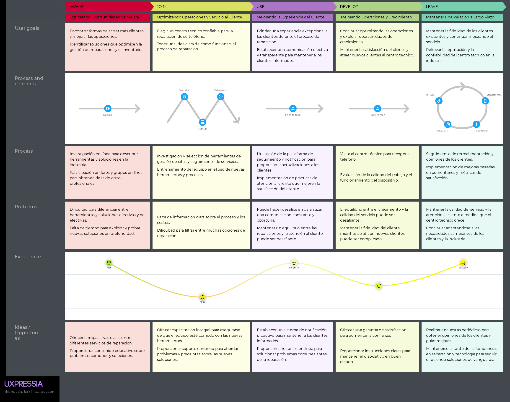
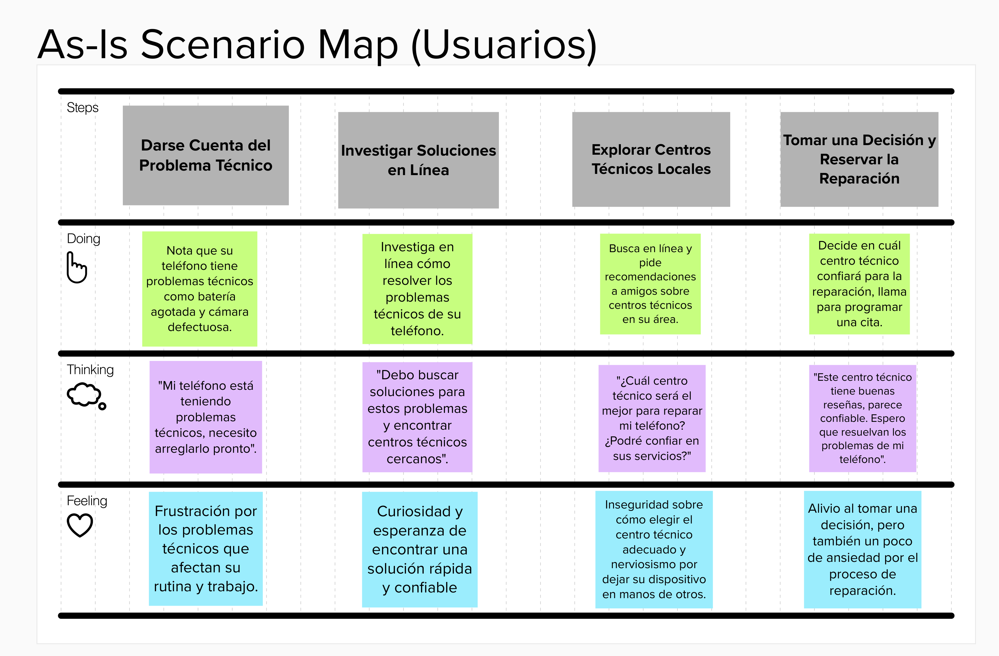

## 2.3. Needfinding
### 2.3.1. User Personas
Los User Personas son esenciales en este proyecto ya que representan a los usuarios potenciales de la aplicación web y brindan una comprensión profunda de sus necesidades, comportamientos y motivaciones. Estos perfiles guían el diseño y desarrollo al asegurar que la aplicación esté adaptada a lo que los usuarios desean y requieren, lo que resulta en una experiencia de usuario más efectiva y satisfactoria. Además, también ayudan en la toma de decisiones informadas, la priorización de características, la resolución anticipada de problemas y la comunicación efectiva entre los equipos.

**Imagen 1: User Persona del segmento Usuario**

  

**Imagen 2: User Persona del segmento Técnico**

  

### 2.3.2. User Task Matrix
**Segmento Objetivo:** usuarios Individuales con Problemas Técnicos en Sus Teléfonos 

**Tabla: Matrix Task del Usuario** 
| Tarea | Frecuencia | Severidad |
|:----------:|:----------:|:----------:|
| Buscar en la aplicación centros técnicos cercanos| A veces | Media |
| Filtrar resultados según servicios y calificaciones| A veces  | Baja|
| Leer reseñas y opiniones de centros técnicos| Casi siempre | Media |
| Seleccionar un centro técnico para reparación| A veces   | Alta |
| Programar una cita para la reparación| A veces  | Alta |
| Rastrear el progreso de la reparación| Casi siempre | Alta |
| Recibir notificaciones sobre el estado de la reparación| Casi siempre| Media |
| Contactar al centro técnico para preguntas| A veces | Media |
| Añadir un centro técnico a favoritos|Rara vez|Baja|

**Segmento Objetivo:** Segmento Objetivo: 

**Tabla: Matrix Task de los Técnicos y Centros Técnicos de Reparación**
| Tarea | Frecuencia | Severidad |
|:----------:|:----------:|:----------:|
| Acceder al panel de control |siempre | Media |
| Actualizar el inventario de piezas | A veces  | Media|
| Gestionar y programar citas de reparación |  A veces | Alta |
| Interactuar con el cliente a través del panel | Casi siempre| Alta |
| Ver detalles y progreso de reparaciones| Casi siempre  | Alta |
| Enviar notificaciones sobre el estado de reparación| Casi siempre | Alta |
| Administrar los ingresos y ganancias |A veces | Alta |
| Responder preguntas de los usuarios | A veces | Media |
| Acceder a la lista de clientes favoritos |Rara vez|Baja|

### 2.3.3. User Journey Mapping
Los User Journey Mapping son esenciales para este proyecto, ya que proporcionan una representación visual y detallada de la interacción y experiencia del usuario durante todo el proceso de solicitud, firma de un contrato y uso de un servicio de reparación de teléfonos móviles. Estas visualizaciones permiten identificar puntos débiles, oportunidades de mejora y momentos de verdad en la experiencia del usuario, que pueden ayudar a diseñar aplicaciones web centradas en el usuario, optimizar la satisfacción del cliente y mejorar el rendimiento de los centros de ingeniería y tecnología asociados. 

**Imagen 3: Journey Mapping del Usuario.** 

  

**Imagen 4: Journey Mapping del Técnico.**  

  

### 2.3.4. Empathy Mapping
Los “empathy maps” son esenciales en este proyecto porque ofrecen una visión clara y concisa de las emociones, pensamientos, acciones y necesidades de los usuarios, lo que ayuda a comprender sus perspectivas y guía el diseño y desarrollo de la aplicación web. Estos mapas permiten que el equipo se ponga en el lugar de los usuarios, lo que resulta en una experiencia más empática y centrada en sus expectativas, lo que a su vez fomenta la toma de decisiones informadas y la creación de soluciones más alineadas con las verdaderas necesidades de los usuarios.

**Imagen 5: Empathy Mapping del Usuario.**

  

**Imagen 6: Empathy Mapping del Técnico.**

  

### 2.3.5. As-is Scenario Mapping

Este escenario de mapeo "AS-IS" refleja el proceso actual que un usuario podría seguir al utilizar la aplicación para buscar y programar una reparación de teléfono. Cada paso incluye lo que el usuario hace, piensa y siente en ese momento. 

**Imagen 7: As-is Scenario Mapping del Usuario.**

  

**Imagen 8: As-is Scenario Mapping del Técnico.**

  

