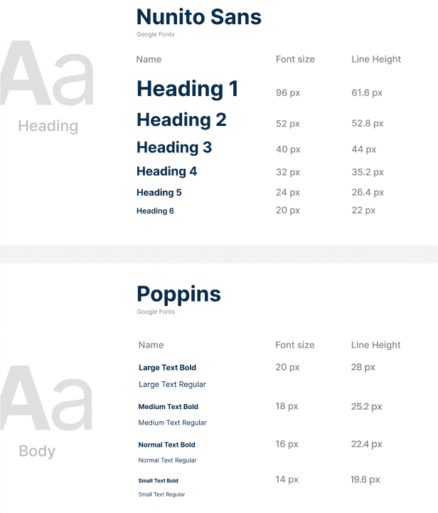
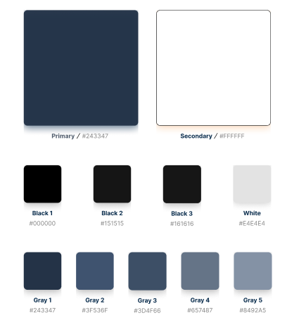
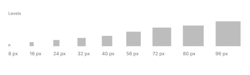
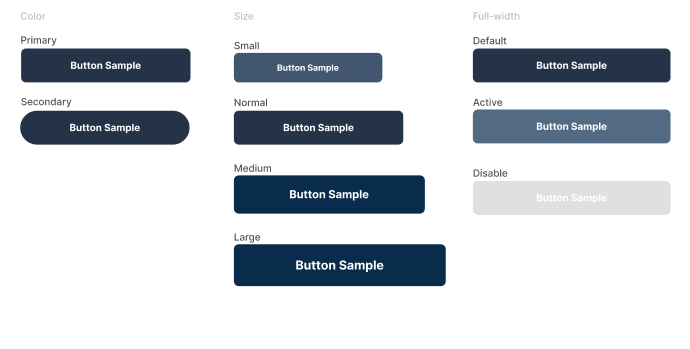

#### 4.1.1. General Style Guidelines
 

**Overview:**

Queremos atrapar la atención del usuario desde el principio mediante la creación y el diseño de una perspectiva del producto que establezca una conexión inmediata e identificable.

 

**Brand Name:**

El startup optó por llamar a la propuesta de solución "PhoneResQ" porque, dado que está centrada en ayudar a los usuarios y se enfoca en la tecnología, se consideró apropiado.

 

**Typography:**

La tipografía asignada por el equipo fue “Nunito Sans” y “Poppins”.

  

 

**Colors:**

Los colores principales son el azul claro y el blanco. El azul claro se selecciona por su asociación con la calma, la serenidad, la relajación y el equilibrio, mientras que el blanco se utiliza como color principal para el fondo.

  

 

**Spacing:**

Los niveles de espacio definidos son desde 8px hasta 96px. A continuación, se muestra una Ilustración

  

 

**Botton:**

  

 
 

#### 4.1.1. General Style Guidelines
 

PhoneResQ se desarrollará tanto para plataforma web, por lo tanto, implementaremos un diseño adaptable (Web Responsive Design) que tiene como finalidad mostrar la información de manera óptima en cualquier tipo de dispositivo, garantizando que el contenido se mantenga intacto para mejorar la experiencia del usuario.

  

 

Además, como equipo, hemos optado por emplear el patrón de diseño en forma de Z en el sitio web, ya que esta técnica de diseño web resulta efectiva para mejorar la experiencia del usuario al dirigir su atención hacia los elementos clave y potenciar la eficacia del contenido en la página. Normalmente, se coloca el logotipo en la esquina superior izquierda para que sea lo primero que capte la atención del usuario. Justo en frente, en la esquina superior derecha, se ubica el menú de navegación, acompañado de un llamado a la acción que se destaca.

  

