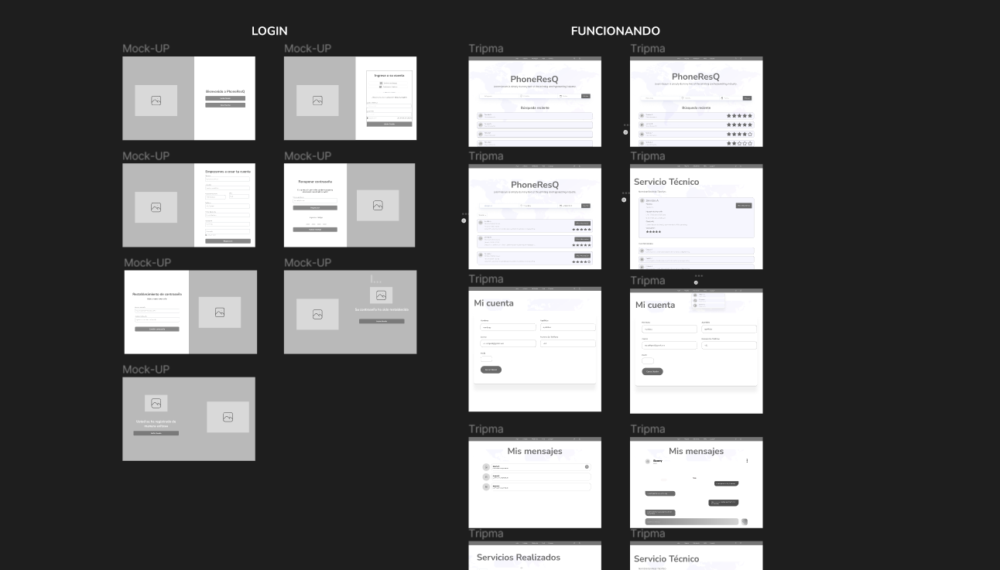
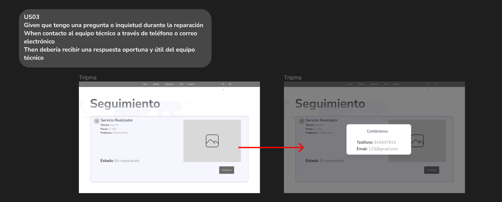
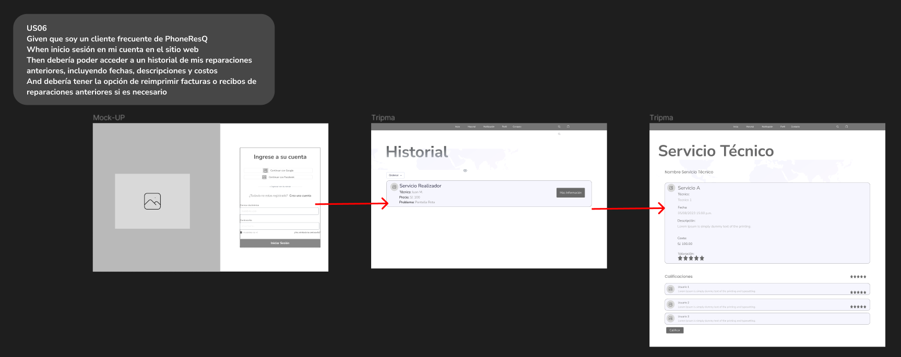
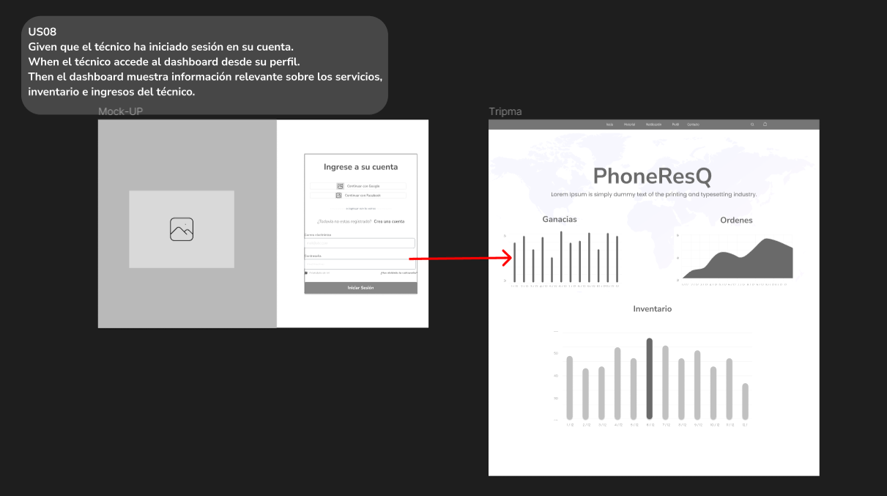
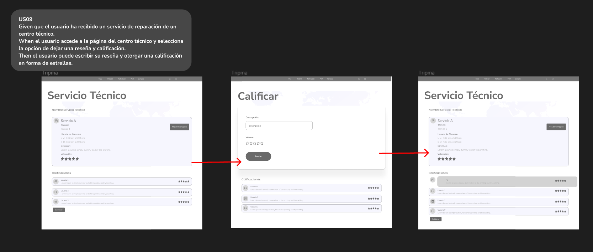
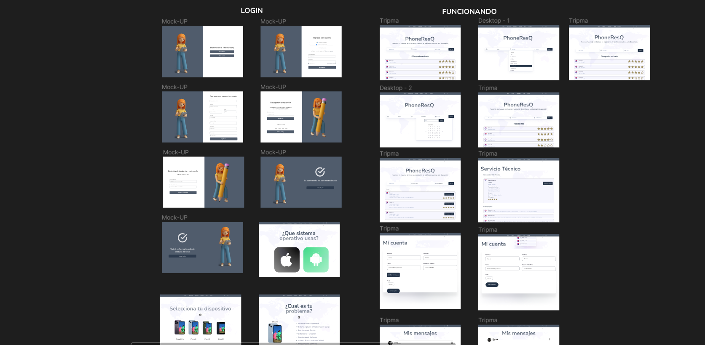
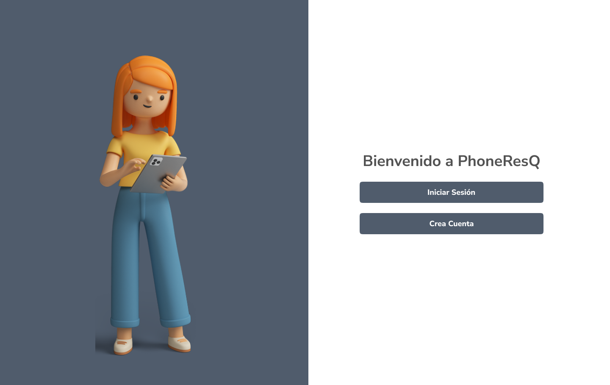
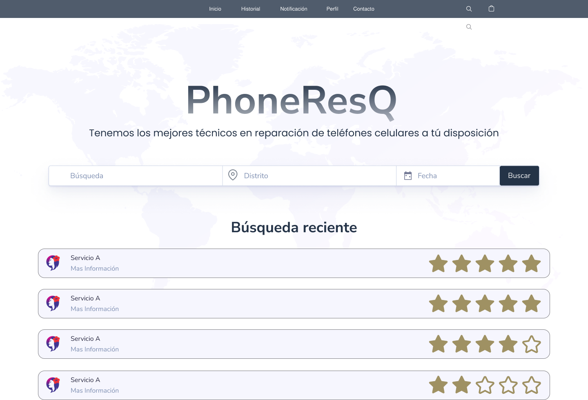

#### 4.4.1. Web Applications Wireframes
 

La sección de Wireframes es una parte esencial de nuestro proceso de diseño y desarrollo de aplicaciones web. Aquí presentamos una representación esquemática a detalle de la estructura y la disposición de los elementos en cada página y pantalla de la aplicación elaborado en Figma.

  

 
 

#### 4.4.2. Web Applications Wireflow Diagrams
 

La sección de Wireframes es una parte esencial de nuestro proceso de diseño y desarrollo de aplicaciones web. Aquí presentamos una representación esquemática a detalle de la estructura y la disposición de los elementos en cada página y pantalla de la aplicación elaborado en Figma.

  

 

  

 

  

 

  

 

 
 

#### 4.4.2. Web Applications Mock-ups
 

La sección de Mock-Ups representa una parte fundamental de nuestro proceso de diseño. Aquí presentamos visualmente la apariencia y la disposición de la interfaz de usuario de nuestra aplicación web, brindando a todos los interesados una vista previa de cómo será la experiencia de usuario final.

  

 

  

 

  

 

  

 

 
 

#### 4.4.3. Web Applications User Flow Diagrams
 

**User Goal 1**: Comunicación Multicanal con el Servicio Técnico   
Given que necesito información sobre mi dispositivo en reparación 
When elijo comunicarme mediante llamadas telefónicas, correo electrónico o chat en línea 
Then el servicio técnico debe estar disponible y responder eficazmente en el canal seleccionado.
 

  

 

**User Goal 2**: Evaluación de Técnicos y Costos Transparentes  
Given que estoy considerando una reparación en PhoneResQ 
When recibo información clara sobre los técnicos disponibles y sus calificaciones 
Then debería poder tomar una decisión informada sobre el técnico que realizará la reparación 
And debería recibir un desglose transparente de los costos, incluyendo piezas y mano de obra, antes de confirmar la reparación
 

  

 

**User Goal 3**: Seguimiento de Reparaciones Anteriores  
Given que soy un cliente frecuente de PhoneResQ 
When inicio sesión en mi cuenta en el sitio web 
Then debería poder acceder a un historial de mis reparaciones anteriores, incluyendo fechas, descripciones y costos 
And debería tener la opción de reimprimir facturas o recibos de reparaciones anteriores si es necesario
 

  

 

**User Goal 4**: Actualización de estado de órdenes de trabajo  
Given que soy un técnico registrado de PhoneResQ 
And tengo una o más órdenes de trabajo asignadas. 
When inicio sesión en mi cuenta en el sitio web. 
Then debería poder acceder a las órdenes de trabajo que tengo de forma visual para interactuar con ellas. 
 

  

 

**User Goal 5**: Dashboard para técnicos.  
Given que el técnico ha iniciado sesión en su cuenta. 
When el técnico accede al dashboard desde su perfil. 
Then el dashboard muestra información relevante sobre los servicios, inventario e ingresos del técnico.
 

  

 

**User Goal 6**: Reseñas y Calificaciones de Centros Técnicos / Técnicos  
Given que el usuario ha recibido un servicio de reparación de un centro técnico. 
When el usuario accede a la página del centro técnico y selecciona la opción de dejar una reseña y calificación. 
Then el usuario puede escribir su reseña y otorgar una calificación en forma de estrellas.
 

  

 

**User Goal 7**: Reportar Problemas o Quejas.   
Given que el usuario ha tenido una experiencia insatisfactoria con un servicio o centro técnico. 
When el usuario selecciona la opción de reportar un problema o queja. 
Then el usuario puede proporcionar detalles y enviar el informe a través de la aplicación.
 

  

 

**User Goal 8**: Seguimiento del estado del servicio  
Given que el usuario ha enviado un informe de problema o queja. 
When el equipo de soporte revisa y responde al informe. 
Then el usuario recibe notificaciones y puede ver el estado actualizado del informe a través de la aplicación
 

  

 

 
 

