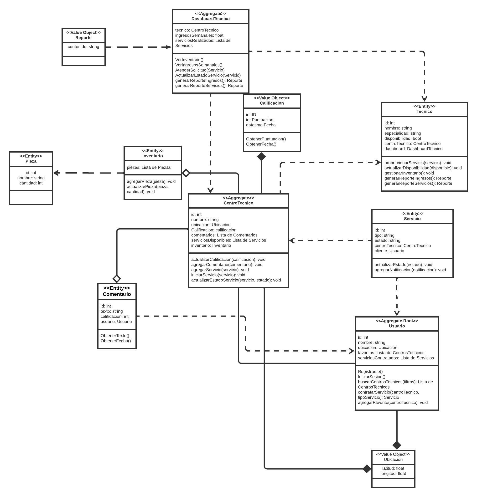

## 4.7. Software Object-Oriented Design
### 4.7.1. Class Diagrams

  

### 4.7.2. Class Dictionary

 - **Clase Usuario:** Esta clase representa a los usuarios de la aplicación. Un usuario puede ser tanto un cliente que busca servicios de reparación como un empleado de una empresa que gestiona reparaciones para múltiples dispositivos. Tiene atributos como su identificación, nombre, ubicación y listas de centros técnicos favoritos y servicios contratados. Puede buscar centros técnicos, contratar servicios y agregar centros técnicos.
 - **Clase Técnico:** Esta clase representa a los técnicos asociados a un centro técnico. Cada técnico tiene su propia información personal y está vinculado a un centro técnico en particular. Los técnicos pueden proporcionar servicios de reparación, gestionar su inventario y actualizar su disponibilidad para llevar a cabo servicios. También tienen acceso al DashboardTecnico para monitorear su desempeño y administrar sus ingresos.os a sus favoritos.
 - **Clase CentroTecnico:** Esta clase representa los centros técnicos disponibles en la aplicación. Cada centro técnico tiene un nombre, ubicación, calificación promedio y una lista de servicios que ofrece. Puede recibir comentarios y calificaciones de los usuarios, y mantener un inventario de piezas para las reparaciones. Los centros técnicos también pueden manejar los servicios contratados por los usuarios y actualizar su estado.
 - **Clase Servicio:** Representa un servicio contratado por un usuario a un centro técnico. Tiene información sobre el tipo de servicio, su estado actual y los usuarios (clientes) y centros técnicos involucrados. Los servicios pueden tener notificaciones para informar a los usuarios sobre cambios en el estado.
 - **Clase Ubicacion:** Una simple clase que almacena las coordenadas de latitud y longitud para representar la ubicación de usuarios, centros técnicos y servicios.
 - **Clase Comentario:** Representa un comentario dado por un usuario sobre un centro técnico. Incluye el texto del comentario, la calificación otorgada y la relación con el usuario que lo escribió.
 - **Clase Inventario:** Esta clase guarda la información sobre las piezas disponibles en un centro técnico para realizar reparaciones. Permite agregar y actualizar piezas en el inventario.
 - **Clase Pieza:** Representa una pieza que forma parte del inventario de un centro técnico. Tiene un nombre, una identificación única y la cantidad disponible.
 - **Clase DashboardTecnico:** Es una interfaz para los técnicos de los centros técnicos. Proporciona una visión general de sus ingresos semanales y los servicios que han realizado. También puede generar informes sobre sus ingresos y servicios.
 - **Clase Reporte:** Esta clase permite almacenar información en formato de reporte. Es utilizada por el DashboardTecnico para generar informes sobre los ingresos y servicios.