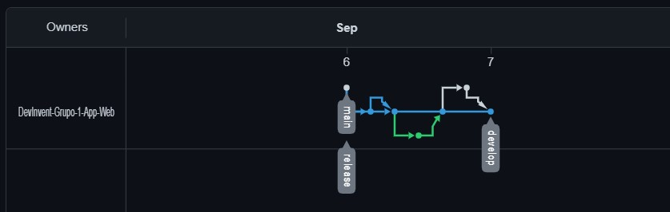
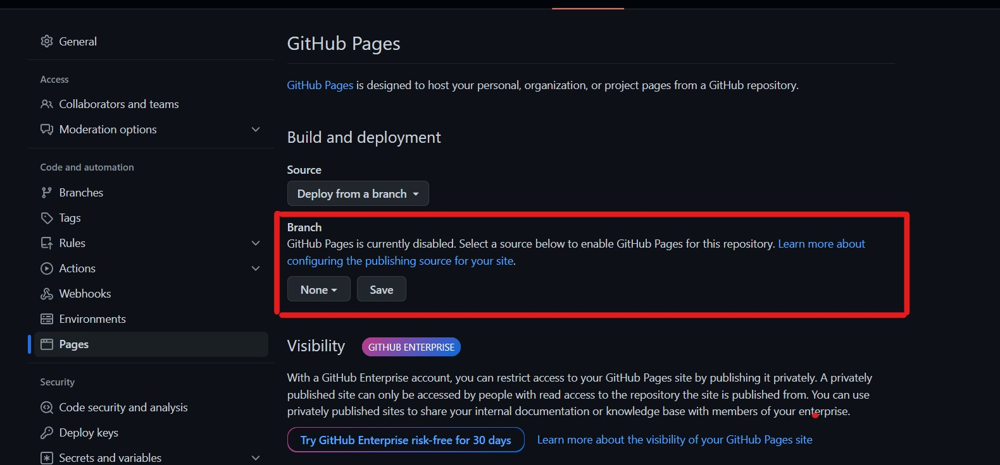
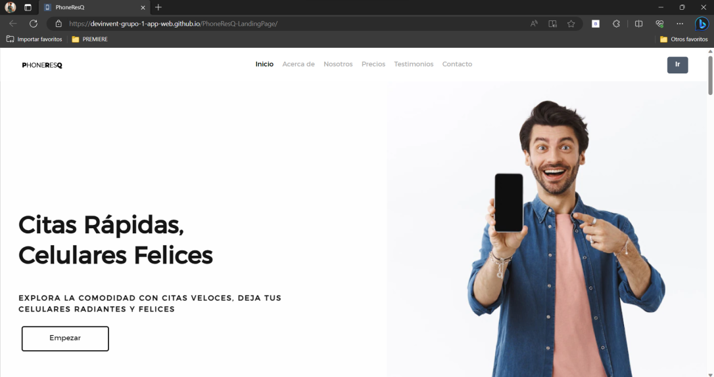

## 5.1. Software Configuration Management
La gestión de configuración de software es esencial para garantizar un desarrollo y despliegue eficiente y consistente de la aplicación. Involucra varios aspectos clave para mantener la calidad y la coherencia en el proceso de desarrollo y entrega del software.

### 5.1.1. Software Development Environment Configuration
En esta sección, se incluirán las herramientas usadas para el desarrollo del proyecto. Por ello, se dividirán en las siguientes secciones, dependiendo de uso en el desarrollo del proyecto

#### Project Management

 - **Discord:** Agiliza la comunicación del equipo al ofrecer mensajes de texto, voz y video en tiempo real, permitiendo decisiones y soluciones rápidas. Sus canales temáticos facilitan la colaboración por equipos y el intercambio de progresos, notificaciones y anuncios. Además, posibilita compartir archivos relevantes como maquetas y documentos de diseño, mejorando la eficiencia en el proyecto de reparación de teléfonos.
 - **WhatsApp:** Agiliza la comunicación instantánea entre miembros del equipo, brindando notificaciones y recordatorios para mantener a todos al tanto de reuniones, entregables y tareas pendientes. Su utilidad radica en mantener la conexión y la eficacia en la realización del proyecto.

#### Requirements Management

 - **Microsoft Word:** Sirve para crear y editar documentos, informes técnicos, documentación del proyecto, especificaciones y otros materiales de texto. Además ofrece una amplia gama de herramientas de formato, estilos, opciones de colaboración y revisión de documentos que hacen fácil la creación de contenido escrito y la comunicación eficiente entre los miembros del equipo.

#### Product UX/UI Design
 - **Figma:** Es una herramienta de diseño de interfaz de usuario (UI) y experiencia de usuario (UX) basada en la nube. Permite a los diseñadores y equipos de desarrollo colaborar en el diseño de la aplicación web, crear prototipos interactivos y compartir diseños en tiempo real. En el proyecto, Figma sería esencial para diseñar y prototipar la interfaz de usuario de la aplicación, facilitando la comunicación visual entre los equipos.
 - **UXPressia:** Es una plataforma de mapas de experiencia del cliente que ayuda a crear y visualizar customer journey maps, mapas de empatía y otros diagramas relacionados con la experiencia del usuario. Puede ser útil para comprender mejor cómo interactúan los usuarios con la aplicación, identificar puntos problemáticos y mejorar la experiencia del usuario.
 - **Miro:** Es una plataforma de colaboración en línea que permite a los equipos trabajar juntos en tableros virtuales. Puede utilizarse para organizar y visualizar ideas, realizar sesiones de lluvia de ideas, crear mapas conceptuales y colaborar en la planificación y diseño del proyecto. Facilita la colaboración y la comunicación entre los miembros del equipo.

#### Software Development:

 - **GitHub:** Es una plataforma en línea que ofrece servicios para controlar las versiones y hospedar repositorios de código. Esta plataforma permite manejar repositorios, hacer seguimiento de cambios, colaborar con otros programadores, revisar código, gestionar problemas y mantener un registro de las alteraciones efectuadas en el código.
 - **Git:** Es un sistema de control de versiones distribuido muy popular en la industria del desarrollo de software. Proporciona a los programadores la capacidad de rastrear las modificaciones en su código, colaborar con otros miembros del equipo y conservar un historial completo de los cambios en un proyecto. Git facilita la creación de ramas independientes para el desarrollo, la fusión de cambios entre esas ramas, el retroceso a versiones anteriores y la resolución de conflictos que surgen al fusionar ramas.
 - **Visual Studio Code:** Es un entorno de desarrollo integrado (IDE) diseñado por Microsoft, conocido por ser ligero y altamente adaptable. Entre sus características se encuentran el resaltado de sintaxis, la autocompletación de código, la depuración, la integración con Git y GitHub, así como el control de versiones incorporado.
 - **HTML, CSS y JavaScript:** Estas son tecnologías fundamentales para el desarrollo web. HTML se utiliza para estructurar el contenido de la aplicación, CSS para estilizar y dar formato a la interfaz de usuario, y JavaScript para agregar interactividad y funcionalidad a la aplicación. En el proyecto, estas tecnologías serían esenciales para construir y desarrollar la aplicación web en sí.

#### Software Testing

 - **Lenguaje Gherkin:** Gherkin es un lenguaje de especificación de comportamiento que se utiliza comúnmente en la metodología de desarrollo ágil. Permite describir el comportamiento deseado de un sistema en un formato legible por humanos. Ayuda en la realización del proyecto al definir casos de uso y requisitos de manera clara y concisa, lo que facilita la comunicación entre los equipos de desarrollo y asegura que el producto final cumpla con las expectativas y necesidades de los usuarios.

### 5.1.2. Source Code Management
En esta sección se presenta la gestión o manejo del código fuente, teniendo como función principal el realizar un seguimiento de los cambios o modificaciones que realizan los miembros del equipo de trabajo durante todo el desarrollo del proyecto. Para ello, se usará Github como un sistema de control de versiones.

URL de la Organización: [https://github.com/DevInvent-Grupo-1-App-Web](https://github.com/DevInvent-Grupo-1-App-Web)

URL del Repositorio de la Landing Page:[https://github.com/DevInvent-Grupo-1-App-Web/PhoneResQ-LandingPage](https://github.com/DevInvent-Grupo-1-App-Web/PhoneResQ-LandingPage)

**GitFlow**

GitFlow es un flujo de trabajo para el control de versiones utilizando Git, que se utiliza comúnmente en proyectos de desarrollo de software. Está diseñado para facilitar la colaboración entre equipos y gestionar eficientemente las ramas del repositorio.

 

  
 

En GitFlow, se utilizan varias ramas principales para organizar el desarrollo y la entrega del software. Estas son las ramas principales:

 - **Rama "master":** Esta rama contiene el código estable y listo para ser desplegado en producción. Los commits en esta rama representan versiones del software que han sido probadas y aprobadas.
 - Rama "develop": Esta rama es donde se realiza el desarrollo principal del proyecto. Es a partir de esta rama que se crean las ramas de características y las ramas de lanzamiento.

Además de estas ramas principales, GitFlow utiliza otras ramas para organizar el desarrollo de características y lanzamientos:

 - **Ramas de características (feature branches):** Se crean a partir de la rama "develop" y se utilizan para desarrollar nuevas características o funcionalidades del software. Una vez que la característica está completa, se fusiona de nuevo en la rama "develop".
 - **Ramas de lanzamiento (release branches):** Se crean a partir de la rama "develop" cuando se está preparando una nueva versión del software para su lanzamiento. En estas ramas se realizan las pruebas finales y se solucionan los errores menores antes de fusionar la rama en "master" y "develop".
 - **Ramas de hotfix (hotfix branches):** Se crean a partir de la rama "master" cuando se necesita solucionar un error crítico en la versión en producción. Una vez que se corrige el error, la rama se fusiona tanto en "master" como en "develop".

### 5.1.3. Source Code Style Guide & Conventions
#### HTML5:

 - **Indentación:** Utiliza una indentación consistente para mejorar la legibilidad del código. Puedes usar espacios o tabulaciones, pero asegúrate de mantener la misma cantidad de espacios o tabulaciones en todo el documento.
 - **Mayúsculas y minúsculas:** HTML5 es insensible a mayúsculas y minúsculas, lo que significa que tag y TAG son equivalentes. Sin embargo, se recomienda utilizar minúsculas para los elementos HTML y atributos, ya que es más común y mejora la legibilidad.
 - **Uso de comillas:** Utiliza comillas dobles ("") para los valores de atributos en HTML.Aunque las comillas simples ('') también son válidas, las comillas dobles son más comunes y se recomiendan para mantener la consistencia.
 - **Atributos booleanos:** Para los atributos booleanos, como disabled o readonly, no es necesario especificar un valor. Puedes simplemente incluir el atributo en el elemento.
 - **Orden de los atributos:** Mantén un orden consistente para los atributos en tus elementos HTML. Un orden común es: id, class, name, type, src, href, alt, title, width, height, data-*, aria-*, role, etc. Esto facilita la lectura y el mantenimiento del código.
 - **Uso de etiquetas semánticas:** Utiliza las etiquetas semánticas de HTML5, como header, nav, main, section, article, aside, footer, etc., para estructurar correctamente el contenido de tu página. Esto mejora la accesibilidad y el SEO.
 - **Evita el uso de etiquetas obsoletas:** HTML5 ha introducido nuevas etiquetas y se han vuelto obsoletas algunas etiquetas antiguas, como font, center, strike, etc. Evita su uso y utiliza las etiquetas y atributos actualizados.
 - **Uso de comentarios:** Utiliza comentarios HTML (<-- comentario -->) para explicar secciones de código o dejar notas para ti mismo u otros desarrolladores. Los comentarios ayudan a comprender el propósito y la funcionalidad del código.

#### CSS:

 - **Indentación:** Utiliza una indentación consistente para mejorar la legibilidad del código CSS. Puedes usar espacios o tabulaciones, pero asegúrate de mantener la misma cantidad de espacios o tabulaciones en todo el documento.
 - **Uso de espacios:** Utiliza espacios alrededor de los selectores, propiedades y valores para mejorar la legibilidad. Por ejemplo: selector { propiedad: valor; }.
 - **Uso de minúsculas:** Utiliza minúsculas para los selectores, propiedades y valores en CSS. Esto es una convención común y mejora la consistencia y legibilidad del código.
 - **Separación de reglas:** Separa las reglas CSS con una línea en blanco para mejorar la legibilidad y facilitar la identificación de cada regla.
 - **Orden de las propiedades:** Mantén un orden consistente para las propiedades en tus reglas CSS. Un orden común es: display, position, width, height, margin, padding, font, color, background, border, text, animation, etc. Esto facilita la lectura y el mantenimiento del código.
 - **Uso de abreviaturas:** Utiliza abreviaturas de propiedades CSS cuando sea posible para reducir la cantidad de código y mejorar la legibilidad. Por ejemplo, en lugar de escribir margin-top, margin-right, margin-bottom, margin-left, puedes usar margin: top right bottom left;.
 - **Uso de comentarios:** Utiliza comentarios CSS (/* comentario */) para explicar secciones de código, dejar notas o desactivar temporalmente ciertas reglas. Los comentarios ayudan a comprender el propósito y la funcionalidad del código.
 - **Evita el uso de estilos en línea:** En general, es recomendable evitar el uso de estilos en línea (style="...") y en su lugar utilizar clases y selectores en tu archivo CSS. Esto promueve la separación de preocupaciones y facilita el mantenimiento del código.
 - **Uso de prefijos de proveedores:** Si estás utilizando características CSS que requieren prefijos de proveedores para la compatibilidad con navegadores antiguos, asegúrate de incluir los prefijos necesarios. Puedes utilizar herramientas como Autoprefixer para generar automáticamente los prefijos.

#### JavaScript:

 - **Indentación:** Utiliza una indentación consistente para mejorar la legibilidad del código. Puedes usar espacios o tabulaciones, pero asegúrate de mantener la misma cantidad de espacios o tabulaciones en todo el documento.
 - **Uso de punto y coma:** Aunque JavaScript permite omitir el punto y coma al final de una declaración, se recomienda incluirlos para evitar posibles errores. Esto también mejora la legibilidad y facilita la comprensión del código.
 - **Uso de comillas:** Utiliza comillas simples ('') o comillas dobles ("") de manera consistente para las cadenas de texto en JavaScript. Sin embargo, se recomienda utilizar comillas simples como convención general, a menos que necesites incluir comillas simples dentro de la cadena.
 - **Uso de camelCase:** Utiliza la convención de escritura camelCase para nombrar variables, funciones y métodos en JavaScript. Por ejemplo: miVariable, miFuncion, miMetodo.
 - **Uso de const y let:** En lugar de utilizar la palabra clave var, se recomienda utilizar const o let para declarar variables en JavaScript. const se utiliza para variables cuyo valor no cambiará, mientras que let se utiliza para variables que pueden cambiar su valor.
 - **Uso de llaves:** Utiliza llaves ({}) para delimitar bloques de código, incluso si solo hay una línea de código dentro del bloque. Esto mejora la legibilidad y evita posibles errores.
 - **Uso de comentarios:** Utiliza comentarios de una línea (// comentario) o comentarios de varias líneas (/* comentario */) para explicar secciones de código, dejar notas o desactivar temporalmente ciertas líneas de código. Los comentarios ayudan a comprender el propósito y la funcionalidad del código.
 - **Uso de espacios:** Utiliza espacios alrededor de operadores y después de las comas para mejorar la legibilidad del código. Por ejemplo: let resultado = valor1 + valor2;.
 - **Uso de funciones flecha:** Utiliza funciones flecha (=>) en lugar de funciones anónimas cuando sea posible. Las funciones flecha tienen una sintaxis más concisa y heredan automáticamente el contexto de this.
 - **Uso de punto y coma automático:** Aunque se recomienda incluir punto y coma al final de cada declaración, JavaScript puede insertarlos automáticamente en ciertos casos. Sin embargo, es buena práctica incluirlos explícitamente para evitar posibles errores.

### 5.1.4. Software Deployment Configuration

Como ya se había mencionado anteriormente, la gestión del código fuente que usaremos, será manejado a través de GitHub. Del mismo modo, se utilizará el servicio GitHub Pages para el despliegue de la Landing Page de PhoneResQ.

Para el desarrollo de la Landing Page de PhoneResQ, se ha usado HTML, CSS y JavaScript.
 - HTML: Para la estructura de la página web.
 - CSS: Para el diseño y la maquetación de la página web.
 - JavaScript: Para la interactividad de la página web.

 

  
 

Para el despliegue de la Landing Page, hemos usado Git, GitHub, GitFlow y GitHub Pages.

 - Git: Para el control de versiones. Nos ayudó a trabajar en equipo y a mantener un registro de los cambios realizados en el código.
 - GitHub: Para el almacenamiento del código fuente. Nos permitió almacenar el código fuente de la Landing Page en un repositorio remoto.
 - GitFlow: Para la gestión de ramas. Nos ayudó a organizar el desarrollo de la Landing Page mediante el uso de ramas.
 - GitHub Pages: Para el despliegue de la Landing Page. Nos permitió desplegar la Landing Page en un sitio web público.

Asimismo, para el despliegue realizamos los siguientes pasos:
 1. Nos dirigimos al repositorio donde está almacenado la Landing Page y luego elegimos la opción de “Settings” que se encuentra en el repositorio.

 

  
 

 2. Cuando estemos en el apartado de “Settings” del repositorio, buscamos la opción “Pages”, que se encuentra en la esquina inferior izquierda y la seleccionamos.
   

  

  3. Dentro de “Pages”, elegimos el “branch” que se publicará en el vínculo. De igual modo, debemos elegir la carpeta donde se localiza la información a publicar, en este caso la carpeta donde está almacenada la Landing Page.
   

  

 4. Finalmente podemos acceder a la Landing Page desplegada con el URL que nos muestra en la parte superior.

URL de la Landing Page:[https://devinvent-grupo-1-app-web.github.io/PhoneResQ-LandingPage/#download](https://devinvent-grupo-1-app-web.github.io/PhoneResQ-LandingPage/#download)

  

