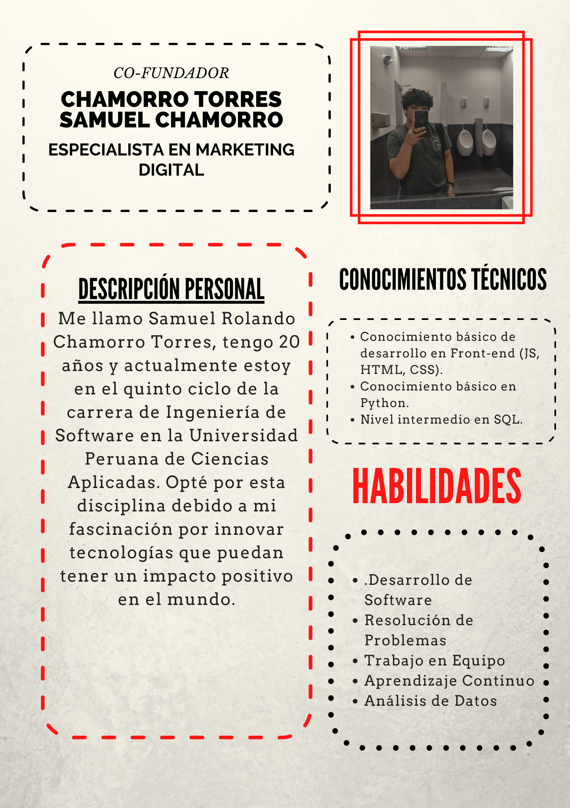
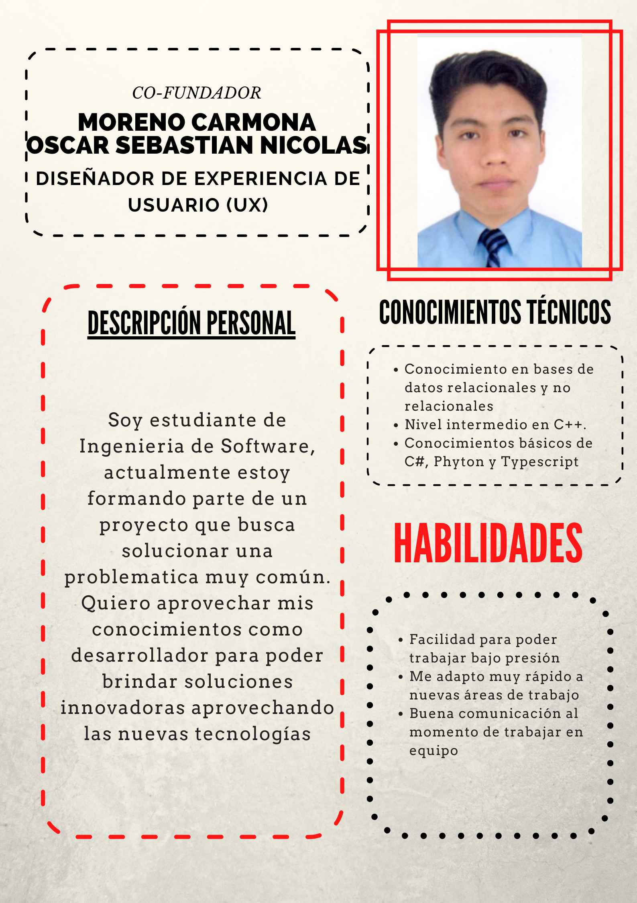
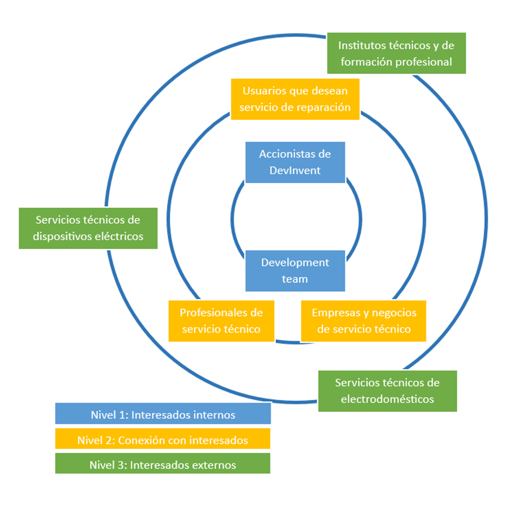

<center>

# Universidad Peruana De Ciencias Aplicadas
## Desarrollo de Aplicaciones Web SV51

</center>

<p align = "center"> </img> </p>


<center>
    <h2>"Informe TB1"</h2>
    <h2>DevInvent - PhoneResQ</h2>
    <h3>Profesor: Escobar Aguirre, Jaime Luis </h2>
</center>

## Integrantes:


* Arenas Conde, José Anthony                U20211D744     
* Chamorro Torres, Samuel Rolando           U202015096
* Cancho Coila, Diego Fabian                U20201F479
* Moreno Carmona, Oscar Sebastián Nicolás   U201911522
-----
## Registro de Versiones Del Informe

| Version | Fecha | Autor |   Descripcion de modificacion   |
|:----------:|:----------:|:----------:|:----------:|
| 0.1   | 1/09/2023 | DevInvent | Se agrego el primer capitulo al trabajo  |
| 0.2   | 9/09/2023 | DevInvent | Se realizaron los Capítulos I: Introducción, Capítulo II: Requirements Elicitation & Analysis, Capítulo III: Requirements Specification y Capítulo IV: Product Design|
| 0.3   | 29/09/2023 | DevInvent | Se realizaron los puntos del Capítulo V: Sprint 2, Sprint Planning 2, Sprint Backlog 2, Development Evidence for Sprint Review, Testing Suite Evidence for Sprint Review, Execution Evidence for Sprint Review, Services Documentation Evidence for Sprint Review, Software Deployment Evidence for Sprint Review y Team Collaboration Insights during Sprint.|


## Project Report Collaboration Insights 
TB1: Para esta entrega, realizamos en equipo los puntos que corresponden a los capítulos asignados en el siguiente repositorio dentro de nuestra organización de grupo: [Github - Informe Final PhoneResQ](https://github.com/DevInvent-Grupo-1-App-Web/PhoneResQ-InformeDelProyecto)
    <br>
 A continuación, se muestran las capturas de evidencia correspondientes al desarrollo de los siguientes capítulos:

    - Capítulo I: Introducción
    - Capítulo II: Requirements Elicitation & Analysis
    - Capítulo III: Requirements Specification
    - Capítulo IV: Product Design
    - Capítulo V: Product Implementation, Validation & Deployment

<div align=center>
            
    </div>

<div align=center>
      
    </div>

<br><br>
- **TP1:** Para esta entrega, realizamos en equipo las actividades correspondientes dentro del repositorio dentro de nuestra organización de grupo:

    Link del repositorio del Informe Final: [Github - Informe Final PhoneResQ](https://github.com/DevInvent-Grupo-1-App-Web/PhoneResQ-InformeDelProyecto)

  <br>

    A continuación, se muestran las capturas de evidencia correspondientes al desarrollo de los siguientes puntos:

    - Sprint 2
    - Sprint Planning 2
    - Sprint Backlog 2
    - Development Evidence for Sprint Review
    - Testing Suite Evidence for Sprint Review
    - Execution Evidence for Sprint Review
    - Services Documentation Evidence for Sprint Review
    - Software Deployment Evidence for Sprint Review
    - Team Collaboration Insights during Sprint

<div align=center>
            
</div>

 <div align=center>
      
 </div>

<br><br>
------
# Contenido

## Tabla de Contenidos

### [Registro de versiones del informe](#registro-de-versiones-del-informe)

### [Project Report Collaboration Insights](#project-report-collaboration-insights)

### [Contenido](#contenido)

### [Student Outcome](#student-outcome-1)

### [Capítulo I: Introducción](#capítulo-i-introducción)

- [1.1. Startup Profile](#11-startup-profile)
  - [1.1.1. Descripción de la Startup](#111-description-de-la-startup)
  - [1.1.2. Perfiles de integrantes del equipo](#112-perfiles-de-integrantes-del-equipo)
- [1.2. Solution Profile](#12-solution-profile)
  - [1.2.1 Antecedentes y problemática](#121-antecedentes-y-problemática)
  - [1.2.2 Lean UX Process](#122-lean-ux-process)
    - [1.2.2.1. Lean UX Problem Statements](#1221-lean-ux-problem-statements)
    - [1.2.2.2. Lean UX Assumptions](#1222-lean-ux-assumptions)
    - [1.2.2.3. Lean UX Hypothesis Statements](#1223-lean-ux-hypothesis-statements)
    - [1.2.2.4. Lean UX Canvas](#1224-lean-ux-canvas)
- [1.3. Segmentos objetivo](#13-segmentos-objetivo)

### [Capítulo II: Requirements Elicitation & Analysis](#capítulo-ii-requirements-elicitation--analysis)

- [2.1. Competidores](#21-competidores)
  - [2.1.1. Análisis competitivo](#211-análisis-competitivo)
  - [2.1.2. Estrategias y tácticas frente a competidores](#212-estrategias-y-tácticas-frente-a-competidores)
- [2.2. Entrevistas](#22-entrevistas)
  - [2.2.1. Diseño de entrevistas](#221-diseño-de-entrevistas)
  - [2.2.2. Registro de entrevistas](#222-registro-de-entrevistas)
  - [2.2.3. Análisis de entrevistas](#223-análisis-de-entrevistas)
- [2.3. Needfinding](#23-needfinding)
  - [2.3.1. User Personas](#231-user-personas)
  - [2.3.2. User Task Matrix](#232-user-task-matrix)
  - [2.3.3. User Journey Mapping](#233-user-journey-mapping)
  - [2.3.4. Empathy Mapping](#234-empathy-mapping)
  - [2.3.5. As-is Scenario Mapping](#235-as-is-scenario-mapping)

### [Capítulo III: Requirements Specification](#capítulo-iii-requirements-specification)

- [3.1. To-Be Scenario Mapping](#31-to-be-scenario-mapping)
- [3.2. User Stories](#32-user-stories)
- [3.3. Impact Mapping](#33-impact-mapping)
- [3.4. Product Backlog](#34-product-backlog)

### [Capítulo IV: Product Design](#capítulo-iv-product-design)

- [4.1. Style Guidelines](#41-style-guidelines)
  - [4.1.1. General Style Guidelines](#411-general-style-guidelines)
  - [4.1.2. Web Style Guidelines](#412-web-style-guidelines)
- [4.2. Information Architecture](#42-information-architecture)
  - [4.2.1. Organization Systems](#421-organization-systems)
  - [4.2.2. Labeling Systems](#422-labeling-systems)
  - [4.2.3. SEO Tags and Meta Tags](#423-seo-tags-and-meta-tags)
  - [4.2.4. Searching Systems](#424-searching-systems)
  - [4.2.5. Navigation Systems](#425-navigation-systems)
- [4.3. Landing Page UI Design](#43-landing-page-ui-design)
  - [4.3.1. Landing Page Wireframe](#431-landing-page-wireframe)
  - [4.3.2. Landing Page Mock-up](#432-landing-page-mock-up)
- [4.4. Web Applications UX/UI Design](#44-web-applications-uxui-design)
  - [4.4.1. Web Applications Wireframes](#441-web-applications-wireframes)
  - [4.4.2. Web Applications Wireflow Diagrams](#442-web-applications-wireflow-diagrams)
  - [4.4.3. Web Applications Mock-ups](#443-web-applications-mock-ups)
  - [4.4.4. Web Applications User Flow Diagrams](#444-web-applications-user-flow-diagrams)
- [4.5. Web Applications Prototyping](#45-web-applications-prototyping)
- [4.6. Domain-Driven Software Architecture](#46-domain-driven-software-architecture)
  - [4.6.1. Software Architecture Context Diagram](#461-software-architecture-context-diagram)
  - [4.6.2. Software Architecture Container Diagrams](#462-software-architecture-container-diagrams)
  - [4.6.3. Software Architecture Components Diagrams](#463-software-architecture-components-diagrams)
- [4.7. Software Object-Oriented Design](#47-software-object-oriented-design)
  - [4.7.1. Class Diagrams](#471-class-diagrams)
  - [4.7.2. Class Dictionary](#472-class-dictionary)
- [4.8. Database Design](#48-database-design)
  - [4.8.1. Database Diagram](#481-database-diagram)

### [Capítulo V: Product Implementation, Validation & Deployment](#capítulo-v-product-implementation-validation--deployment)

- [5.1. Software Configuration Management](#51-software-configuration-management)
  - [5.1.1. Software Development Environment Configuration](#511-software-development-environment-configuration)
  - [5.1.2. Source Code Management](#512-source-code-management)
  - [5.1.3. Source Code Style Guide & Conventions](#513-source-code-style-guide--conventions)
  - [5.1.4. Software Deployment Configuration](#514-software-deployment-configuration)
- [5.2. Landing Page, Services & Applications Implementation](#52-landing-page-services--applications-implementation)
  - [5.2.1. Sprint 1](#521-sprint-1)
    - [5.2.1.1. Sprint Planning 1](#5211-sprint-planning-1)
    - [5.2.1.2. Sprint Backlog 1](#5212-sprint-backlog-1)
    - [5.2.1.3. Development Evidence for Sprint Review](#5213-development-evidence-for-sprint-review)
    - [5.2.1.4. Testing Suite Evidence for Sprint Review](#5214-testing-suite-evidence-for-sprint-review)
    - [5.2.1.5. Execution Evidence for Sprint Review](#5215-execution-evidence-for-sprint-review)
    - [5.2.1.6. Services Documentation Evidence for Sprint Review](#5216-services-documentation-evidence-for-sprint-review)
    - [5.2.1.7. Software Deployment Evidence for Sprint Review](#5217-software-deployment-evidence-for-sprint-review)
    - [5.2.1.8. Team Collaboration Insights during Sprint](#5218-team-collaboration-insights-during-sprint)

  - [5.2.2. Sprint 2](#522-sprint-2)
    - [5.2.2.1. Sprint Planning 2](#5221-sprint-planning-2)
    - [5.2.2.2. Sprint Backlog 2](#5222-sprint-backlog-2)
    - [5.2.2.3. Development Evidence for Sprint Review](#5223-development-evidence-for-sprint-review)
    - [5.2.2.4. Testing Suite Evidence for Sprint Review](#5224-testing-suite-evidence-for-sprint-review)
    - [5.2.2.5. Execution Evidence for Sprint Review](#5225-execution-evidence-for-sprint-review)
    - [5.2.2.6. Services Documentation Evidence for Sprint Review](#5226-services-documentation-evidence-for-sprint-review)
    - [5.2.2.7. Software Deployment Evidence for Sprint Review](#5227-software-deployment-evidence-for-sprint-review)
    - [5.2.2.8. Team Collaboration Insights during Sprint](#5228-team-collaboration-insights-during-sprint)

### [Conclusiones](#conclusiones)

### [Bibliografía](#bibliografía)

### [Anexos](#anexos)

<br><br>


<br><br>

# Student Outcome

| Criterio específico                                                                                                                                                                   | Acciones realizadas                                                                                                                                                                                                                                                                                                                                                                                                                                                                                                                                                                                                                                                                                                                                                                                                                                                                                                                                                                                                                                                                                                                                                                                                                                                                              | Conclusiones                                                                                                                                                                                        |
| :------------------------------------------------------------------------------------------------------------------------------------------------------------------------------------ | :----------------------------------------------------------------------------------------------------------------------------------------------------------------------------------------------------------------------------------------------------------------------------------------------------------------------------------------------------------------------------------------------------------------------------------------------------------------------------------------------------------------------------------------------------------------------------------------------------------------------------------------------------------------------------------------------------------------------------------------------------------------------------------------------------------------------------------------------------------------------------------------------------------------------------------------------------------------------------------------------------------------------------------------------------------------------------------------------------------------------------------------------------------------------------------------------------------------------------------------------------------------------------------------------- | :-------------------------------------------------------------------------------------------------------------------------------------------------------------------------------------------------- |
| Participa en equipos multidisciplinarios con eficacia, eficiencia y objetividad, en el marco de un proyecto en soluciones de ingeniería de software.  | **Diego Fabian Cancho Coila** <br> <br> TB1 <br><br> - Después de deliberar sobre el tema central del proyecto, tomamos en cuenta las opiniones de todos los miembros del equipo. Luego, coordinamos la frecuencia y el horario de nuestras reuniones según la disponibilidad de cada uno. <br><br> TP1 <br> Durante el Sprint 2, el equipo se reunió en una sesión de planificación en Discord para establecer los objetivos y user stories. Luego, los miembros del equipo, utilizando Visual Studio Code y Git, colaboraron en el desarrollo de las funcionalidades planificadas, creando branches y realizando commits. Finalmente, se llevó a cabo una revisión del sprint para presentar y revisar las funcionalidades desarrolladas.<br><br> **Arenas Conde, José Anthony** <br> <br> TB1 <br><br> Se realizaron dos reuniones semanales para compartir dudas, sugerencias y avances. Además, se concretó la repartición de responsabilidades de manera equitativa. <br> TP1 <br> La colaboración efectiva del equipo se reflejó en la reunión de planificación del Sprint 2, realizada en Discord. A partir de esta reunión, se distribuyeron las user stories entre los miembros del equipo, quienes utilizaron Visual Studio Code y Git para desarrollar y gestionar el código de manera eficiente. Al finalizar el sprint, se llevó a cabo una revisión exitosa para demostrar el progreso alcanzado. <br><br> **Oscar Sebastian Nicolas Moreno Carmona** <br><br> TB1   <br><br> - Se coordinó con el equipo las fechas para la entrega de avances, las reuniones, las partes que cada uno tenía que realizar. De manera que, se tuvo un desarrollo óptimo de la TB1 <br><br> TP1 <br> <br> En el marco del Sprint 2, el equipo se reunió en una sesión de planificación a través de Discord para definir con claridad los objetivos y las user stories a abordar. A lo largo del sprint, se destacó la eficiencia en la colaboración, con los miembros asignados a tareas específicas utilizando Git y Visual Studio Code para trabajar de manera conjunta en el desarrollo. La revisión del sprint evidenció el cumplimiento de las metas establecidas.<br><br> **Samuel Rolando Chamorro Torres** <br><br> TB1 <br><br> - Seleccionamos el tema central del proyecto tras tomar en cuenta las perspectivas de cada integrante del equipo. Posteriormente, organizamos la frecuencia y horarios de nuestras reuniones de acuerdo con la disponibilidad de todos los participantes. <br><br> TP1 <br> La participación cohesionada del equipo se manifestó en la planificación del Sprint 2, que se llevó a cabo en Discord. La distribución de tareas y el desarrollo colaborativo en Visual Studio Code con Git permitieron una ejecución eficiente de las user stories. La revisión final del sprint destacó el trabajo en equipo y la objetividad en la implementación de funcionalidades. | TB1 <br> Elegimos el tema central del proyecto, escuchando opiniones de todos los integrantes del equipo, luego realizamos los acuerdos de la cantidad de reuniones y el horario adaptado a la disponibilidad de todos, al final se acordaron plazos de entrega y la repartición de responsabilidades <br> <br> TP1 <br> El equipo no solo desarrolló funcionalidades relacionadas con el sector empresarial de interés, sino que también documentó adecuadamente los servicios y realizó un despliegue exitoso en un entorno de producción. Esto demuestra un conocimiento práctico del dominio de aplicación de la solución de software. |
| Conoce al menos un sector empresarial o dominio de aplicación de soluciones de software. |  **Diego Fabian Cancho Coila** <br> <br> TB1 <br> <br> -Después de colaborar juntos, ahora tenemos una visión general sobre cómo funciona el sector de logística en una empresa, con un conocimiento fundamental de cómo se implementan las soluciones de software en situaciones reales <br> TP1 <br> Durante el desarrollo del Sprint 2, el equipo implementó funcionalidades específicas del sector empresarial al que se dirige la solución de software. Además, se documentaron detalladamente los endpoints del servicio relacionados con este sector, proporcionando una visión completa de la aplicación. Finalmente, se logró el despliegue exitoso en Google Firebase, lo que demuestra un conocimiento práctico del dominio empresarial. <br><br> **Arenas Conde, José Anthony** <br> <br> TB1 <br><br>  - Luego del trabajo conjunto, se tiene una idea general de cómo es el trabajo en el sector de logística de una empresa, teniendo una comprensión básica de cómo se aplican las soluciones de software en un contexto real .<br><br> TP1 <br> El equipo demostró su comprensión del sector empresarial al incorporar funcionalidades relevantes en el desarrollo del Sprint 2. La documentación detallada de los servicios, junto con el despliegue en Google Firebase, subraya la familiaridad del equipo con el dominio de aplicación de la solución de software. <br><br>**Oscar Sebastian Nicolas Moreno Carmona** <br><br> TB1<br> <br> - Como equipo, hemos realizado el trabajo de gran parte del área de requerimientos de lo sería una empresa de software. Por ello, hemos realizado muchos avances para tener un buen producto.<br><br>TP1<br> Durante el Sprint 2, el equipo no solo implementó funcionalidades específicas del sector empresarial, sino que también documentó minuciosamente los servicios relacionados con este sector. El despliegue exitoso en Google Firebase fue el punto culminante que respaldó el conocimiento aplicado en este dominio.<br><br> **Samuel Rolando Chamorro Torres** <br><br> TB1 <br><br> - Después de colaborar en conjunto, se ha desarrollado una comprensión general sobre las operaciones en el ámbito de la logística empresarial, adquiriendo conocimientos fundamentales acerca de la implementación de software en situaciones reales. <br><br> TP1 <br> El equipo se destacó en la incorporación de funcionalidades relacionadas con el sector empresarial durante el Sprint 2. La documentación exhaustiva de los servicios y el exitoso despliegue en Google Firebase reflejan un conocimiento sólido del dominio de aplicación de la solución de software. <br>                                                                                                                                                                                                          | TB1 <br> Nos enfocamos en mantenernos fieles al marco de desarrollo SCRUM, usando las técnicas y estrategias que tanto caracterizan a este framework para obtener los mejores resultados posibles.    <br> <br> TP1 <br> En general, el equipo demostró una colaboración efectiva y un conocimiento aplicado tanto en la ingeniería de software como en el dominio empresarial específico. El Sprint 2 se completó satisfactoriamente, logrando el objetivo de desplegar la primera versión del frontend en Google Firebase.        |

<br><br>

# 1.1.1 Descripción de la startup  

DevInvent es un startup que se dedica al desarrollo de software enfocada en brindar soluciones personalizadas y de alta calidad. La empresa fue fundada por estudiantes de ingeniería de software de la Universidad Peruana de Ciencias Aplicadas. 

DevInvent adopta un enfoque orientado al cliente y trabaja en estrecha colaboración con los estos para tener una mejor comprensión de sus necesidades comerciales y competitivas para desarrollar soluciones de software que cumplan con sus requisitos específicos. El equipo de desarrollo de está conformado por programadores, diseñadores creativos, analistas de negocios altamente capacitados y experimentados que trabajan en conjunto para crear soluciones personalizadas y escalables. DevInvent se esfuerza por mantenerse al informado de las últimas tecnologías y tendencias del mercado para brindar soluciones de software innovadoras y escalables que ayuden a sus clientes a alcanzar sus objetivos comerciales.

**Misión de DevInvent:**
Desarrollar soluciones de software personalizadas y de alta calidad en colaboración con nuestros clientes para impulsar su éxito empresarial.

**Visión de DevInvent:**
Convertirnos en líderes reconocidos en el desarrollo de software personalizado y ser el socio de confianza para empresas que buscan soluciones tecnológicas innovadoras.

# 1.1.2 Perfiles de integrantes del equipo







<br>
# 1.2.1 Antecedentes y problemática

**Antecedentes:**  
En la actualidad, la posesión de un teléfono inteligente se ha convertido en una necesidad prioritaria. Conforme a los datos recopilados por OSIPTEL, durante la época de la pandemia de Covid-19, la presencia de teléfonos inteligentes se consolidó en el mercado peruano. Según el estudio, la penetración de smartphones en los hogares peruanos aumentó del 66.3% en 2016 al 88.4% en 2021, lo que representa un incremento de más de 22 puntos porcentuales en tan solo cinco años (OSIPTEL, 2022). Estas cifras dan una perspectiva clara de la gran cantidad de personas que podrían necesitar acudir a centros técnicos de reparación de teléfonos inteligentes inevitablemente para mantenimiento o arreglo de sus dispositivos.  
En el año 2019, Amparo Babiloni, quien ocupa el cargo de directora en Xataka Android, lideró un equipo conformado por 8 individuos en la ejecución de un experimento. El propósito de este experimento era evaluar los servicios técnicos de varias marcas reconocidas. La principal meta consistía en evaluar directamente la calidad de los servicios que estas grandes empresas brindan en términos de la reparación de teléfonos móviles.  
En relación con la marca Xiaomi, se observó que la comunicación se llevó a cabo mediante llamadas telefónicas y que el tiempo de espera para la reparación fue de 13 días. Esto representó una extensión de 6 días más en comparación con el tiempo habitual ofrecido por el mismo servicio técnico.  
Asimismo, el servicio técnico de Samsung ofrecía diversos canales de comunicación, incluyendo teléfono, correo electrónico y chat. Sin embargo, el mayor inconveniente se manifestó cuando los responsables del servicio técnico intentaron comunicar el estado de la reparación a través de una llamada telefónica. En ese momento, Babiloni y su equipo no estaban disponibles para atender la llamada y, lamentablemente, el servicio técnico no volvió a contactarlos.  
En el caso de Motorola, su servicio técnico optó por el contacto vía correo electrónico. En este mensaje, proporcionaron un presupuesto y dieron la opción al cliente de aceptar o rechazar la continuación de la reparación basándose en dicho presupuesto.  
Por último, en el caso de BQ, se presentaron errores por parte del servicio técnico al registrar incorrectamente la dirección de correo electrónico de contacto. Esto resultó en un leve retraso en el proceso, superando ligeramente el tiempo habitual.  
Luego de una exhaustiva observación e investigación por parte de nuestro equipo, se notó que en empresas como Claro, los usuarios plantean interrogantes como: "¿Cómo puedo obtener información actualizada sobre el estado de mi dispositivo en el Servicio Técnico?" Esta situación señala una deficiencia en la comunicación entre el equipo de servicio técnico de la empresa y los clientes que buscan reparar sus teléfonos móviles.  
Además, se constató que la comunidad de usuarios de Claro hace esfuerzos para abordar esta necesidad al responder rápidamente a las inquietudes de los clientes. No obstante, hemos llegado a la conclusión de que el equipo técnico no ofrece detalles al cliente acerca del progreso de la reparación. En su lugar, se espera que el cliente deba presentarse en persona para obtener información sobre el estado actual de su dispositivo móvil.  
La herramienta ClaroBot se empleó con el propósito de obtener información acerca del diagnóstico de los dispositivos en proceso de reparación. Los resultados proporcionados por el chatbot indicaron que, en el caso de una revisión técnica en Lima, el proceso lleva aproximadamente 4 días, mientras que en provincias el plazo se extiende a 7 a 10 días.  
En otra línea, se notó que, para acceder al estado del equipo, coordinar la recogida del dispositivo o conocer el estado de la atención, es necesario ponerse en contacto a través de un número telefónico provisto por ClaroBot. Sin embargo, es importante resaltar que el chatbot dirigió al usuario a una sección para conocer el estado del equipo, pero esta sección mencionada no pudo ser hallada. Esto refleja una carencia en la comunicación entre el usuario y el servicio técnico (Comunicación personal con ClaroBot, 5 de abril de 2023).  
Durante el proceso de investigación, se descubrió la existencia de un canal de YouTube denominado DescoCaosTv, el cual compartió un video titulado "Pongo a prueba a dos técnicos de celulares". En dicho video, el presentador anunció su intención de llevar un teléfono móvil con un problema básico a diversas tiendas de reparación, con el propósito de evaluar los diagnósticos proporcionados por los técnicos y los costos asociados. A lo largo del video, se puede observar cómo diferentes técnicos indican al presentador que el problema del teléfono es la placa, proponiendo un costo de reparación de 200 soles, lo que genera desconfianza en el presentador.  
No obstante, el presentador continúa consultando con otros técnicos hasta que finalmente encuentra uno que lo impresiona positivamente. Este último técnico le asegura que, si logra encender el teléfono, cobrará 20 soles por la reparación. Esta declaración genera confianza en el presentador, quien entrega el teléfono al técnico. Sorprendentemente, en ese mismo instante, el técnico repara el teléfono y muestra su funcionamiento al presentador.  
Este caso resalta una carencia notoria en términos de comunicación accesible entre el cliente y el técnico en el ámbito de la reparación de teléfonos móviles, además de subrayar la importancia de la confianza en estos centros técnicos. Además, queda en evidencia la necesidad de comprender mejor las necesidades de los clientes en estas áreas. Para abordar esta situación, se emplearán diversas herramientas con el propósito de establecer una conexión empática con las personas y mejorar en este aspecto.  

**Problemática: Técnica de las 5"W"s y 2 "H"s**  

**What?**  

***¿Cuál es el problema?***
Falta comunicación efectiva, acceso seguro y confiable a servicios de reparación y mantenimiento de dispositivos móviles en Perú se refiere a las dificultades que enfrentan los usuarios para encontrar servicios técnicos que sean confiables en términos de calidad y seguridad. Muchas veces, los usuarios se enfrentan a la falta de opciones confiables para reparar sus dispositivos móviles, lo que puede llevar a reparaciones deficientes, pérdida de datos y en algunos casos, perdida de piezas o daño adicional a los dispositivos.  

***¿Cuál es la relación con la persona en cuestión?***  
Los usuarios o clientes requieren encontrar un centro técnico seguro y confiables para reparar sus teléfonos móviles que además le mantenga informado del proceso de reparación en el que se encuentren estos, así mismo informar sobre presupuesto, costo total de reparación o mantenimiento del dispositivo móvil.   

**When?**

***¿Cuándo sucede el problema?***  
Sucede al momento que una persona requiere de contratar un servicio técnico para su teléfono móvil, la falta de comunicación con el cliente puede llevar a múltiples visitas para obtener actualizaciones sobre la reparación y el costo. También preocupa la seguridad y la calidad de las reparaciones. Por eso, la gente busca opciones que ofrezcan comodidad, seguridad y seguimiento del estado del dispositivo.  

***¿Cuándo utiliza el cliente le producto?***
El cliente podrá usarlo cuando requiera contratar un servicio técnico de celular y tenga que dejar su teléfono inteligente en este durante varios días e incluso horas, con el fin de estar actualizado en el estado de su reparación o encontrar servicios técnicos seguros y de calidad. 

**Where?**

**¿Dónde está el cliente cuando usa el producto?**  
Los clientes suelen encontrarse en el hogar realizando sus labores domésticas, universitarias o están trabajando.  

***¿A dónde se dirige?***
Los clientes se dirigen a sus hogares, al trabajo o sus centros de estudio.  

***¿Dónde surge el problema?***  
El problema puede suceder en cualquier lugar, el cliente puede requerir de los servicios de un centro técnico en el lugar en el que su teléfono celular sufre un accidente y la parte de la comunicación entre ambas partes suele pasar en lugar en donde el cliente no puede estar pendiente de los mensajes o correos de su técnico como por ejemplo en el trabajo en donde tienes que cumplir una jornada laboral y no disponen de tiempo para contestar o estar pendiente de los posibles mensajes del centro técnico.  

**Who?**  

***¿Quiénes están involucrados?***  
El problema identificado tiene dos públicos objetivos. En primer lugar, a toda persona que presente problemas con su teléfono inteligente y sientan desconfianza e inseguridad de dejar su equipo con los técnicos para que realicen el servicio de soporte y reparación. Por otro lado, los técnicos de soporte y reparación de celulares también se verán afectados, debido a que perderán posibles nuevos clientes, debido a las inseguridades que hay actualmente en el rubro del soporte de celulares.  

**Why?**

***¿Cuál es la causa del problema?*** 
Los problemas comenzaron cuando los centros de reparación de celulares empezaron a robar partes de los dispositivos, generando preocupaciones de seguridad para los usuarios. Además, los servicios técnicos no priorizan la comunicación con el cliente y siguen usando métodos tradicionales de interacción. Esta situación se debe al temor de los usuarios hacia técnicos poco confiables que podrían cambiar partes originales por piezas de baja calidad y cobrar precios excesivos.  

**How?**

***¿En qué condiciones los clientes usan nuestros productos?*** 
Cuando los servicios técnicos no incorporan mejores canales de comunicación con los clientes y no se sabe cuáles son los establecimientos de reparación más seguros.  

***¿Cómo prefieren los clientes acceder a nuestro producto?***  
En términos generales, se prefiere por aplicación web.  

***¿Qué llevó al cliente a llegar a esta situación?*** 
El aumento de los problemas de seguridad en los servicios técnicos y los gastos frecuentes en visitas a técnicos de telefonía celular fue el punto de partida. En consecuencia, como equipo, nos esforzamos por lograr la meta establecida, que consiste en satisfacer las necesidades de nuestros usuarios a través de servicios técnicos confiables, la seguridad de nuestros clientes y una comunicación efectiva con los expertos en reparaciones.  

**How much?**  
La situación que enfrenta el cliente surge cuando no se le proporciona información sobre el tiempo estimado para la reparación de su teléfono celular, qué componentes serán reemplazados, si la reparación es inviable, el progreso del proceso de reparación y el costo total al finalizar, entre otros aspectos  

## 1.2.2 Lean UX Process
### 1.2.2.1 Lean UX Problem Statements  

1. 	**Nuestro entorno** revela que los profesionales que se dedican a brindar servicios de reparación y soporte para dispositivos móviles enfrentan dificultades en establecer una sensación de confianza y seguridad en aquellos potenciales clientes que buscan dichos servicios. Estas dificultades surgen en gran medida debido a los recurrentes casos de estafas perpetradas por individuos malintencionados que se hacen pasar por técnicos legítimos.  
Hemos observado que existe un elemento crítico que impacta negativamente a estos técnicos especializados en reparación y soporte de dispositivos móviles: la ausencia de una adecuada presencia y reconocimiento de sus servicios en el mercado. Esta carencia se traduce en la falta de visibilidad a través de plataformas como sitios web o redes sociales, lo cual limita su capacidad para recibir respaldo y recomendaciones por parte de clientes satisfechos.  
¿De qué forma se puede brindar apoyo a las personas que están en la búsqueda de servicios técnicos para sus smartphones, para que puedan descubrir centros de reparación de celulares que sean confiables y evitar aquellos que sean fraudulentos?  

2.	**Nuestro entorno** evidencia que los profesionales que se dedican a brindar servicios de reparación y soporte para dispositivos móviles enfrentan dificultades al manejar la recepción de múltiples equipos de diversos clientes. Esta situación puede resultar en una falta de organización durante la ejecución del servicio, llevando a la realización de trabajos en paralelo con más de un celular. Esta práctica podría desencadenar problemas como la mezcla o extravío de componentes entre los dispositivos.  
Hemos notado que un aspecto crucial que impacta a los técnicos encargados de proporcionar servicios de reparación y soporte para dispositivos móviles es la carencia de un sistema eficiente para gestionar el orden de llegada de los dispositivos de los clientes.  
¿Cómo mejorar la eficiencia en la gestión de dispositivos de clientes para técnicos de reparación y soporte de celulares?  
3.	**Nuestro entorno** evidencia que los usuarios de servicios de reparación de teléfonos móviles han experimentado dificultades en la comunicación con los técnicos. Además, es frecuente que después de haber sido reparados, los teléfonos presenten problemas nuevamente en cuestión de meses debido a un servicio deficiente en el proceso de reparación.  
Hemos observado que un elemento crucial que impacta a los usuarios de los servicios de reparación de dispositivos móviles es la necesidad de realizar varias visitas al centro técnico para obtener información sobre el progreso de la reparación de sus teléfonos celulares. En numerosas ocasiones, sus dispositivos han experimentado la sustitución de componentes originales.  
¿De qué manera se puede garantizar que los usuarios encuentren servicios de reparación de teléfonos celulares que sean seguros, al mismo tiempo que se mejora la eficiencia en la comunicación con los técnicos?

### 1.2.2.2 Lean UX Assumptions

**User:**  
Personas que requieren contratar un servicio técnico de reparación para su dispositivo móvil y conocer si es confiable o no dicha empresa.  
Técnicos en reparación de teléfonos móviles que buscan tener un mejor manejo de su centro de labores (inventario de productos) además de mejorar la experiencia de sus clientes y tener una comunicación directa con sus clientes.

**User outcomes:**  
**Usuario:**  
Recurrir a un servicio que sea seguro y de confianza de un centro de reparación de teléfonos celulares.  
Conocer los comentarios y calificaciones de los centros de reparación técnica de celulares para así tomar una decisión informada.  
Tener disponible una lista de los lugares donde se brindan servicios de reparación de teléfonos celulares en cualquier lugar en el que se requiera.  
**Técnico:**  
Generar confianza y seguridad a sus clientes al momento de reparar sus teléfonos celulares.  
Abarcar más público objetivo y mercado.  
Generar mayores ingresos y tener un mejor manejo de su inventario.  
Brindad una mejor experiencia a sus clientes al mantenerlos informados sobre el proceso de reparación en el que se encuentran sus teléfonos celulares.  
**Features:**
Recomendación de centros técnicos cercanos según la ubicación de consulta. 
Dashboard para el control de inventario de los técnicos de teléfonos celulares.  
Implementación de un sistema de tracking.  
Valoración y posibilidad de comentar los perfiles de los centros técnicos asociados a la aplicación.  

**Suposiciones de negocio:**  
1. **Creo que mis usuarios necesitan**, conocer a que centros de reparación técnico de teléfonos celulares acudir, cuales son de confianza y seguros en caso requieran de algún servicio relacionado con ello y que además se encuentre cercano al lugar donde se encuentran. 

2.	**Creo que mis usuarios técnicos necesitan**, un entorno en el cual puedan gestionar de manera adecuado el inventario de su negocio y además mantener informados a sus clientes del proceso de reparación en el que se encuentran sus equipos por medio del tracking. 

3.	**Estas necesidades se pueden resolver con** una aplicación capaz de proporcionar una lista de los centros técnicos mejor valorados por otros usuarios y que se encuentren cercanos al lugar de consulta. Por otro lado, la necesidad de los técnicos se puede solucionar brindándole una herramienta que le permita gestionar de manera óptima el inventario de su negocio y la comunicación con sus clientes. 

4.	**El valor #1 que un cliente quiere de mi servicio** es que, al buscar un centro técnico cercano a su ubicación, estos sean los mejores valorados, seguros y confiables. Por parte de los técnicos el valor #1 es que estos puedan expandir su mercado y mantener una mejor comunicación con sus clientes y un manejo óptimo de sus inventarios. 

5.	**El cliente también puede obtener beneficios adicionales**, respecto a los usuarios que buscan centros técnicos seguros, confiables y cercanos, estos podrán tiempo al momento de contratar un servicio mientras que, los técnicos obtendrán beneficios monetarios porque podrán ampliar su público objetivo y además tener una mejor administración de su negocio. 

6.	**Voy a adquirir la mayoría de mis clientes** a través de redes sociales tales como Facebook, Instagram y Twitter, ya que son las redes sociales más utilizadas, adicionalmente a lo mencionada, también se utilizará una Landing Page.

7.	**Haremos dinero a través de** suscripciones mensuales de afiliación por parte de los centros de prestación técnica de reparación de teléfonos celulares y una posible implementación de comisiones al utilizar la aplicación como intermediario de pago. 

8.	**Mi competencia principal en el mercado** serán las aplicaciones que tienen como objetivo brindar información de centros técnicos y verificar estados de reparación tales como son Claro Perú, Movistar, entre otros.

9.	**Mi mayor riesgo de producto son** errores funcionales como: problemas de bug, actualización, error de compatibilidad, etc. Estos errores podrán ser reportadas por el usuario para tener un registro de funciones a corregir.

10.	**Resolveremos esto a través de** testeos, pruebas y mejoras en el diseño de la aplicación si es antes del lanzamiento. Si ocurre errores después del lanzamiento se corregirá con actualizaciones.  

**Suposiciones de usuario:**  
1.	**¿Quién utiliza nuestra plataforma?**
Nuestra plataforma es utilizada tanto por usuarios que poseen dispositivos móviles y buscan información sobre centros técnicos de calidad y seguridad, como por técnicos que desean promocionar su propio centro y establecer una comunicación efectiva con los usuarios.  

2. **¿Cómo se integra nuestro producto en la rutina laboral o cotidiana?**  
Nuestro producto se integra de manera natural en la vida cotidiana de las personas. Los usuarios que experimentan problemas con sus dispositivos móviles buscan información sobre centros técnicos, incluyendo su ubicación y el estado de sus reparaciones, lo que nuestro producto facilita.
3. **¿Cuáles son los desafíos que aborda nuestro producto?**  
Nuestro producto se enfrenta al reto principal de asegurar un diseño sólido y libre de errores desde el inicio de su desarrollo. Además, al ser una novedad en el mercado, es importante aumentar su visibilidad a través de estrategias de publicidad en plataformas digitales populares. Para abordar este desafío, la confianza de los usuarios se construirá mediante retroalimentación y recomendaciones.
4. **¿Cuál es la imagen que deseamos proyectar con nuestro producto?**  
Buscamos que nuestra aplicación se perciba como una fuente confiable de información que asista a los usuarios en la identificación de nuevos centros técnicos y aquellos con reputación destacada. Además, deseamos que nuestra plataforma sea vista como una herramienta para monitorear el progreso de las reparaciones de dispositivos móviles.
5. **¿Cuál es el propósito fundamental de nuestra aplicación?** 
Nuestro objetivo principal con esta aplicación es satisfacer las necesidades de los usuarios al proporcionarles una plataforma que les permita descubrir servicios técnicos confiables, rastrear el estado de sus reparaciones y acceder a comentarios y experiencias compartidas por otros usuarios sobre diversos centros técnicos.
6. **¿Qué funcionalidades destacan en nuestra aplicación?**  
Las funcionalidades clave de nuestra aplicación son las siguientes: Compatibilidad con dispositivos iOS, Android y acceso a través de la web. Proporciona detalles exhaustivos sobre servicios técnicos. Su diseño es minimalista y amigable, facilitando su uso para una experiencia óptima del usuario.  

### 1.2.2.3 Lean UX Hypothesis Statements  

1.	**Creemos** que la aplicación web propuesta contribuirá a que las personas que requieren de los servicios de algún centro técnico se sientan más seguras y tengan una mayor confianza al momento de contratar un servicio de reparación o mantenimiento de sus teléfonos inteligentes.  
**Sabremos** que esto es cierto  
**Cuando** el flujo de nuevos usuarios, calificaciones y comentarios positivos aumenten en un 40%.  
2.	**Creemos** que la aplicación web ayudará a que los técnicos tengan un mejor manejo de su inventario y entrega de dispositivos reparados a sus clientes.  
**Sabremos** que esto es cierto  
**Cuando** la cantidad de suscripciones de nuevos técnicos que formaran parte de la aplicación aumente en un 35%trimestralmente. 
3.	**Creemos** que el sistema de tracking administrada por el centro técnico ayudará a que el técnico brinde una mejor experiencia en sus servicios y mantendrá de informado a sus clientes de manera oportuna sobre el proceso de reparación.  
**Sabremos** que esto es cierto 
**Cuando** la cantidad de reclamos disminuya en un 20% y el flujo de actividad en este aumente en un 45%.  

### 1.2.2.4 Lean UX Canvas  

| Business Problem | Solution Ideas | Business Outcomes |
| ---------------- | -------------- | ----------------- |
| **Nuestro** entorno revela que los profesionales que se dedican a brindar servicios de reparación y soporte para dispositivos móviles enfrentan dificultades en establecer una sensación de confianza y seguridad en aquellos potenciales clientes que buscan dichos servicios. Estas dificultades surgen en gran medida debido a los recurrentes casos de estafas perpetradas por individuos malintencionados que se hacen pasar por técnicos legítimos. <br><br>**Hemos** observado que existe un elemento crítico que impacta negativamente a estos técnicos especializados en reparación y soporte de dispositivos móviles: la ausencia de una adecuada presencia y reconocimiento de sus servicios en el mercado. Esta carencia se traduce en la falta de visibilidad a través de plataformas como sitios web o redes sociales, lo cual limita su capacidad para recibir respaldo y recomendaciones por parte de clientes satisfechos.<br><br>**¿De qué forma se puede brindar apoyo a las personas que están en la búsqueda de servicios técnicos para sus smartphones, para que puedan descubrir centros de reparación de celulares que sean confiables y evitar aquellos que sean fraudulentos?**<br><br>**Nuestro** entorno evidencia que los usuarios de servicios de reparación de teléfonos móviles han experimentado dificultades en la comunicación con los técnicos. Además, es frecuente que después de haber sido reparados, los teléfonos presenten problemas nuevamente en cuestión de meses debido a un servicio deficiente en el proceso de reparación.<br><br>**Hemos** observado que un elemento crucial que impacta a los usuarios de los servicios de reparación de dispositivos móviles es la necesidad de realizar varias visitas al centro técnico para obtener información sobre el progreso de la reparación de sus teléfonos celulares. En numerosas ocasiones, sus dispositivos han experimentado la sustitución de componentes originales.<br><br>**¿De qué manera se puede garantizar que los usuarios encuentren servicios de reparación de teléfonos celulares que sean seguros, al mismo tiempo que se mejora la eficiencia en la comunicación con los técnicos?** | Aplicación que permita buscar, contactar y contratar servicios técnicos de reparación de teléfonos inteligentes y que además permita estar informados del proceso de reparación en el que se encuentran sus teléfonos inteligentes por medio del tracking administrada por el centro técnico<br><br>Aplicación que permita a los técnicos de teléfonos inteligentes tener un dashboard que pueda personalizar de acuerdo con las necesidades de su negocio.<br><br>Aplicación que permita contactar técnicos mejores valorados por las personas miembros de este para tomar una decisión informada | **Técnicos:** <br><br>Mayor flujo de clientes por parte de los técnicos en la prestación de sus servicios de reparación de teléfonos inteligentes<br><br>Aumento de un 10% de servicios prestados inicialmente.<br><br>Obtener ganancias de un 15% mascada mes gracias al beneficio de promocionarse en nuestra aplicación web, tener un mejor manejo de su inventario y tener una comunicación eficaz con sus clientes por medio del tracking. |
| **Users and Customers** <br><br>Personas que cuenta con un teléfono inteligente y requieren contratar un servicio técnico de prevención o reparación de su teléfono que sea seguro y confiable.<br><br>Especialistas en reparación técnica de teléfonos inteligentes que quieren expandir su mercado y tener una mejor administración de su negocio |  | **User Benefits** <br><br> Técnicos: <br><br> Tener una mejor administración de su negocio <br><br>  Abarcar un mayor público objetivo. <br><br> Ventaja competitiva con respecto a otros centros técnicos. <br><br> Mantener informado a su cliente en todo momento sobre el proceso de reparación (tracking), esto genera confianza y seguridad. <br><br> **Usuarios:** <br><br> Ahorrar tiempo y dinero a la hora de buscar y contratar un servicio técnico. <br><br> Tomar decisiones informadas gracias a las calificaciones y comentarios que reciben los centros técnicos por parte de otros usuarios. <br><br> Sensación de seguridad y confianza al dejar sus teléfonos inteligentes en los centros técnicos. |
| **Hypotesis Statement** <br><br> **Creemos** que la aplicación web propuesta contribuirá a que las personas que requieren de los servicios de algún centro técnico se sientan más seguras y tengan una mayor confianza al momento de contratar un servicio de reparación o mantenimiento de sus teléfonos inteligentes. <br><br> **Sabremos** que esto es cierto <br><br> **Cuando** el flujo de nuevos usuarios, calificaciones y comentarios positivos aumenten en un 40%. <br><br><br> **Creemos** que el sistema de tracking administrada por el centro técnico ayudará a que el técnico brinde una mejor experiencia en sus servicios y mantendrá de informado a sus clientes de manera oportuna sobre el proceso de reparación. <br><br> **Sabremos** que esto es cierto <br><br> **Cuando** la cantidad de reclamos disminuya en un 20% y el flujo de actividad en este aumente en un 45%. | **What’s the most important thing we need to learn first?** <br><br> ¿Tienen problemas los usuarios para encontrar un servicio técnico de teléfono inteligentes? <br><br> ¿Los usuarios necesitan comunicarse directamente con los técnicos? <br><br> ¿Los usuarios se ven afectados por las acciones fraudulentas por parte de técnicos deshonestos? <br><br> ¿Los usuarios requieren visitar múltiples centros de servicio técnico de teléfonos inteligentes?. | **What’s the least amount of work we need to do to learn the next most important thing?** <br><br> Realizar entrevistas para estimar la necesidad real de las personas para encontrar o solicitar algun servicio técnico de telefonos celulares <br><br> Crear una orden de servicio y gestionar los posibles cambios y actualización del proceso de reparación para verificar que tan necesario es. <br><br> Entrevistar a 20 usuarios sobre que tan frecuentes es el que los usuarios se vean afectados por acciones fraudulentas por parte de los centros técnicos. <br><br> Entrevistar a 30 usuarios sobre que beneficio les trajo poder elegir a que centro técnico diregirse por medio de la aplicación y considerando las calificaciones y comentarios de otras personas sobre un centro técnico. |

<br>

## 1.3 Segmentos objetivo
Para el presente proyecto, consideramos dos segmentos objetivo:  
**Usuarios:**  
Son personas naturales que cuentan y hacen uso de un dispositivo móvil (celular, tablet o laptop). Recurren a nuestra aplicación cuando requieren de un técnico que pueda reparar sus dispositivos con un servicio eficaz y seguro, evitando sufrir de sucesos como el robo de piezas o cambio por otras de menor calidad o rendimiento.  
  
**Técnicos:**  
Son personas naturales (personas con formación y/o experiencia en la reparación de dispositivos móviles) o jurídicas (centros o talleres de servicio técnico) que buscan ofrecer sus servicios de reparación a más clientes. Adicionalmente, desean tener una plataforma que les ayude a administrar sus órdenes de trabajo de manera organizada y eficiente.  


Stakeholders diagram

<br>

### 2.1.1 Análisis competitivo

<table style="undefined;table-layout: fixed; width: 903px">
<colgroup>
<col style="width: 72.2px">
<col style="width: 146.2px">
<col style="width: 171.2px">
<col style="width: 171.2px">
<col style="width: 171.2px">
<col style="width: 171.2px">
</colgroup>
<thead>
  <tr>
    <th colspan="6">Competitive Analysis Landscape</th>
  </tr>
</thead>
<tbody>
  <tr>
    <td colspan="2" rowspan="2">¿Por qué llevar a cabo este análisis?</td>
    <td colspan="4">¿Cuáles son las fortalezas y debilidades de nuestros competidores? ¿Cuáles son nuestras fortalezas y debilidades en comparación con nuestros competidores? ¿Existen oportunidades para diferenciarnos de nuestros competidores y cómo podemos aprovecharlas?</td>
  </tr>
  <tr>
    <td colspan="4">El objetivo del siguiente análisis competitivo es identificar las fortalezas y debilidades de DevInvent y su producto PhoneResQ en relación con sus competidores para desarrollar diseños y estrategias efectivas para competir en el mercado.</td>
  </tr>
  <tr>
    <td colspan="2">Competidores</td>
    <td>PhoneResQ</td>
    <td>AyFix</td>
    <td>Timbrit</td>
    <td>Helpers</td>
  </tr>
  <tr>
    <td rowspan="2">Perfil</td>
    <td>Overview</td>
    <td>Aplicación web</td>
    <td>Aplicación móvil y web</td>
    <td>Aplicación web</td>
    <td>Aplicación móvil y web</td>
  </tr>
  <tr>
    <td>Ventaja competitiva ¿Qué valor ofrece al cliente?</td>
    <td>Además de brindar la facilidad de contacto, permite al usuario la  hacer un seguimiento en tiempo real del proceso de reparación, manteniéndolo informado y, de esta forma, mejorando su experiencia durante y tras el servicio.</td>
    <td>Tiene una amplia red de prestadores de servicio del hogar y brinda confiabilidad y seguridad a sus clientes. Permite además a los prestadores de servicio afiliarse como FixMans y FixGirls, ampliando su cartera de clientes.</td>
    <td>Su oferta de servicios es extensa, abarcando desde albañilería, arquitectura, diseño hasta atención de mascotas y planificación de eventos. Los prestadores de servicio pueden ser certificados por la aplicación y tener un mayor arraigo.</td>
    <td>Se centra en servicios de reparación y mejora del hogar. Para poder ser promocionado en la aplicación, se exige al profesional pasar por filtros de examenes psicológicos, revisión de antecendentes y selección.</td>
  </tr>
  <tr>
    <td rowspan="2">Perfil de marketing</td>
    <td>Mercado objetivo</td>
    <td>Personas que requieren de servicio técnico especializado en dispositivos móviles cerca a su ubicación y tengan un nivel de confiabilidad bueno.<br><br>Especialistas en servicio técnico que deseen un mayor alcance de sus servicios y aumentar el número de clientes a través de la mejora de su proceso de reparación</td>
    <td>Personas que requieren de prestadores de servicios para el hogar de manera segura y confiable.<br><br>Profesionales que desean ampliar su cartera de clientes.</td>
    <td>Personas que desean servicios varios para el mejoramiento del hogar, reparaciones menores y servicios personales.<br><br>Profesionales que desean ampliar su cartera de clientes.</td>
    <td>Personas que requieren servicios de reparación en el hogar.<br><br>Profesionales con experiencia comprobable y que brinden seguridad a sus clientes que desean aumentar su alcance.</td>
  </tr>
  <tr>
    <td>Estrategias de marketing</td>
    <td>Publicidad en redes sociales.<br><br>Colaboración con <em>influencers</em> para dar a conocer la aplicación.<br><br>Apoyo en las experiencias de los clientes y la recomendación de estos.</td>
    <td>Publicidad televisiva y anuncios.</td>
    <td>Publicidad audiovisual en plataformas sociales y blogs.</td>
    <td>Publicidad a través de medios masivos como canales televisivos o medios escritos.</td>
  </tr>
  <tr>
    <td rowspan="4">Perfil del producto</td>
    <td>Productos y servicios</td>
    <td>Aplicación web con presentación para usuarios y para prestadores de servicio</td>
    <td>Aplicación web con presentación para usuarios y prestadores de servicios.<br><br>
Aplicación móvil para Android
</td>
    <td>Aplicación web con presentación para usuarios y prestadores de servicios.<br><br>
Aplicación móvil para Android<br><br>
Aplicación móvil para iOS<br><br>
</td>
    <td>Aplicación web con presentación para usuarios y prestadores de servicios.<br><br>
Chat en WhatsApp para la comunicación entre usuario y prestador.
</td>
  </tr>
  <tr>
    <td>Precios y costos</td>
    <td>Planes para los profesionales:<br>Plan personal: Gratis<br>Plan empresas: Fijo de 19.99 dólares.</td>
    <td>Cuota fija mensual para los profesionales<br>MXN 385 (29.97 USD)</td>
    <td>Comisiones por servicio prestado a los profesionales</td>
    <td>Comisión por servicio prestado entre 17% y 22% en base a categoría y precio del servicio.</td>
  </tr>
  <tr>
    <td>Canales de distribución</td>
    <td>Web (Responsive, PWA)</td>
    <td>Web/Móvil</td>
    <td>Web/Móvil</td>
    <td>Web/WhatsApp</td>
  </tr>
  <tr>
    <td>Tecnologías usadas</td>
    <td>ASP.NET, .NET, Vue.js Typescript flavoured, HTTPS</td>
    <td>Kotlin</td>
    <td>Kotlin/Swift</td>
    <td>Angular, React, HTML/CSS/JS</td>
  </tr>
  <tr>
    <td rowspan="4">Análisis SWOT</td>
    <td>Fortalezas</td>
    <td>Enfoque completo en la mejora de la comunicación entre cliente y profesional</td>
    <td>Amplio rango de servicios</td>
    <td>Cobertura en varios países</td>
    <td>Participó y ganó en dos concursos de startups</td>
  </tr>
  <tr>
    <td>Debilidades</td>
    <td>Nueva propuesta sin experiencia o trayectoria en el mercado</td>
    <td>Cobertura limitada a México</td>
    <td>Dependiente fuertemente de sus profesionales afiliados</td>
    <td>El contacto entre cliente y profesional está separado de la aplicación</td>
  </tr>
  <tr>
    <td>Oportunidades</td>
    <td>Déficits de comunicación entre cliente y técnico y de seguimiento de la reparación<br><br>
Alta demanda por reparación de celulares
</td>
    <td>Los profesionales suelen ofrecer sus servicios de forma muy rudimentaria</td>
    <td>Requerimiento de mayores opciones y oferta de servicios</td>
    <td>Problemas recurrentes y que requieren de profesionales muy experimentados.</td>
  </tr>
  <tr>
    <td>Amenazas</td>
    <td>Competidores con mucha más experiencia</td>
    <td>Cambios en la demanda del mercado</td>
    <td>Recepción de muchas críticas negativas por parte de los usuarios</td>
    <td>Experiencia del usuario degradada por problemas con los profesionales</td>
  </tr>
</tbody>
</table>

### 2.1.2 Estrategias y tácticas frente a competidores

**_Diferenciación de producto_**

Destacaremos las características únicas y ventajas competitivas de nuestra aplicación en comparación con los competidores. Dada nuestra propuesta, nos enfocamos tanto en establecer una comunicación directa y constante como en producir el contacto entre usuario y ténico asociado de la manera más rápida y adecuada posible, mejorando la experiencia de ambas partes.

_Tácticas_

- Realizar campañas de marketing y publicidad que destaquen las características únicas que nos posicionen como una alternativa especializada en el servicio técnico de dispositivos en comparación con los competidores.

- En el lado de los técnicos asociados, ofrecer facilidades o pruebas gratuitas de nuestro servicio para poder apreciar las características de la aplicación y fomentar la lealtad hacia nuestra propuesta.

***Colaboración estratégica***

Para poder incrementar la confianza perceptible por nuestros usuarios finales estableceremos relaciones y asociaciones con emprendimientos o negocios afiliados que puedan presentar nuestra aplicación a sus clientes habituales.

_Tácticas_

- Iniciar el despliegue de la aplicación presentando el proyecto directamente a los profesionales de servicio técnico que brinden sus servicios como independientes o como un negocio.

- Brindar a los prestadores de servicios y negocios promotores de la aplicación completo soporte por el periodo de prueba de la aplicación para asegurar una correcta adaptación al nuevo flujo de trabajo y canales de comunicación con sus clientes.

<br>

### 2.2.1 Diseño de entrevistas

#### Guía de preguntas para usuarios que desean reparar su dispositivo

1. ¿Cuál es tu nombre?

2. ¿Cuántos años tienes?

3. ¿Dónde vives?

4. ¿A qué te dedicas?

5. ¿Cuándo fue la última vez que llevaste algún dispositivo como celulares o tablets a reparación? (En caso dijera que no, cerrar la entrevista) ¿Qué problema tuvo?

6. ¿Sueles tener problemas con tus dispositivos? ¿Con qué frecuencia?

7. Al llevar tu dispositivo a ser reparado ¿el servicio fue eficiente?

8. ¿La reparación fue rápida? De haber sido más larga o compleja ¿cuánto tiempo tardó?

9. Durante el proceso de atención ¿se te mantuvo informado(a) adecuadamente de cómo iba la reparación? Por ejemplo, solicitaron piezas adicionales o de recambio, preguntas acerca del uso que se le dio al dispositivo o accidentes, etc.

10. Al momento de recoger el dispositivo ¿hubo algún tipo de inconveniente? De haberlo ¿podrías describirlo?

11. Acerca del costo final ¿consideras que fue justo?

12. ¿Crees que si te hubieran explicado el problema adecuadamente y el proceso de reparación hunbiera sido más convincente el precio acordado?

13. Durante alguna experiencia ¿hubieron inconvenientes con el proceso de reparación? ¿Podría detallarlo? (En base a la respuesta dada, hacer las preguntas necesarias para obtener información relevante al proyecto)

14. ¿Recomendarías al técnico o centro de servicio técnico? ¿Lo hiciste? ¿Conoces la experiencia de la persona a la que le recomendaste?

#### Preguntas sobre el proyecto a usuarios que desean reparar el dispositivo:

1. ¿Conoces alguna plataforma o aplicación que te pueda ayudar a encontrar un profesional o centro de servicio técnico?
   
   > *En caso de una respuesta negativa, terminar la entrevista*

2. Además de acercarte al servicio técnico ¿la aplicación ayudó en el seguimiento de la reparacoón?

3. ¿Qué otra funcionalidad considerarías necesaria en la aplicación?

#### Guía de preguntas para usuarios que desean reparar su dispositivo

1. ¿Cuál es tu nombre?

2. ¿Cuántos años tienes?

3. ¿Dónde vives?

4. ¿A qué te dedicas?

5. ¿Tienes añgún tipo de formación especializada en la reparación de dispositivos móviles? ¿Cuál?

6. ¿Cuánto tiempo tienes de experiencia en este oficio?

7. ¿Cómo sueles llevar a cabo la reparación? ¿Cómo te organizas al hacerlas?

8. ¿Cuáles son los problemas más comunes o las soluciones más comunes de varios problemas? ¿Varía mucho el tiempo entre cada reparación?

9. En promedio ¿cuánto es el tiempo de una reparación típica de celular o laptop? ¿Y cuánto duró la reparación más larga que hayas efectuado?

10. ¿Cómo manejas situaciones en las que una reparación se vuelve más compleja de lo esperado o requiere piezas adicionales? ¿Informas al cliente sobre estos cambios y obtienes su aprobación antes de proceder? ¿O al momento de acercarse el cliente a solicitar la reparación queda implícito que estás autorizado a hacer todos los recambios que se puedan necesitar?

11. ¿Qué enfoque tomas en términos de comunicación con los clientes durante el proceso de reparación? ¿Les mantienes informados sobre el progreso y los posibles retrasos?

12. ¿Has tenido casos en los que los clientes hayan expresado insatisfacción con una reparación realizada? ¿Cómo abordas estas situaciones y buscas resolver los problemas?

13. ¿Cómo determinas el costo de una reparación? ¿Qué factores consideras al establecer el precio para los clientes?

14. ¿Has notado que la explicación detallada del problema y el proceso de reparación influyen en la percepción del cliente sobre el precio acordado? ¿En qué medida crees que esto puede afectar la satisfacción del cliente?

15. ¿Has recibido recomendaciones por parte de clientes satisfechos? En caso afirmativo, ¿puedes compartir algunas experiencias en las que hayas tenido un impacto positivo en la satisfacción del cliente?

16. En tu opinión, ¿qué hace que un centro de servicio técnico sea exitoso en términos de satisfacción del cliente? ¿Cuáles son los aspectos clave que contribuyen a una experiencia positiva para quienes buscan reparaciones de dispositivos?

#### Preguntas sobre el proyecto a los técnicos:

1. ¿Conoces alguna plataforma o aplicación que te permita registrarte para ofrecer tus servicios? ¿Cuál?

2. ¿Cómo impacta esta en tu negocio (o impactaría)?

3. ¿Qué funcionalidades adicionales propondrías para la aplicación

### 2.2.2. Registro de entrevistas

A continuación, se presenta la transcripción, evidencia y síntesis de cada una de las entrevistas llevadas a cabo tanto con los usuarios como con los técnicos de los servicios dedicados a la reparación de dispositivos móviles. 

<span class="size" style="font-size:20px">**Segmento 01: Usuarios de Dispositivos móviles**</span>

**Entrevista 01**

Entrevistado 1: 

Nombre y apellidos: Juan Vasquez 

Edad: 20 años

Ubicación: Cedros de Villa

Evidencia de la reunión:

<p align="center">
  
</p>


Inicio: 00:01   

Fin: 04:49


**Enlace de entrevista:** [https://upcedupe-my.sharepoint.com/:v:/g/personal/u20211d744_upc_edu_pe/ESAUjqvzcjxLhCYcFYsTHvkB3JnPNtk6klQx-GvVJbaJAQ?e=2ZProM](https://upcedupe-my.sharepoint.com/:v:/g/personal/u20211d744_upc_edu_pe/ESAUjqvzcjxLhCYcFYsTHvkB3JnPNtk6klQx-GvVJbaJAQ?e=2ZProM)

**Resumen de la entrevista:**

Preguntas principales: 

**¿Cuándo fue la última vez que llevaste algún dispositivo como celulares o tabletas a reparación? (En caso dijera que no, cerrar la entrevista) ¿Qué problema tuvo?**

Mi celular el año pasado sufrió una caída al agua. 

**¿Sueles tener problemas con tus dispositivos? ¿Con qué frecuencia?**

No suelo tener problemas con mis dispositivos. 

**Al llevar tu dispositivo a ser reparado ¿el servicio fue eficiente?**

Si fue muy rápido y eficiente. 

**¿La reparación fue rápida? De haber sido más larga o compleja ¿cuánto tiempo tardó?**

Aproximadamente al rededor de una hora. 

**Durante el proceso de atención ¿se te mantuvo informado(a) adecuadamente de cómo iba la reparación? Por ejemplo, solicitaron piezas adicionales o de recambio, preguntas acerca del uso que se le dio al dispositivo o accidentes, etc.** 

Para nada solo la repararon. 

**Al momento de recoger el dispositivo ¿hubo algún tipo de inconveniente? De haberlo ¿podrías describirlo?** 

No hubo ningun inconveniente. 

**Acerca del costo final ¿consideras que fue justo?** 

No sabria decirte si fue justo, si supiera como se manejan esos precios podría contestarte a la pregunta. 

**¿Crees que si te hubieran explicado el problema adecuadamente y el proceso de reparación hubiera sido más convincente el precio acordado?** 

Si, claro. 

**Durante alguna experiencia ¿hubo inconvenientes con el proceso de reparación? ¿Podría detallarlo? (En base a la respuesta dada, hacer las preguntas necesarias para obtener información relevante al proyecto)** 

No no tuve inconvenientes. 

**¿Recomendarías al técnico o centro de servicio técnico? ¿Lo hiciste? ¿Conoces la experiencia de la persona a la que le recomendaste?** 

Si lo recomendaría. 

**¿Conoces alguna plataforma o aplicación que te pueda ayudar a encontrar un profesional o centro de servicio técnico?** 

No conozco alguna aplicación o plataforma que me brinde eso 


**Entrevista 02**

Nombre y apellidos: Gissell Palomino

Edad: 20 años

Ubicación: San Juan de Miraflores

Evidencia de la reunión:

<p align="center">
  
</p>

Inicio: 04:50     

Fin: 12:22


**Enlace de entrevista:** [https://upcedupe-my.sharepoint.com/:v:/g/personal/u20211d744_upc_edu_pe/ESAUjqvzcjxLhCYcFYsTHvkB3JnPNtk6klQx-GvVJbaJAQ?e=2ZProM](https://upcedupe-my.sharepoint.com/:v:/g/personal/u20211d744_upc_edu_pe/ESAUjqvzcjxLhCYcFYsTHvkB3JnPNtk6klQx-GvVJbaJAQ?e=2ZProM)

**Resumen de la entrevista:**

Preguntas principales: 

**¿Cuándo fue la última vez que llevaste algún dispositivo como celulares o tabletas a reparación? (En caso dijera que no, cerrar la entrevista) ¿Qué problema tuvo?** 

Hace unos cuatro meses aproximadamente, su celular estaba teniendo fallas al momento de cargar, así que luego de hacer algunas pruebas para saber lo que estaba fallando, es decir, si era el cargador o el propio celular, descubrió que el celular era la falla. 

**¿Sueles tener problemas con tus dispositivos? ¿Con qué frecuencia?** 

Generalmente, debido a la antigüedad de su celular, suele sucedes máximo dos veces al año. 

**Al llevar tu dispositivo a ser reparado ¿el servicio fue eficiente?** 

Sí, la atención fue rápida debido a que ya tenía una idea de la falla del celular, así que solo le dijo al técnico lo que pensaba. 

**¿La reparación fue rápida? De haber sido más larga o compleja ¿cuánto tiempo tardó?** 

El técnico tuvo el celular alrededor de cuatro o cinco horas, para poder repararlo 

**Durante el proceso de atención ¿se te mantuvo informado(a) adecuadamente de cómo iba la reparación? Por ejemplo, solicitaron piezas adicionales o de recambio, preguntas acerca del uso que se le dio al dispositivo o accidentes, etc.** 

No le preguntó nada, debido que ya sabía la razón de la falla. 

**Al momento de recoger el dispositivo ¿hubo algún tipo de inconveniente? De haberlo ¿podrías describirlo?** 

La transacción fue fluida, solo fueron, dejaron el teléfono por unas horas, luego regresaron, realizaron el pago y si hicieron las pruebas de que el dispositivo estaba funcionando correctamente. 

**Acerca del costo final ¿consideras que fue justo?**

No sabría decirte si fue justo, pero si le pareció un poco elevado. 

**¿Crees que si te hubieran explicado el problema adecuadamente y el proceso de reparación hubiera sido más convincente el precio acordado?**

Sí, si le hubiera explicado el porqué del precio y el procedimiento. 

**Durante alguna experiencia ¿hubo inconvenientes con el proceso de reparación? ¿Podría detallarlo? (En base a la respuesta dada, hacer las preguntas necesarias para obtener información relevante al proyecto)** 

Probablemente si, debido al tiempo del uso del dispositivo y al poco mantenimiento que le brindó a su dispositivo. 

**¿Recomendarías al técnico o centro de servicio técnico? ¿Lo hiciste? ¿Conoces la experiencia de la persona a la que le recomendaste?** 

En su caso, su celular tiene un buen funcionamiento hasta ahora, así que recomendaría el servicio del técnico al que acudió. 

**¿Conoces alguna plataforma o aplicación que te pueda ayudar a encontrar un profesional o centro de servicio técnico?** 

No, no conoce alguna aplicación similar. Asimismo, cuenta que al momento de buscar un técnico le fue muy difícil de hacer, ya que había poca información sobre ellos, como los precios o similares. Además, siente que es necesaria una aplicación que le ayude a encontrar un técnico o servicio de reparación, ya que como contó anteriormente le fue muy difícil encontrar a alguien para que repare su celular en su momento. 

 


<span class="size" style="font-size:20px">**Segmento 02: Técnico de dispositivos móviles**</span>

**Entrevista 01**

Nombre y apellidos: Franco Chavez

Edad: 24 años

Ubicación: Chorrillos, Lima

Evidencia de la reunión:

<p align="center">
  
</p>


Inicio: 12:23     

Fin: 19:52

**Enlace de entrevista:** [https://upcedupe-my.sharepoint.com/:v:/g/personal/u20211d744_upc_edu_pe/ESAUjqvzcjxLhCYcFYsTHvkB3JnPNtk6klQx-GvVJbaJAQ?e=2ZProM](https://upcedupe-my.sharepoint.com/:v:/g/personal/u20211d744_upc_edu_pe/ESAUjqvzcjxLhCYcFYsTHvkB3JnPNtk6klQx-GvVJbaJAQ?e=2ZProM)

**Resumen de la entrevista:**

Preguntas principales:  

**¿Tienes algún tipo de formación especializada en la reparación de dispositivos móviles? ¿Cuál?**  

Si, tengo una formación especializada en reparación de dispositivos móviles, complete un curso certificado en una academia reconocida que cubre reparación de hardware y software.  

**¿Cuánto tiempo tienes de experiencia en este oficio?**  

Llevo trabajando como técnico en reparación de dispositivos móviles durante 5 años.  

**¿Cómo sueles llevar a cabo la reparación? ¿Cómo te organizas al hacerlas?**  

Cuando recibo un dispositivo para reparar, primero realizo un diagnóstico para identificar el problema, luego sigo con un proceso realizado que incluye desmontaje, remplazo de componentes dañados, ensamblaje y pruebas exhaustivas.  

**¿Cuáles son los problemas más comunes o las soluciones más comunes de varios problemas? ¿Varía mucho el tiempo entre cada reparación?** 

Los problemas más comunes suelen ser pantallas rotas, baterías agotadas y problemas de carga, las soluciones incluyen reemplazar las piezas dañadas, realizar actualizaciones de software, el tiempo de reparación varía según el problema, pero en promedio una reparación simple puede llevar un poco más de una hora.   

**En promedio ¿cuánto es el tiempo de una reparación típica de celular o laptop? ¿Y cuánto duró la reparación más larga que hayas efectuado?**  

El tiempo promedio para reparar un teléfono es de aproximadamente entre 2 a 3 horas, la reparación más larga que he recibido fue una laptop con múltiples problemas, me tomo alrededor de 2 días debido a su complejidad.   

**¿Cómo manejas situaciones en las que una reparación se vuelve más compleja de lo esperado o requiere piezas adicionales? ¿Informas al cliente sobre estos cambios y obtienes su aprobación antes de proceder? ¿O al momento de acercarse el cliente a solicitar la reparación queda implícito que estás autorizado a hacer todos los recambios que se puedan necesitar?** 

Absolutamente, siempre informo al cliente si la reparación se vuelve más compleja o requiere piezas adicionales, les proporciono a detalle sobe los cambios necesarios, el costo adicional y luego obtengo su aprobación antes de proceder.   

**¿Qué enfoque tomas en términos de comunicación con los clientes durante el proceso de reparación? ¿Les mantienes informados sobre el progreso y los posibles retrasos?** 

Mantengo una comunicación abierta con los clientes, les informo sobre el progreso de la reparación y cualquier posible retraso que pueda surgir. La transparencia es clave para mantener a los informados y satisfechos.  

**¿Has tenido casos en los que los clientes hayan expresado insatisfacción con una reparación realizada? ¿Cómo abordas estas situaciones y buscas resolver los problemas?**  

Si, ha sucedido en raras ocasiones, cuando un cliente expresa insatisfacción, escucho sus preocupaciones y ofrezco soluciones para rectificar la situación, si es necesario, vuelvo a revisar y corregir los problemas sin costo adicional.  

**¿Cómo determinas el costo de una reparación? ¿Qué factores consideras al establecer el precio para los clientes?**  

El costo se basa en la gravedad del problema y los componentes necesarios para la reparación, considero el costo de las piezas, el tiempo de trabajo y la complejidad general del proceso.  

**¿Has notado que la explicación detallada del problema y el proceso de reparación influyen en la percepción del cliente sobre el precio acordado? ¿En qué medida crees que esto puede afectar la satisfacción del cliente?**  

Definitivamente, una explicación detallada puede ayudar en intentar comprender la labor involucrada y justificar el precio. La transparencia puede aumentar la satisfacción del cliente al mostrarles el valor de la reparación.   

**¿Has recibido recomendaciones por parte de clientes satisfechos? En caso afirmativo, ¿puedes compartir algunas experiencias en las que hayas tenido un impacto positivo en la satisfacción del cliente?**  

Si, recibido recomendaciones, una vez un cliente quedo muy satisfecho con la reparación de su teléfono antes de un viaje importante y recomendó mis servicios a sus amigos.   

**En tu opinión, ¿qué hace que un centro de servicio técnico sea exitoso en términos de satisfacción del cliente? ¿Cuáles son los aspectos clave que contribuyen a una experiencia positiva para quienes buscan reparaciones de dispositivos?**  

La atención al cliente, la calidad de la reparación, la transparencia en la comunicación y la honestidad son clave para brinda un servicio al cliente confiable y resolver los problemas de manera efectiva, son fundamentales.  

**¿Conoces alguna plataforma o aplicación que te permita registrarte para ofrecer tus servicios? ¿Cuál?**   

Si, conozco la plataforma “fixnow” que permite a los técnicos registrarse y ofrecer sus servicios en la reparación.    

**¿Cómo impacta está en tu negocio (o impactaría)?**  

Yo considero que estas plataformas podrían aumentar mi visibilidad y atraer a más clientes, también facilitaría en la programación de citas y la gestión de clientes, lo que optimizaría mi negocio.   

**¿Qué funcionalidades adicionales propondrías para la aplicación?**  

Seria genial tener una función de seguimiento en tiempo real para que los clientes puedan ver el progreso de su reparación. También una opción de chat en vivo, para consultas rápidas y la posibilidad de proporcionar estimaciones de precios en línea según la descripción del problema. 

**Entrevista 02**

Nombre y apellidos: Luis Alfredo Pinto

Edad: 29 años

Ubicación: Estoy viviendo en Huarmey, en el departamento de Ancash.

Evidencia de la reunión:

<p align="center">
  
</p>

Inicio: 19:53

Fin: 29:47


**Enlace de entrevista:** [https://upcedupe-my.sharepoint.com/:v:/g/personal/u20211d744_upc_edu_pe/ESAUjqvzcjxLhCYcFYsTHvkB3JnPNtk6klQx-GvVJbaJAQ?e=2ZProM](https://upcedupe-my.sharepoint.com/:v:/g/personal/u20211d744_upc_edu_pe/ESAUjqvzcjxLhCYcFYsTHvkB3JnPNtk6klQx-GvVJbaJAQ?e=2ZProM)

**Resumen de la entrevista:**

Preguntas principales:  

**¿Tienes algún tipo de formación especializada en la reparación de dispositivos móviles? ¿Cuál?**  

Sí, he estado estudiando lo que es ingeniería electrónica y computación informática.  

**¿Cuánto tiempo tienes de experiencia en este oficio?**  

Llevo trabajando durante dos años.  

**¿Cómo sueles llevar a cabo la reparación? ¿Cómo te organizas al hacerlas?**  

Bueno, primero reviso los celulares, dependiendo el tipo de problema para poder buscar una solución. Para ello también cuento con todas mis herramientas y el repuesto necesario para poder realizar cada tipo de reparación que tenga. 

**¿Cuáles son los problemas más comunes o las soluciones más comunes de varios problemas? ¿Varía mucho el tiempo entre cada reparación?**  

Claro, depende también el tipo de problema, porque lo más comunes son a veces por caídas, cambio de pantalla o a veces cuando su celular no carga. Lo más común es que siempre llegan o no se escucha el sonido de su celular a la hora del altavoz, el audio. 

**En promedio ¿cuánto es el tiempo de una reparación típica de celular o laptop? ¿Y cuánto duró la reparación más larga que hayas efectuado?**  

Bueno, normalmente lo más común es demoran 20, 30 minutos y lo más largo, hasta una hora y cincuenta minutos. 

**¿Cómo manejas situaciones en las que una reparación se vuelve más compleja de lo esperado o requiere piezas adicionales? ¿Informas al cliente sobre estos cambios y obtienes su aprobación antes de proceder? ¿O al momento de acercarse el cliente a solicitar la reparación queda implícito que estás autorizado a hacer todos los recambios que se puedan necesitar?**  

Claro, normalmente cuando el cliente deja su equipo, uno lo revisa para ver el tipo de problema que hay. Dependiendo de lo que son los repuestos que tengo, le indico cuánto es el tiempo que me voy a demorar y de paso, si es que no tengo algún repuesto, indicarle también que puedo conseguir el repuesto, pero le va a costar un costo un poco elevado. Dependiendo a eso, si el cliente accede, uno empieza la reparación, pero ya depende del cliente también, porque uno no puede repararlo así nada más si no te da la aprobación el cliente, porque si no, después cómo te paga. 

**¿Qué enfoque tomas en términos de comunicación con los clientes durante el proceso de reparación? ¿Les mantienes informados sobre el progreso y los posibles retrasos?**  

Claro, normalmente cuando uno ya empieza a hacer la reparación, yo tengo un tiempo estimado, más que todo para que el cliente pueda llegar y venir para que pueda ver su solar en qué estado está. Yo le digo por si regresan dentro de media hora, porque para ese entonces ya puede estar su celular. Y si encuentra algún inconveniente, le indico qué inconveniente estoy encontrando. Y si por A o B me dice que lo puedo cambiar, ese inconveniente y normal, uno prosigue con la reparación y le indico más o menos el tiempo aproximado para que pueda recoger su equipo. Siempre hay que mantenerlo informado tomado para que no tenga ningún problema 

**¿Has tenido casos en los que los clientes hayan expresado insatisfacción con una reparación realizada? ¿Cómo abordas estas situaciones y buscas resolver los problemas?**  

Si, ha sucedido en raras ocasiones, solo escucho sus preocupaciones y ofrezco soluciones para rectificar lo sucedido, si es necesario. 

**¿Cómo determinas el costo de una reparación? ¿Qué factores consideras al establecer el precio para los clientes?**  

En esa parte depende mucho, porque a veces el equipo solamente es algo del sistema mismo para poder repararlo. Pero si ya cuando es piezas que cuestan o prácticamente celulares que a veces tienen que traer, que las piezas son difícil de encontrar, ya le digo más o menos el monto o le digo que voy a viajar para consultar más o menos un promedio de cuánto me va a salir y ya le cobro solamente lo que es la mano de trabajo. 

**¿Has notado que la explicación detallada del problema y el proceso de reparación influyen en la percepción del cliente sobre el precio acordado? ¿En qué medida crees que esto puede afectar la satisfacción del cliente?**  

Claro, normalmente a veces dependiendo el equipo que tenga, uno le da un precio estimado de su reparación, pero a veces, cuando ya el costo es muy elevado, preferible se le recomienda que mejor compre un nuevo equipo, porque le va a salir prácticamente lo mismo reparado a comprarlo. Pero para mi negocio, uno siempre tiene que decir siempre la verdad. Si el cliente desea recuperarlo, normal, ya se le da el costo estimado. 

**¿Has recibido recomendaciones por parte de clientes satisfechos? En caso afirmativo, ¿puedes compartir algunas experiencias en las que hayas tenido un impacto positivo en la satisfacción del cliente?**  

Claro, normalmente a veces cuando hago el tipo de cambio de pantalla, porque algunos vienen con su pantalla rota, todo eso, he quedado con los clientes más o menos que... Normalmente el cliente llega satisfecho con las reparaciones que uno hace. De igual manera, ya estamos viendo para que toda solución que tenga sea realizada en el momento preciso y el cliente sea satisfecho con todas las cosas que uno hace.   

**En tu opinión, ¿qué hace que un centro de servicio técnico sea exitoso en términos de satisfacción del cliente? ¿Cuáles son los aspectos clave que contribuyen a una experiencia positiva para quienes buscan reparaciones de dispositivos?**  

Normalmente, para que un cliente quede satisfecho, tengo más que todo experiencia en lo que es la misma reparación. De igual manera, lo único que espera el cliente es que en el momento que entra su equipo y vea el problema que necesita, la reparación sea inmediata. Y siempre hay que dejar satisfecho a un cliente. De igual manera, vemos la manera posible de indicarle todas las incomodidades o los problemas que haya tenido su equipo para poder realizar la reparación inmediatamente.  

**¿Conoces alguna plataforma o aplicación que te permita registrarte para ofrecer tus servicios? ¿Cuál?**  

Bueno, no conozco ninguna plataforma ahorita o no tengo una plataforma en sí inmediatamente, pero como ahora tenemos las redes sociales y por ese medio me estoy avanzando para que puedan contar prácticamente con mis servicios, igual manera me promociono por ese tipo de redes, pero no he encontrado hasta ahora una aplicación donde indique más o menos, hoy hago reparaciones y me puedan contactar directamente por ahí. Pero por medio de las redes sociales, algún momento me estoy yendo, viendo. 

**¿Cómo impacta está en tu negocio (o impactaría)?**  

Claro, sería satisfactorio, porque al final de cuentas, al buscar por una aplicación sería más rápido y eficaz encontrar estos tipos de clientes para poder brindarle una buena atención. De igual manera, ya en esa aplicación especificará los problemas que tiene su equipo y uno ya vendría ya prácticamente sabiendo qué es lo que necesita para poder iniciar esa reparación. 

**¿Qué funcionalidades adicionales propondrías para la aplicación?**

Bueno, más que todo, tendría una información detallada de los equipos También aparte que sale el nombre del que lo está atendiendo, del técnico, e indicarle qué tipo de reparaciones hace, cuáles son los problemas más comunes que tenemos. Indicarle de una forma detallada para el cliente si se encuentra satisfecho y de igual manera pueda ver las especificaciones que uno hace para que pueda ver si su equipo puede ser reparado a la vez. De igual manera, en ese tipo de aplicación también vamos a poder contar las propuestas que tienen los clientes si algún tipo de reparación ha quedado insatisfecha para poder corregirlo. 

**Entrevista 03**

Nombre y apellidos: Gustavo Pardo 

Edad: 22 años

Ubicación: Huaral, Huaral 


Evidencia de la reunión:

<p align="center">
  
</p>

Inicio: 29:47

Fin: 42:18

**Enlace de entrevista:** [https://upcedupe-my.sharepoint.com/:v:/g/personal/u20211d744_upc_edu_pe/ESAUjqvzcjxLhCYcFYsTHvkB3JnPNtk6klQx-GvVJbaJAQ?e=2ZProM](https://upcedupe-my.sharepoint.com/:v:/g/personal/u20211d744_upc_edu_pe/ESAUjqvzcjxLhCYcFYsTHvkB3JnPNtk6klQx-GvVJbaJAQ?e=2ZProM)

Resumen de la entrevista:

Preguntas principales: 

**¿Tienes algún tipo de formación especializada en la reparación de dispositivos móviles? ¿Cuál?** 

Sí, (…) llevé un curso técnico de (…) tres años [en el instituto San Isidro]. 

**¿Cuánto tiempo tienes de experiencia en este oficio?**

2 años 

**¿Cómo sueles llevar a cabo la reparación? ¿Cómo te organizas al hacerlas?**

Primero comunicarme con el cliente, luego conseguir los elementos para la reparación y luego (…) me pongo a reparar. 

**¿Cuáles son los problemas más comunes o las soluciones más comunes de varios problemas? ¿Varía mucho el tiempo entre cada reparación?**

En celulares, el problema más común es el cambio de pantalla. Hay algunas reparaciones que son más largas que otras. Depende del modelo de teclado para la laptop, por ejemplo. Tengo que encontrarlo para cambiarlo. 

Hay algunas reparaciones que son más largas que otras.  

**En promedio ¿cuánto es el tiempo de una reparación típica de celular o laptop? ¿Y cuánto duró la reparación más larga que hayas efectuado?** 

En promedio serían 40 a 50 minutos que toma una reparación. El caso más extremo fue una hora*. Para ese caso me demoré más por la comunicación con el cliente. Tenía que esperar que el cliente viniera para comunicarle que tenía que cambiar la memoria RAM.1 


**¿Has recibido recomendaciones por parte de clientes satisfechos? En caso afirmativo, ¿puedes compartir algunas experiencias en las que hayas tenido un impacto positivo en la satisfacción del cliente?**

En tu opinión, ¿qué hace que un centro de servicio técnico sea exitoso en términos de satisfacción del cliente? ¿Cuáles son los aspectos clave que contribuyen a una experiencia positiva para quienes buscan reparaciones de dispositivos? 


### 2.2.3. Análisis de entrevistas


**Segmento 1: Usuarios de dispositivos móviles**
De las entrevistas a usuarios de dispositivos móviles, se pueden extraer los siguientes puntos clave: 

 - **Frecuencia de Problemas:** Los usuarios mencionan que no suelen tener problemas frecuentes con sus dispositivos. Los problemas tienden a surgir esporádicamente debido al uso y la antigüedad de los dispositivos. 
 - **Eficiencia en el Servicio:** En las entrevistas, los usuarios valoran la eficiencia del servicio de reparación. Destacan que las reparaciones se llevaron a cabo de manera rápida y sin inconvenientes significativos.
 - **Comunicación durante la Reparación:** En un caso, el usuario menciona que no hubo una comunicación detallada durante la reparación debido a que ya conocía la causa de la falla. En general, la comunicación no fue un aspecto destacado en ninguno de los casos.
 - **Costo y Transparencia:** En las entrevistas, los usuarios mencionan que no pueden evaluar si el costo de la reparación fue justo. Sin embargo, además, se menciona que el usuario habría apreciado una explicación más detallada sobre el costo y el proceso de reparación.
 - **Recomendación de Servicio:** Los usuarios expresan su disposición a recomendar el servicio de reparación que utilizaron. Esto sugiere que quedaron satisfechos con el servicio y la calidad de la reparación.
 - **Dificultades para Encontrar Servicios de Reparación:** En todas las entrevistas, se menciona la dificultad para encontrar técnicos o servicios de reparación, especialmente debido a la falta de información detallada sobre precios y disponibilidad. Los usuarios expresan la necesidad de una aplicación o plataforma que les ayude a encontrar profesionales de reparación. 

**Segmento 2:Técnicos de dispositivos móviles**
En base a las tres entrevistas realizadas a técnicos de dispositivos móviles, se pueden extraer algunas conclusiones y patrones comunes: 

 - **Formación y Experiencia:** Todos los técnicos tienen algún tipo de formación en reparación de dispositivos móviles, ya sea a través de cursos especializados o estudios relacionados con la electrónica. La experiencia varía desde 2 hasta 5 años en la industria.
 - **Proceso de Reparación:** Los técnicos siguen un proceso común para la reparación que incluye la comunicación con el cliente, diagnóstico, adquisición de piezas, reparación y pruebas exhaustivas. Los problemas más comunes incluyen pantallas rotas, problemas de carga y problemas de audio.
 - **Tiempo de Reparación:** El tiempo promedio para reparar un dispositivo móvil varía, pero generalmente oscila entre 40 minutos y 3 horas, dependiendo de la complejidad del problema. La reparación más larga mencionada fue de alrededor de 2 días.
 - **Comunicación con el Cliente:** Todos los técnicos hacen hincapié en la importancia de mantener una comunicación abierta y transparente con los clientes. Informan sobre el progreso de la reparación y cualquier posible retraso.
 - **Aprobación del Cliente:** Los técnicos obtienen la aprobación del cliente antes de proceder con reparaciones complejas o si se requieren piezas adicionales. Esto demuestra un enfoque centrado en el cliente y la transparencia.
 - **Determinación de Costos:** Los costos de reparación se basan en factores como la gravedad del problema, el costo de las piezas y el tiempo de trabajo. Algunos técnicos mencionaron que, en casos de reparaciones costosas, recomiendan a los clientes considerar la compra de un nuevo dispositivo si es más económico.
 - **Explicación Detallada:** La explicación detallada del problema y del proceso de reparación parece influir en la percepción del cliente sobre el precio acordado. Los técnicos creen que la transparencia en este aspecto puede aumentar la satisfacción del cliente.
 - **Recomendaciones y Satisfacción del Cliente:** Los técnicos han recibido recomendaciones por parte de clientes satisfechos, lo que sugiere que brindan un servicio de calidad que genera satisfacción y fidelidad del cliente.
 - **Éxito del Centro de Servicio Técnico:** Según la opinión de los técnicos, el éxito de un centro de servicio técnico está vinculado a la experiencia en reparación, la inmediatez en la solución de problemas y la satisfacción del cliente. También mencionan que la honestidad y la transparencia son aspectos clave. 
 - **Plataformas de Registro de Servicios:** Dos de los técnicos mencionaron conocer plataformas o aplicaciones donde pueden registrarse para ofrecer sus servicios, lo que podría aumentar su visibilidad y la gestión de clientes.
 - **Funcionalidades Adicionales para Aplicaciones:** Los técnicos proponen funcionalidades adicionales para aplicaciones, como proporcionar información detallada de los equipos, mostrar el nombre del técnico, indicar los problemas comunes y permitir que los clientes expresen sus comentarios y propuestas. 

<br>
## 2.3. Needfinding
### 2.3.1. User Personas
Los User Personas son esenciales en este proyecto ya que representan a los usuarios potenciales de la aplicación web y brindan una comprensión profunda de sus necesidades, comportamientos y motivaciones. Estos perfiles guían el diseño y desarrollo al asegurar que la aplicación esté adaptada a lo que los usuarios desean y requieren, lo que resulta en una experiencia de usuario más efectiva y satisfactoria. Además, también ayudan en la toma de decisiones informadas, la priorización de características, la resolución anticipada de problemas y la comunicación efectiva entre los equipos.

**Imagen 1: User Persona del segmento Usuario**

<p align="center">
  
</p>

**Imagen 2: User Persona del segmento Técnico**

<p align="center">
  
</p>

### 2.3.2. User Task Matrix
**Segmento Objetivo:** usuarios Individuales con Problemas Técnicos en Sus Teléfonos 

**Tabla: Matrix Task del Usuario** 
| Tarea | Frecuencia | Severidad |
|:----------:|:----------:|:----------:|
| Buscar en la aplicación centros técnicos cercanos| A veces | Media |
| Filtrar resultados según servicios y calificaciones| A veces  | Baja|
| Leer reseñas y opiniones de centros técnicos| Casi siempre | Media |
| Seleccionar un centro técnico para reparación| A veces   | Alta |
| Programar una cita para la reparación| A veces  | Alta |
| Rastrear el progreso de la reparación| Casi siempre | Alta |
| Recibir notificaciones sobre el estado de la reparación| Casi siempre| Media |
| Contactar al centro técnico para preguntas| A veces | Media |
| Añadir un centro técnico a favoritos|Rara vez|Baja|

**Segmento Objetivo:** Segmento Objetivo: 

**Tabla: Matrix Task de los Técnicos y Centros Técnicos de Reparación**
| Tarea | Frecuencia | Severidad |
|:----------:|:----------:|:----------:|
| Acceder al panel de control |siempre | Media |
| Actualizar el inventario de piezas | A veces  | Media|
| Gestionar y programar citas de reparación |  A veces | Alta |
| Interactuar con el cliente a través del panel | Casi siempre| Alta |
| Ver detalles y progreso de reparaciones| Casi siempre  | Alta |
| Enviar notificaciones sobre el estado de reparación| Casi siempre | Alta |
| Administrar los ingresos y ganancias |A veces | Alta |
| Responder preguntas de los usuarios | A veces | Media |
| Acceder a la lista de clientes favoritos |Rara vez|Baja|


### 2.3.3. User Journey Mapping
Los User Journey Mapping son esenciales para este proyecto, ya que proporcionan una representación visual y detallada de la interacción y experiencia del usuario durante todo el proceso de solicitud, firma de un contrato y uso de un servicio de reparación de teléfonos móviles. Estas visualizaciones permiten identificar puntos débiles, oportunidades de mejora y momentos de verdad en la experiencia del usuario, que pueden ayudar a diseñar aplicaciones web centradas en el usuario, optimizar la satisfacción del cliente y mejorar el rendimiento de los centros de ingeniería y tecnología asociados. 

**Imagen 3: Journey Mapping del Usuario.** 

<p align="center">
  
</p>

**Imagen 4: Journey Mapping del Técnico.**  

<p align="center">
  
</p>

### 2.3.4. Empathy Mapping
Los “empathy maps” son esenciales en este proyecto porque ofrecen una visión clara y concisa de las emociones, pensamientos, acciones y necesidades de los usuarios, lo que ayuda a comprender sus perspectivas y guía el diseño y desarrollo de la aplicación web. Estos mapas permiten que el equipo se ponga en el lugar de los usuarios, lo que resulta en una experiencia más empática y centrada en sus expectativas, lo que a su vez fomenta la toma de decisiones informadas y la creación de soluciones más alineadas con las verdaderas necesidades de los usuarios.

**Imagen 5: Empathy Mapping del Usuario.**

<p align="center">
  
</p>


**Imagen 6: Empathy Mapping del Técnico.**

<p align="center">
  
</p>


### 2.3.5. As-is Scenario Mapping

Este escenario de mapeo "AS-IS" refleja el proceso actual que un usuario podría seguir al utilizar la aplicación para buscar y programar una reparación de teléfono. Cada paso incluye lo que el usuario hace, piensa y siente en ese momento. 

**Imagen 7: As-is Scenario Mapping del Usuario.**

<p align="center">
  
</p>

**Imagen 8: As-is Scenario Mapping del Técnico.**

<p align="center">
  
</p>

<br>


### Capitulo III: Requirements Specification
#### 3.1. To-Be Scenario Mapping

<br>
Link del board para mejor visualización: https://miro.com/app/board/uXjVMrcoYx8=/?share_link_id=569820806792

<br>

#### 3.2. User Stories 

<center>
<em>
Tabla de épicas
</em>
</center>

| Epic ID | Título de épica                                      | Descripción de épica                                                                                                                                                                                                                                                                                                                                                                                               |
| ------- | ---------------------------------------------------- | ------------------------------------------------------------------------------------------------------------------------------------------------------------------------------------------------------------------------------------------------------------------------------------------------------------------------------------------------------------------------------------------------------------------ |
| EP01    | Funcionalidades generales de la aplicación web       | Como usuario de la aplicación web, quiero tener acceso a funcionalidades generales que me permitan utilizar la plataforma de manera eficiente y satisfactoria. Esto incluye características como la navegación, búsqueda de información, acceso a servicios principales y una experiencia de usuario fluida en general.                                                                                            |
| EP02    | Funcionalidades relacionadas a la cuenta del usuario | Como usuario registrado en la aplicación web, deseo contar con funcionalidades específicas relacionadas con mi cuenta personal. Esto implica la gestión de mi perfil, la configuración de preferencias, la visualización de historiales y datos personales, así como la capacidad de realizar acciones específicas vinculadas a mi cuenta.                                                                         |
| EP03    | Funcionalidades relacionadas a la cuenta del técnico | Como técnico registrado en la aplicación web, necesito funcionalidades específicas relacionadas con mi cuenta de técnico. Esto incluye la gestión de mi perfil profesional, la disponibilidad para recibir órdenes de trabajo, acceso a herramientas de seguimiento y actualización de estado de reparaciones, y otras características que faciliten mi trabajo técnico.                                           |
| EP04    | Estructura del landing page                          | Como usuario que visita la página de inicio (landing page) de la aplicación web, espero encontrar una estructura clara y atractiva que me permita obtener información sobre los servicios y características ofrecidos. Esto implica una organización efectiva de secciones, acceso intuitivo a información relevante, y un diseño que fomente la navegación fácil y la comprensión de lo que la plataforma ofrece. |

 <center>
<em>
Tabla de user stories
</em>
</center>

| User story ID |                               Título                                |                                                                              Descripción                                                                              |                                                                                                                                                                            Criterios de aceptación                                                                                                                                                                             | Relacionado con (Epic ID) |
| :-----------: | :-----------------------------------------------------------------: | :-------------------------------------------------------------------------------------------------------------------------------------------------------------------: | :----------------------------------------------------------------------------------------------------------------------------------------------------------------------------------------------------------------------------------------------------------------------------------------------------------------------------------------------------------------------------: | :-----------------------: |
|     US01      | Notificaciones de Estado por Correo Electrónico o Mensajes de Texto |     Como cliente, quiero recibir notificaciones por correo electrónico o mensajes de texto sobre el estado de mi dispositivo en el servicio técnico de PhoneResQ.     | **Scenario:** Recibir confirmación y actualizaciones de estado <br/>**Given** que he dejado mi dispositivo para reparación <br/>**When** recibo una confirmación por correo electrónico o mensaje de texto<br/>**Then** debería recibir actualizaciones automáticas sobre el estado de la reparación<br/>**And** si hay un retraso, debería recibir una estimación actualizada |           EP01            |
|     US02      |           Comunicación Multicanal con el Servicio Técnico           | Como cliente, quiero poder comunicarme con el servicio técnico de PhoneResQ a través de múltiples canales para obtener información sobre el estado de mi dispositivo. |  **Scenario**: Comunicación efectiva a través de varios canales<br/>**Given** que necesito información sobre mi dispositivo en reparación <br/>**When** elijo comunicarme mediante llamadas telefónicas, correo electrónico o chat en línea <br/>**Then** el servicio técnico debe estar disponible y responder eficazmente en el canal seleccionado                                                                                                                                                                                                                                                                                                                                                                                                                                                                                                                                                                                                                                                                                                                                                                                                                                                                                                                                                                                                                                                                                                                                                                                                                                                                                    | EP02                      |
| US03          | Comunicación en Caso de Problemas o Inquietudes                     | Como cliente, quiero poder comunicarme fácilmente con el equipo técnico de PhoneResQ en caso de cualquier problema o inquietud durante el proceso de reparación.                            | **Scenario:** Comunicación efectiva con el equipo técnico <br/>**Given** que tengo una pregunta o inquietud durante la reparación <br/>**When** contacto al equipo técnico a través de teléfono o correo electrónico <br/>**Then** debería recibir una respuesta oportuna y útil del equipo técnico                                                                                                                                                                                                                                                                                                                                                                                                                                                                                                                                                                                                                                                                                                                                                                                                                                                                                                                                                                                                                                                                                                                                                                                                                                                                                                                                     | EP02                      |
| US04          | Transparencia en los Tiempos de Espera                              | Como cliente, quiero que el proceso de revisión técnica y reparación de mi dispositivo en PhoneResQ sea transparente en cuanto a tiempos de espera.                                         | **Scenario**: Estimaciones claras de tiempo <br/>**Given** que dejo mi dispositivo para reparación <br/>**When** recibo una estimación clara del tiempo que tomará el proceso <br/>**Then** si el tiempo de espera se extiende, debería recibir una actualización oportuna y una nueva estimación <br/>**And** la información sobre los tiempos de espera debe estar disponible en el sitio web y proporcionada por ClaroBot al consultar el estado de la reparació                                                                                                                                                                                                                                                                                                                                                                                                                                                                                                                                                                                                                                                                                                                                                                                                                                                                                                                                                                                                                                                                                                                                                                    | EP02                      |
| US05          | Evaluación de Técnicos y Costos Transparentes                       | Como cliente, quiero poder evaluar la calidad de los técnicos y recibir información transparente sobre los costos antes de confirmar una reparación en PhoneResQ                            | **Scenario:** Evaluación de técnicos y costos <br/>**Given** que estoy considerando una reparación en PhoneResQ <br/>**When** recibo información clara sobre los técnicos disponibles y sus calificaciones <br/>**Then** debería poder tomar una decisión informada sobre el técnico que realizará la reparación <br/>**And** debería recibir un desglose transparente de los costos, incluyendo piezas y mano de obra, antes de confirmar la reparación                                                                                                                                                                                                                                                                                                                                                                                                                                                                                                                                                                                                                                                                                                                                                                                                                                                                                                                                                                                                                                                                                                                                                                               | EP02                      |
| US06          | Seguimiento de Reparaciones Anteriores                              | Como cliente, quiero tener la capacidad de acceder al historial de mis reparaciones anteriores en PhoneResQ para un mejor seguimiento y referencia.                                         | **Scenario:** Acceso al historial de reparaciones <br/>**Given** que soy un cliente frecuente de PhoneResQ <br/>**When** inicio sesión en mi cuenta en el sitio web <br/>**Then** debería poder acceder a un historial de mis reparaciones anteriores, incluyendo fechas, descripciones y costos <br/>**And** debería tener la opción de reimprimir facturas o recibos de reparaciones anteriores si es necesario                                                                                                                                                                                                                                                                                                                                                                                                                                                                                                                                                                                                                                                                                                                                                                                                                                                                                                                                                                                                                                                                                                                                                                                                                      | EP02                      |
| US07          | Actualización de estado de órdenes de trabajo | Como técnico, quiero poder acceder a las órdenes de trabajo que he aceptado para poder actualizar el estado de la reparación e informar adecuadamente al cliente. | **Scenario:** Acceso al listado de órdenes <br/>**Given** que soy un técnico registrado de PhoneResQ<br/>**And** tengo una o más órdenes de trabajo asignadas. <br/>**When** inicio sesión en mi cuenta en el sitio web. <br/>**Then** debería poder acceder a las órdenes de trabajo que tengo de forma visual para interactuar con ellas. <br/><br/>**Scenario:** Actualización de estado de órdenes <br/>**Given** que soy un técnico registrado <br/>**And** tengo acceso a mis órdenes de trabajo asignadas <br/>**When** accedo a una de las órdenes <br/>**And** modifico el estado de ellas. <br/>**And** introduzco comentarios de ser necesarios. <br/>**Then** mi cliente debería recibir una notificación sobre la actualización y avance de la reparación. | EP03 |
| US08          | Dashboard para técnicos.                                            | Como técnico asociado a la aplicación web, quiero tener acceso a un dashboard que me permita brindar una mejor experiencia a mis clientes y administrar mi inventario e ingresos semanales. | **Escenario 1:** Acceso al dashboard <br/>**Given** que el técnico ha iniciado sesión en su cuenta. <br/>**When** el técnico accede al dashboard desde su perfil. <br/>**Then** el dashboard muestra información relevante sobre los servicios, inventario e ingresos del técnico. <br/> <br/>**Escenario 2:** Actualización de estado de servicios y gestión de inventario <br/>**Given** que el técnico ha accedido al dashboard. <br/>**When** el técnico actualiza el estado de un servicio en curso o realiza cambios en su inventario. <br/>**Then** los cambios se reflejan en tiempo real en la aplicación y se registran adecuadamente en el sistema.                                                                                                                                                                                                                                                                                                                                                                                                                                                                                                                                                                                                                                                                                                                                                                                                                                                                                                                                                                     | EP03                      |
| US09          | Reseñas y Calificaciones de Centros Técnicos / Técnicos             | Como usuario, quiero poder dejar reseñas y calificaciones para los centros técnicos después de recibir sus servicios, para compartir mi experiencia con otros usuarios.                     | **Escenario 1:** Dejar una reseña y calificación <br/>**Given** que el usuario ha recibido un servicio de reparación de un centro técnico. <br/>**When** el usuario accede a la página del centro técnico y selecciona la opción de dejar una reseña y calificación. <br/>**Then** el usuario puede escribir su reseña y otorgar una calificación en forma de estrellas. <br/> <br/>**Escenario 2:** Visualizar reseñas y calificaciones <br/>**Given** el usuario está buscando centros técnicos. <br/>**When** el usuario selecciona un centro técnico en la lista de resultados. <br/>**Then** el usuario puede ver las reseñas y calificaciones dejadas por otros usuarios sobre ese centro técnico.                                                                                                                                                                                                                                                                                                                                                                                                                                                                                                                                                                                                                                                                                                                                                                                                                                                                                                                          | EP03                      |
| US10          | Reportar Problemas o Quejas.                                        | Como usuario, quiero poder reportar problemas o quejas sobre un servicio o centro técnico en caso de una experiencia insatisfactoria.                                                       | **Escenario 1:** Enviar un informe de problema o queja <br/>**Given** que el usuario ha tenido una experiencia insatisfactoria con un servicio o centro técnico. <br/>**When** el usuario selecciona la opción de reportar un problema o queja. <br/>**Then** el usuario puede proporcionar detalles y enviar el informe a través de la aplicación. <br/> <br/>**Escenario 2:** Seguimiento del estado del informe <br/>**Given** que el usuario ha enviado un informe de problema o queja. <br/>**When** el equipo de soporte revisa y responde al informe. <br/>**Then** el usuario recibe notificaciones y puede ver el estado actualizado del informe a través de la aplicación                                                                                                                                                                                                                                                                                                                                                                                                                                                                                                                                                                                                                                                                                                                                                                                                                                                                                                                                                | EP02                      |
| US11          | Seguimiento del estado del servicio                                 | Como usuario, quiero poder seguir el estado de mi servicio de reparación de teléfono celular para estar informado en todo momento.                                                          | **Escenario 1:** Seguimiento del estado del servicio <br/>**Given** el usuario ha contratado un servicio de reparación de teléfono celular. <br/>**When** el usuario accede a la aplicación y selecciona el servicio contratado. <br/>**Then** la aplicación muestra el estado actual del servicio, como "Recepción", "En reparación" o "Listo para recoger". <br/> <br/>**Escenario 2:** Notificaciones de cambio de estado <br/>**Given** el usuario ha contratado un servicio de reparación de teléfono celular. <br/>**When** el estado del servicio cambia (por ejemplo, de "Inspección" a "En reparación"). <br/>**Then** el usuario recibe una notificación en la aplicación y/o por correo electrónico con la actualización del estado del servicio.                                                                                                                                                                                                                                                                                                                                                                                                                                                                                                                                                                                                                                                                                                                                                                                                                                                                       | EP02                      |
| US12          | Gestión de Inventarios para Centros Técnicos                        | Como técnico en un centro técnico, quiero tener una herramienta para gestionar mi inventario de piezas y accesorios de manera eficiente.                                                    | **Escenario 1**: Ingreso y actualización de inventario <br/>**Given** que el técnico ha iniciado sesión en la aplicación. <br/>**When** el técnico accede a la sección de inventario y agrega o actualiza productos. <br/>Then el inventario se actualiza en tiempo real y muestra las existencias actuales. <br/> <br/>**Escenario 2:** Generación de informes y solicitud de pedidos de reposición <br/>**Given** que el técnico desea generar un informe sobre su inventario o solicitar productos de reposición. <br/>**When** el técnico utiliza las funciones correspondientes en la aplicación. <br/>**Then** la aplicación genera informes detallados sobre el inventario y permite al técnico solicitar pedidos de reposición de manera conveniente.                                                                                                                                                                                                                                                                                                                                                                                                                                                                                                                                                                                                                                                                                                                                                                                                                                                                      | EP03                      |
| US13          | Gestión de Perfiles de Técnicos                                     | Como administrador de la aplicación, quiero tener la capacidad de crear y gestionar perfiles de técnicos independientes o de técnicos asociados a centros técnicos verificados.             | **Escenario 1:** Crear un perfil de técnico <br/>**Given** que el administrador desea agregar un nuevo técnico al sistema. <br/>**When** el administrador crea un perfil de técnico, asigna un centro técnico y completa la información necesaria. <br/>**Then** el perfil del técnico se crea en el sistema. <br/> <br/>**Escenario 2:** Crear un perfil de técnico asociado <br/>**Given** que el administrador desea agregar un nuevo técnico al sistema. <br/>**When** el administrador crea un perfil de técnico, asigna un centro técnico y completa la información necesaria. <br/>**Then** el perfil del técnico se crea en el sistema y está asociado al centro técnico correspondiente. <br/> <br/>**Escenario 3**: Edición y gestión de perfiles de técnicos <br/>**Given** que el administrador desea actualizar la información de un técnico. <br/>**When** el administrador accede al perfil del técnico y realiza cambios. <br/>**Then** la información del técnico se actualiza y se refleja correctamente en el sistema.                                                                                                                                                                                                                                                                                                                                                                                                                                                                                                                                                                                     | EP01                      |
| US14          | Navegar a la Página de Inicio                                       | Como usuario, quiero poder acceder a la página de inicio de la Landing Page para obtener información general sobre el servicio                                                              | **Escenario:** Navegar a la Página de Inicio <br/>**Given** que el usuario está en cualquier página de la Landing Page. <br/>**When** el usuario hace clic en la opción "Inicio" en la barra de navegación. <br/>**Then** la Landing page te redirige a la sección de inicio, mostrando información general sobre el servicio.                                                                                                                                                                                                                                                                                                                                                                                                                                                                                                                                                                                                                                                                                                                                                                                                                                                                                                                                                                                                                                                                                                                                                                                                                                                                                                          | EP04                      |
| US15          | Navegar a la sección de Testimonios                                 | Como usuario, quiero poder acceder a la sección de testimonios de la Landing Page para leer experiencias de otros usuarios con el servicio.                                                 | **Escenario:** Navegar a la sección de Testimonios <br/>**Given** que el usuario está en cualquier página de la Landing Page. <br/>**When** el usuario hace clic en la opción "Testimonios" en la barra de navegación. <br/>**Then** la landing page te redirige a la sección de testimonios se carga, mostrando comentarios y reseñas de otros usuarios.                                                                                                                                                                                                                                                                                                                                                                                                                                                                                                                                                                                                                                                                                                                                                                                                                                                                                                                                                                                                                                                                                                                                                                                                                                                                               | EP04                      |
| US16          | Sección de configuración                                            | Como usuario, quiero poder acceder a la sección de configuración donde pueda visualizar diferentes opciones que pueda modificar para una mejor experiencia en la App web                    | **Escenario:** Entrar a la sección de configuración <br/>**Given** el usuario está en cualquier página de la Landing Page. <br/>**When** el usuario hace clic en el logo de “Configuración” en la barra de navegación <br/>**Then** la landing page te redirigé a la sección de configuración donde hay diferentes herramientas                                                                                                                                                                                                                                                                                                                                                                                                                                                                                                                                                                                                                                                                                                                                                                                                                                                                                                                                                                                                                                                                                                                                                                                                                                                                                                         | EP01                      |
| US17          | Contacto con soporte                                                | Como usuario quiero poder acceder a una sección en la que pueda ver todas las opciones para poder comunicarme con el soporte al cliente                                                     | **Escenario:** Entrar a la sección de "Soporte” <br/>**Given** el usuario está en el footer del landing page.<br/>**When** el usuario hace clic en el botón soporte al cliente <br/>**Then** la app web abre una sección en la cual el usuario puede ver todos los canales de atención al cliente y los locales                                                                                                                                                                                                                                                                                                                                                                                                                                                                                                                                                                                                                                                                                                                                                                                                                                                                                                                                                                                                                                                                                                                                                                                                                                                                                                                         | EP04                      |
| US18          | Sección de servicios disponibles                                    | Como usuario quiero poder acceder a una sección en la cual me informen todos los tipos de servicios que ofrecen                                                                             | **Escenario:** Entrar a la sección de "Servicios" <br/>**Given** el usuario está en la landing page <br/>**When** el usuario hace clic en la sección servicios<br/>**Then** la app web abre una sección en la cual el usuario puede ver todos los canales de atención al cliente y los locales                                                                                                                                                                                                                                                                                                                                                                                                                                                                                                                                                                                                                                                                                                                                                                                                                                                                                                                                                                                                                                                                                                                                                                                                                                                                                                                                             | EP04                      |
| US19          | Registro de un dispositivo                                          | Como cliente, quiero poder registrar un dispositivo para poder solicitar un servicio técnico.                                                                                               | **Scenario 1:** Acceso a la interfaz de registro de un dispositivo <br/>**Given** que soy un cliente registrado de PhoneResQ <br/>**And** tengo un dispositivo que requiere reparación <br/>**And** el dispositivo aún no ha sido registrado en el sistema <br/>**When** inicio sesión en mi cuenta en el sitio web. <br/>**And** accedo a la sección de Mis dispositivos. <br/>**Then** debería aparecer la opción de registrar un nuevo dispositivo. <br/><br/>**Scenario 2:** Registro de un dispositivo <br/>**Given** que soy un cliente registrado de PhoneResQ<br/>**And** tengo un dispositivo que requiere reparación<br/>**And** estoy en la interfaz de registro de un dispositivo <br/>**When** ingreso los datos del dispositivo <br/>**Then** el dispositivo debería quedar registrado en el sistema. <br/>**And** deberia aparecer en la lista de mis dispositivos. <br/>**And** podría asignarlo al momento de solicitar un servicio técnico.                                                                                                                                                                                                                                                                                                                                                                                                                                                                                                                                                                                                                                                              | EP02                      |
| US20          | Búsqueda de Centros Técnicos                                        | Como cliente, quiero poder buscar centros técnicos para poder solicitar un servicio técnico.                                                                                                | **Scenario 1:** Acceso a la interfaz de búsqueda de centros técnicos <br/>**Given** que soy un cliente registrado de PhoneResQ **And** tengo un dispositivo que requiere reparación <br/>**When** inicio sesión en mi cuenta en el sitio web. <br/>**And** accedo a la sección de Buscar Centros Técnicos.  <br/>**Then** debería aparecer la opción de buscar centros técnicos <br/>**And** deberían aparecer el cuadro de búsqueda y los filtros de búsqueda. <br/><br/>**Scenario 2:** Búsqueda de centros técnicos<br/>**Given** que soy un cliente registrado de PhoneRes<br/>**And** tengo un dispositivo que requiere reparación<br/>**And** estoy en la interfaz de búsqueda de centros técnicos <br/>**When** ingreso los datos de búsqueda <br/>**Then** deberían aparecer los centros técnicos que coincidan con los criterios de búsqueda.<br/>**And** podría seleccionar un centro técnico para solicitar un servicio técnico.                                                                                                                                                                                                                                                                                                                                                                                                                                                                                                                                                                                                                                                                                 | EP02                      |
| US21          | Registro de cita con el centro servicio técnico deseado             | Como cliente, deseo registrar una cita con el centro de servicio técnico para poder acordar el servicio y costo de la reparación.                                                           | **Scenario:** Registro de cita en un centro técnico <br/>**Given** que soy un cliente registrado de PhoneResQ<br/>**And** tengo un dispositivo que requiere reparación<br/>**And** estoy en la interfaz de búsqueda de centros técnicos <br/>**And** he seleccionado un centro técnico <br/>**When** ingreso los datos de la cita <br/>**Then** debería aparecer la opción de solicitar una cita. <br/>**And** debería aparecer la confirmación de la cita.                                                                                                                                                                                                                                                                                                                                                                                                                                                                                                                                                                                                                                                                                                                                                                                                                                                                                                                                                                                                                                                                                                                                                                         | EP02                      |
| US22          | Registro de Centro Técnico                                          | Como dueño de un centro técnico, quiero poder registrar mi centro técnico para poder ofrecer servicios técnicos                                                                             | **Scenario 1**: Acceso a la interfaz de registro de un centro técnico <br/>**Given** que soy un dueño de un centro técnico <br/>**And** soy un usuario registrado de PhoneResQ como técnico. <br/>**And** quiero registrar mi centro técnico <br/>**When** inicio sesión en mi cuenta en el sitio web. <br/>**And** accedo a la sección de Mi centro técnico en el Dashboard. <br/>**Then** debería aparecer la opción de registrar un nuevo centro técnico. <br/><br/>**Scenario 2:** Registro de un centro técnico <br/>**Given** que soy un dueño de un centro técnico <br/>**And** estoy en la interfaz de registro de un centro técnico <br/>**When** ingreso los datos del centro técnico <br/>**Then** el centro técnico debería quedar registrado en el sistema. <br/>**And** deberia aparecer en mi dashboard.                                                                                                                                                                                                                                                                                                                                                                                                                                                                                                                                                                                                                                                                                                                                                                                                       | EP03                      |
| US23          | Registro de Técnico en un Centro técnico                            | Como técnico que trabaja en un centro técnico, quiero poder registrarme en el centro técnico para poder formar parte del grupo de técnicos del centro técnico.                              | **Scenario 1:** Acceso a la interfaz de registro de un técnico <br/>**Given** que soy un técnico <br/>**And** soy un usuario registrado de PhoneResQ como técnico. <br/>**And** quiero registrarme en un centro técnico <br/>**And** el dueño de mi centro técnico ya registró el centro técnico. <br/>**When** inicio sesión en mi cuenta en el sitio web. <br/>**And** accedo a la sección de Mi centro técnico en el Dashboard. <br/>**Then** debería aparecer la opción dee unirme a un centro técnico. <br/> <br/>**Scenario 2:** Registro de un técnico <br/>Given que soy un técnico <br/>**And** estoy en la interfaz de unirme a un centro técnico. <br/>**And** el dueño del centro técnico me brindó el código de invitación al centro técnico. <br/>**When** ingreso el código de invitación <br/>**Then** el sistema debería unirme como miembro del centro técnico tras la validación de la solicitud de ingreso por parte del dueño del centro técnico. <br/><br/>**Scenario 3:** Validación de la solicitud de ingreso <br/>**Given** que soy el dueño de un centro técnico <br/>**And** un técnico solicitó unirse a mi centro técnico <br/>**When** inicio sesión en mi cuenta en el sitio web. <br/>**And** accedo a la sección de Mi centro técnico en el Dashboard. <br/>**And** accedo a la sección de Notificaciones. <br/>**Then** debería aparecer la opción de validar la solicitud de ingreso. <br/>**And** debería aparecer la opción de rechazar la solicitud de ingreso. <br/>**And** al validar la solicitud de ingreso, el técnico debería quedar registrado en el centro técnico. | EP01                      |
| US24          | Navegar a la sección de Precios.                                    | Como usuario, quiero poder acceder a la página de precios para conocer las tarifas y opciones disponibles.                                                                                  | **Escenario:** Navegar a la sección de Precios<br/>**Given** que el usuario está en cualquier página de la aplicación web.<br/>**When** el usuario hace clic en la opción "Precios" en la barra de navegación.<br/>**Then** se le dirige a la sección de precios mostrando detalles de las tarifas y opciones disponibles.                                                                                                                                                                                                                                                                                                                                                                                                                                                                                                                                                                                                                                                                                                                                                                                                                                                                                                                                                                                                                                                                                                                                                                                                                                                                                                              | EP04                      |
| US25          | Navegar a la sección "Nosotros".                                    | Como usuario, quiero poder acceder a la sección "Nosotros" para obtener información detallada sobre el equipo y la misión de la empresa.                                                    | **Escenario:** Navegar a la sección"Nosotros"<br/>**Given** el usuario está en cualquier página de la aplicación web.<br/>**When** el usuario hace clic en la opción "Nosotros" en la barra de navegación.<br/>**Then** la página "Nosotros" se carga, mostrando detalles sobre el equipo y la misión de la empresa.                                                                                                                                                                                                                                                                                                                                                                                                                                                                                                                                                                                                                                                                                                                                                                                                                                                                                                                                                                                                                                                                                                                                                                                                                                                                                                                    | EP04                      |

<br>

#### 3.3. Impact Mapping


<br>


#### 3.4. Product Backlog


<center>
<em>
Tabla del product backlog
</em>
</center>

| # Orden |Título | Descripción | Story Points (1/2/3/5/8) |
| :---: | :---: | :---: | :---: |
| 1 | Notificaciones de Estado por Correo Electrónico o Mensajes de Texto | Como cliente, quiero recibir notificaciones por correo electrónico o mensajes de texto sobre el estado de mi dispositivo en el servicio técnico de PhoneResQ. | 3 |
| 2 | Comunicación Multicanal con el Servicio Técnico | Como cliente, quiero poder comunicarme con el servicio técnico de PhoneResQ a través de múltiples canales para obtener información sobre el estado de mi dispositivo. | 3 |
| 3 | Comunicación en Caso de Problemas o Inquietudes | Como cliente, quiero poder comunicarme fácilmente con el equipo técnico de PhoneResQ en caso de cualquier problema o inquietud durante el proceso de reparación. | 3 |
| 4 | Transparencia en los Tiempos de Espera | Como cliente, quiero que el proceso de revisión técnica y reparación de mi dispositivo en PhoneResQ sea transparente en cuanto a tiempos de espera. | 3 |
| 5 | Evaluación de Técnicos y Costos Transparentes | Como cliente, quiero poder evaluar la calidad de los técnicos y recibir información transparente sobre los costos antes de confirmar una reparación en PhoneResQ | 3 |
| 6 | Seguimiento de Reparaciones Anteriores | Como cliente, quiero tener la capacidad de acceder al historial de mis reparaciones anteriores en PhoneResQ para un mejor seguimiento y referencia. | 3 |
| 7 | Actualización de estado de órdenes de trabajo | Como técnico, quiero poder acceder a las órdenes de trabajo que he aceptado para poder actualizar el estado de la reparación e informar adecuadamente al cliente. | 5 |
| 8 | Dashboard para técnicos. | Como técnico asociado a la aplicación web, quiero tener acceso a un dashboard que me permita brindar una mejor experiencia a mis clientes y administrar mi inventario e ingresos semanales. | 5 |
| 9 | Reseñas y Calificaciones de Centros Técnicos / Técnicos | Como usuario, quiero poder dejar reseñas y calificaciones para los centros técnicos después de recibir sus servicios, para compartir mi experiencia con otros usuarios. | 3 |
| 10 | Reportar Problemas o Quejas. | Como usuario, quiero poder reportar problemas o quejas sobre un servicio o centro técnico en caso de una experiencia insatisfactoria. | 3 |
| 11 | Seguimiento del estado del servicio | Como usuario, quiero poder seguir el estado de mi servicio de reparación de teléfono celular para estar informado en todo momento. | 5 |
| 12 | Gestión de Inventarios para Centros Técnicos | Como técnico en un centro técnico, quiero tener una herramienta para gestionar mi inventario de piezas y accesorios de manera eficiente. | 5 |
| 13 | Gestión de Perfiles de Técnicos | Como administrador de la aplicación, quiero tener la capacidad de crear y gestionar perfiles de técnicos independientes o de técnicos asociados a centros técnicos verificados. | 3 |
| 14 | Navegar a la Página de Inicio | Como usuario, quiero poder acceder a la página de inicio de la Landing Page para obtener información general sobre el servicio | 3 |
| 15 | Navegar a la sección de Testimonios | Como usuario, quiero poder acceder a la sección de testimonios de la Landing Page para leer experiencias de otros usuarios con el servicio. | 3 |
| 16 | Sección de configuración | Como usuario, quiero poder acceder a la sección de configuración donde pueda visualizar diferentes opciones que pueda modificar para una mejor experiencia en la App web | 3 |
| 17 | Contacto con soporte | Como usuario quiero poder acceder a una sección en la que pueda ver todas las opciones para poder comunicarme con el soporte al cliente | 3 |
| 18 | Sección de servicios disponibles | Como usuario quiero poder acceder a una sección en la cual me informen todos los tipos de servicios que ofrecen | 3 |
| 19 | Registro de un dispositivo | Como cliente, quiero poder registrar un dispositivo para poder solicitar un servicio técnico. | 3 |
| 20 | Búsqueda de Centros Técnicos | Como cliente, quiero poder buscar centros técnicos para poder solicitar un servicio técnico. | 5 |
| 21 | Registro de cita con el centro servicio técnico deseado | Como cliente, deseo registrar una cita con el centro de servicio técnico para poder acordar el servicio y costo de la reparación. | 5 |
| 22 | Registro de Centro Técnico | Como dueño de un centro técnico, quiero poder registrar mi centro técnico para poder ofrecer servicios técnicos | 5 |
| 23 | Registro de Técnico en un Centro técnico | Como técnico que trabaja en un centro técnico, quiero poder registrarme en el centro técnico para poder formar parte del grupo de técnicos del centro técnico. | 5 |
| 24 | Navegar a la sección de Precios. | Como usuario, quiero poder acceder a la página de precios para conocer las tarifas y opciones disponibles. | 3 |
| 25 | Navegar a la sección "Nosotros". | Como usuario, quiero poder acceder a la sección "Nosotros" para obtener información detallada sobre el equipo y la misión de la empresa. | 3 |

<br>

### Capitulo IV: Product  Design

#### 4.1. Style Guidelines 

#### 4.1.1. General Style Guidelines
<br>

**Overview:**
<div style="text-align: justify;">
Queremos atrapar la atención del usuario desde el principio mediante la creación y el diseño de una perspectiva del producto que establezca una conexión inmediata e identificable.
</div>

<br>

**Brand Name:**
<div style="text-align: justify;">
El startup optó por llamar a la propuesta de solución "PhoneResQ" porque, dado que está centrada en ayudar a los usuarios y se enfoca en la tecnología, se consideró apropiado.
</div>

<br>

**Typography:**
<div style="text-align: justify;">
La tipografía asignada por el equipo fue “Nunito Sans” y “Poppins”.
</div>

<p align="center">
  
</p>

<br>

**Colors:**
<div style="text-align: justify;">
Los colores principales son el azul claro y el blanco. El azul claro se selecciona por su asociación con la calma, la serenidad, la relajación y el equilibrio, mientras que el blanco se utiliza como color principal para el fondo.
</div>

<p align="center">
  
</p>

<br>

**Spacing:**
<div style="text-align: justify;">
Los niveles de espacio definidos son desde 8px hasta 96px. A continuación, se muestra una Ilustración
</div>

<p align="center">
  
</p>

<br>

**Botton:**

<p align="center">
  
</p>

<br>
<br>

#### 4.1.1. General Style Guidelines
<br>

<div style="text-align: justify;">
PhoneResQ se desarrollará tanto para plataforma web, por lo tanto, implementaremos un diseño adaptable (Web Responsive Design) que tiene como finalidad mostrar la información de manera óptima en cualquier tipo de dispositivo, garantizando que el contenido se mantenga intacto para mejorar la experiencia del usuario.
</div>

<p align="center">
  
</p>

<br>

<div style="text-align: justify;">
Además, como equipo, hemos optado por emplear el patrón de diseño en forma de Z en el sitio web, ya que esta técnica de diseño web resulta efectiva para mejorar la experiencia del usuario al dirigir su atención hacia los elementos clave y potenciar la eficacia del contenido en la página. Normalmente, se coloca el logotipo en la esquina superior izquierda para que sea lo primero que capte la atención del usuario. Justo en frente, en la esquina superior derecha, se ubica el menú de navegación, acompañado de un llamado a la acción que se destaca.
</div>

<p align="center">
  
</p>

<br>

Esta sección se basa principalmente del contenido visual y los estilos, los tags, etc. Que se tomarán en cuenta para nuestra web y landing page de PhoneResQ. A continuación veremos los tópicos de Organization Systems, Labeling Systems, SEO Tags and Meta Tags, Searching Systems y Navigation Systems.  

#### 4.2. Information Architecture

### 4.2.1 Organization Systems  
Esta sección se basa principalmente del contenido visual y los estilos, los tags, etc. Que se tomarán en cuenta para nuestra web y landing page de PhoneResQ. A continuación veremos los tópicos de Organization Systems, Labeling Systems, SEO Tags and Meta Tags, Searching Systems y Navigation Systems.  
1. Menu Principal  
   - 	Inicio: La página de inicio puede mostrar una vista general de la aplicación y destacar las características clave.
   -	Buscar Centros Técnicos: Permite a los usuarios buscar centros técnicos cercanos según sus necesidades.
   -	Mis Servicios: Muestra una lista de los servicios contratados por el usuario, junto con su estado actual.
   -	Favoritos: Muestra una lista de los centros técnicos marcados como favoritos por el usuario.
   -	Dashboard Técnico: Acceso para técnicos a su panel de control personal.
   Cerrar Sesión: Permite a los usuarios cerrar sesión.
2. Página de Búsqueda de Centros Técnicos  
    -	Filtros de Búsqueda: Permite a los usuarios filtrar los resultados por ubicación, tipo de servicio, calificaciones, etc.
    -	Lista de Centros Técnicos: Muestra los resultados de la búsqueda con información resumida de cada centro técnico.
    -	Detalle de Centro Técnico: Al hacer clic en un centro técnico, se muestra información detallada, calificaciones y comentarios.
3. Página de Detalle del Servicio  
    -	Información del Servicio: Muestra detalles del servicio contratado, incluido el estado actual y el progreso.
    -	Comentarios y Calificaciones: Permite a los usuarios agregar comentarios y calificaciones al servicio.
    -	Notificaciones: Muestra notificaciones relacionadas con el servicio.
4. Página de Favoritos  
    -	Lista de Centros Técnicos Favoritos: Muestra los centros técnicos marcados como favoritos por el usuario.
5. Panel de Control del Técnico (Dashboard Técnico)  
    -	Resumen de Ingresos: Muestra ingresos semanales y estadísticas relacionadas con los servicios realizados.
    -	Gestión de Inventario: Permite a los técnicos gestionar su inventario de piezas y actualizar la disponibilidad.
    -	Historial de Servicios: Muestra una lista de los servicios realizados, su estado y detalles.
    -	Generar Reportes: Permite a los técnicos generar informes sobre ingresos y servicios.
6. Otras Páginas y Funciones  
    -	Registro y Autenticación: Páginas para registrarse e iniciar sesión en la aplicación.
    -	Perfil de Usuario: Permite a los usuarios gestionar su perfil y la información personal.
    -	Configuraciones: Permite a los usuarios y técnicos configurar sus preferencias.
    -	Página de Contacto: Proporciona información de contacto y formularios para consultas.
    -	Página de Acerca de Nosotros: Información sobre la empresa o la aplicación.
    -	Ayuda y Soporte: Recursos de ayuda, preguntas frecuentes y opciones de asistencia.
7. Barra de Navegación  
    -	Una barra de navegación clara y consistente en la parte superior de cada página facilita la navegación entre las secciones principales de la aplicación.
8. Búsquedas y Filtros  
    -	Ofrece opciones de búsqueda y filtros en varias páginas para ayudar a los usuarios a encontrar la información que necesitan.
9. Notificaciones  
    -	Muestra notificaciones importantes relacionadas con servicios y actualizaciones en una ubicación visible, como una campana de notificaciones.
10. Diseño Responsivo  
    - La aplicación debe ser fácil de usar tanto en dispositivos de escritorio como en dispositivos móviles, adaptando la interfaz de usuario según el tamaño de la pantalla.
    Este sistema de organización de información proporciona una estructura lógica y eficiente para tu aplicación web, lo que facilita la navegación y la interacción de los usuarios.   
### 4.2.2 Labeling Systems  
Para los labeling systems decidimos tomar en cuenta estructurar el contenido con un header donde se puedan agrupar las secciones a las que el usuario puede acceder, de manera que, el usuario sabe donde puede hacer click para poder ingresar a las secciones correspondientes.
- Organización visual  
Se implementará un header con las secciones importantes, un logo de nuestra startup el cual permitirá al usuario regresar a la página de inicio y un icono de “Mi perfil” que permitirá al usuario dirigirse a su espacio donde puede visualizar sus datos.  
Además, se estructurá el SPA de manera que podamos poner la información esencial de nuestra startup en el inicio, acompañado de imagenes que puedan llamar la atención del usuario.  

|   Sección   |                                                                             Descripción                                                                             |
| :---------: | :-----------------------------------------------------------------------------------------------------------------------------------------------------------------: |
|   Inicio    |                                       Sección principal a la cual llegará el usuario al entrar al link de la aplicación web.                                        |
|  Acerca de  | En esta sección se le dará la información correspondiente al usuario para que pueda saber sobre que trata nuestra startup y cuales son los servicios que brindamos. |
|  Nosotros   |                           En este apartado el usuario podrá conocer quienes son los integrantes del proyecto y una descripción de ellos.                            |
|   Precios   |                                      En esta sección, se podrán ver los planes y tarifas disponibles con los cuales contamos.                                       |
| Testimonios |                            Una sección en la cual, los clientes pondrán sus reseñas y comentarios acerca del servicio que se les brindó                             |
|  Contacto   |                         Por ultimo, esta sección en la cual se le brindará al usuario todos los canales por los cuales nos puede contactar.                         |
### 4.2.3 SEO Tags and Meta Tags  
En esta sección, presentaremos las etiquetas que usaremos para poder identificar y diferenciar 	nuestro sitio web de los demás que puedan existir en internet.  
Para la aplicación web:  
**Title:** PhoneResQ  
**Description:** PhoneResQ – Official Website  
**Keywords:** phone, phone repairment, phone technical, device, iphone, android, technology, 	phone rescue  
**Authors:** DevInvent Team  
### 4.2.4 Searching Systems  
El Sistema de Búsqueda es esencial para que los usuarios encuentren rápidamente información específica, como centros técnicos, servicios de reparación y detalles relacionados con sus dispositivos. Aquí hay una descripción detallada:  
***Funcionalidad:*** El Sistema de Búsqueda permitirá a los usuarios buscar centros técnicos, servicios de reparación y otra información relevante en toda la aplicación.  
**Características clave**:  
- *Búsqueda por ubicación*: Los usuarios podrán buscar centros técnicos cercanos a su ubicación actual o especificar una ubicación deseada.
- *Búsqueda por servicio*: Los usuarios podrán buscar servicios de reparación específicos, como reparación de pantalla, cambio de batería, etc.
- *Filtros avanzados*: Se proporcionarán filtros para refinar la búsqueda, como calificaciones, precios y disponibilidad.
- *Resultados relevantes*: El sistema de búsqueda debe mostrar resultados relevantes y ordenarlos de acuerdo con la ubicación y otros criterios.  
**Escenarios de Uso**:
- Un usuario necesita reparar la pantalla de su teléfono y busca centros técnicos cercanos que ofrezcan este servicio.
- Una empresa quiere encontrar centros técnicos que puedan manejar grandes volúmenes de reparaciones para sus empleados y busca opciones adecuadas.
### 4.2.5 Navigation Systems  
El Sistema de Navegación es la estructura de navegación de la aplicación que ayuda a los usuarios a moverse de manera eficiente entre las diferentes secciones y páginas de la aplicación. Aquí hay una descripción detallada:  

***Estructura de Navegación:*** El Sistema de Navegación constará de las siguientes secciones principales en la barra de navegación:  
- Inicio  
- Acerca de  
- Precios  
- Testimonio  
- Contacto  
- Nosotros  

***Navegación intuitiva:*** La estructura de navegación debe ser intuitiva y fácil de entender para que los usuarios puedan acceder a la información que desean de manera rápida.  

Elementos de navegación:  
- Barra de navegación: La barra de navegación en la parte superior de la página proporcionará enlaces a todas las secciones principales.
- Enlaces Internos: Los enlaces internos en cada página permitirán a los usuarios moverse entre las diferentes secciones de manera fluida.  
  
Escenarios de Uso:  
- Un usuario que visita la aplicación por primera vez debe poder encontrar fácilmente información sobre los servicios de reparación y la empresa en la página de inicio.  
- Un usuario que está interesado en conocer las tarifas y precios de los servicios debe poder acceder rápidamente a la página de Precios desde cualquier parte de la aplicación.  

#### 4.3. Landing Page UI Design


#### 4.3.1. Landing Page Wireframe. 
<br>

<div style="text-align: justify;">
Se creó una representación inicial en forma de bosquejo de baja fidelidad para nuestro Landing Page:
</div>

<br>

<p align="center">
  
</p>
<p align="center">
<a href="https://www.figma.com/file/3T4QUWksIOdqRd7jg6QMxZ/PhoneResQ?type=design&node-id=0%3A1&mode=design&t=sPFWQqrnzCN2621T-1"> Enlace del wireframe en Figma </a>
<br/>
</p>

#### 4.3.2. Landing Page Mock-up.
<br>

<div style="text-align: justify;">
Landing Page desarrollado utilizando un prototipo de fidelidad intermedia en forma de Mock Up. A continuación, se muestra una vista previa de nuestra propuesta:
</div>

<br>

<p align="center">
  
  <br/>
  <a href="https://www.figma.com/file/3T4QUWksIOdqRd7jg6QMxZ/PhoneResQ?type=design&node-id=0%3A1&mode=design&t=sPFWQqrnzCN2621T-1 "> Enlace del mock-up en Figma </a>
</p>

<br>

#### 4.4. Web Applications UX/UI Desing

#### 4.4.1. Web Applications Wireframes
<br>
<div style="text-align: justify;">
La sección de Wireframes es una parte esencial de nuestro proceso de diseño y desarrollo de aplicaciones web. Aquí presentamos una representación esquemática a detalle de la estructura y la disposición de los elementos en cada página y pantalla de la aplicación elaborado en Figma.
</div>

<p align="center">
  
</p>

<br>
<br>

#### 4.4.2. Web Applications Wireflow Diagrams
<br>
<div style="text-align: justify;">
La sección de Wireframes es una parte esencial de nuestro proceso de diseño y desarrollo de aplicaciones web. Aquí presentamos una representación esquemática a detalle de la estructura y la disposición de los elementos en cada página y pantalla de la aplicación elaborado en Figma.
</div>

<p align="center">
  
</p>
<br>
<p align="center">
  
</p>
<br>
<p align="center">
  
</p>
<br>
<p align="center">
  
</p>
<br>


<br>
<br>

#### 4.4.2. Web Applications Mock-ups
<br>
<div style="text-align: justify;">
La sección de Mock-Ups representa una parte fundamental de nuestro proceso de diseño. Aquí presentamos visualmente la apariencia y la disposición de la interfaz de usuario de nuestra aplicación web, brindando a todos los interesados una vista previa de cómo será la experiencia de usuario final.
</div>
<p align="center">
  
</p>
<br>
<p align="center">
  
</p>
<br>
<p align="center">
  
</p>
<br>
<p align="center">
  
</p>
<br>


<br>
<br>

#### 4.4.3. Web Applications User Flow Diagrams
<br>

**User Goal 1**: Comunicación Multicanal con el Servicio Técnico<br><br> 
Given que necesito información sobre mi dispositivo en reparación 
When elijo comunicarme mediante llamadas telefónicas, correo electrónico o chat en línea 
Then el servicio técnico debe estar disponible y responder eficazmente en el canal seleccionado.
<br>

<p align="center">
  
</p>
<br>


**User Goal 2**: Evaluación de Técnicos y Costos Transparentes<br><br>
Given que estoy considerando una reparación en PhoneResQ 
When recibo información clara sobre los técnicos disponibles y sus calificaciones 
Then debería poder tomar una decisión informada sobre el técnico que realizará la reparación 
And debería recibir un desglose transparente de los costos, incluyendo piezas y mano de obra, antes de confirmar la reparación
<br>

<p align="center">
  
</p>
<br>


**User Goal 3**: Seguimiento de Reparaciones Anteriores<br><br>
Given que soy un cliente frecuente de PhoneResQ 
When inicio sesión en mi cuenta en el sitio web 
Then debería poder acceder a un historial de mis reparaciones anteriores, incluyendo fechas, descripciones y costos 
And debería tener la opción de reimprimir facturas o recibos de reparaciones anteriores si es necesario
<br>

<p align="center">
  
</p>
<br>


**User Goal 4**: Actualización de estado de órdenes de trabajo<br><br>
Given que soy un técnico registrado de PhoneResQ 
And tengo una o más órdenes de trabajo asignadas. 
When inicio sesión en mi cuenta en el sitio web. 
Then debería poder acceder a las órdenes de trabajo que tengo de forma visual para interactuar con ellas. 
<br>

<p align="center">
  
</p>
<br>


**User Goal 5**: Dashboard para técnicos.<br><br>
Given que el técnico ha iniciado sesión en su cuenta. 
When el técnico accede al dashboard desde su perfil. 
Then el dashboard muestra información relevante sobre los servicios, inventario e ingresos del técnico.
<br>

<p align="center">
  
</p>
<br>


**User Goal 6**: Reseñas y Calificaciones de Centros Técnicos / Técnicos<br><br>
Given que el usuario ha recibido un servicio de reparación de un centro técnico. 
When el usuario accede a la página del centro técnico y selecciona la opción de dejar una reseña y calificación. 
Then el usuario puede escribir su reseña y otorgar una calificación en forma de estrellas.
<br>

<p align="center">
  
</p>
<br>


**User Goal 7**: Reportar Problemas o Quejas. <br><br>
Given que el usuario ha tenido una experiencia insatisfactoria con un servicio o centro técnico. 
When el usuario selecciona la opción de reportar un problema o queja. 
Then el usuario puede proporcionar detalles y enviar el informe a través de la aplicación.
<br>

<p align="center">
  
</p>
<br>


**User Goal 8**: Seguimiento del estado del servicio<br><br>
Given que el usuario ha enviado un informe de problema o queja. 
When el equipo de soporte revisa y responde al informe. 
Then el usuario recibe notificaciones y puede ver el estado actualizado del informe a través de la aplicación
<br>

<p align="center">
  
</p>
<br>

<br>
<br>

#### 4.5. Web Applications Prototyping

<br>

<div style="text-align: justify;">
En la creación de los prototipos, se consideraron las distintivas formas en que los usuarios interactúan, como los gestos táctiles breves en la pantalla. Además, se llevó a cabo de manera interactiva gran parte de las secciones para garantizar que nuestros usuarios y técnicos disfruten de la experiencia óptima posible. Como conclusión, se elaboraron Diagramas de Flujo de Usuario que facilitaron la comprensión de cada funcionalidad del producto.
</div>

<p align="center">
  
</p>

<br>

## 4.6. Domain-Drive Software Architecture

### 4.6. Domain-Driven Software Architecture.

En esta sección, se expondrán los diagramas que representan la arquitectura de software que hemos concebido para nuestra aplicación web. En la elaboración de estos diseños, hemos aplicado patrones de diseño de alto nivel, bajo la perspectiva de Domain-Driven. De esta manera, podremos transmitir de manera eficaz y efectiva la estructura de nuestra arquitectura de software.

### 4.6.1. Software Architecture Context Diagram.

Seguidamente, se mostrará el diagrama de contexto de nuestro software. Este elemento visual representa la forma en que el sistema se integra con su entorno, resaltando los puntos clave de su arquitectura.


### 4.6.2. Software Architecture Container Diagrams.

A continuación, se expondrá el diagrama de contenedores de nuestro sistema. Este elemento visual presenta los componentes técnicos de alto nivel, lo que contribuye a una mayor comprensión de la arquitectura de software.


### 4.6.3. Software Architecture Components Diagrams.

En esta sección, se exhibirá el diagrama de componentes de nuestra arquitectura de software. En él, se proporciona un desglose detallado de los componentes de nuestros contenedores, incluyendo sus responsabilidades y los aspectos relacionados con la tecnología y la implementación.

**repair component diagram**


**backtraking component diagram**


**security component diagram**


**calification component diagram**


<br>

## 4.7. Software Object-Oriented Design
### 4.7.1. Class Diagrams

<p align="center">
  
</p>

### 4.7.2. Class Dictionary

 - **Clase Usuario:** Esta clase representa a los usuarios de la aplicación. Un usuario puede ser tanto un cliente que busca servicios de reparación como un empleado de una empresa que gestiona reparaciones para múltiples dispositivos. Tiene atributos como su identificación, nombre, ubicación y listas de centros técnicos favoritos y servicios contratados. Puede buscar centros técnicos, contratar servicios y agregar centros técnicos.
 - **Clase Técnico:** Esta clase representa a los técnicos asociados a un centro técnico. Cada técnico tiene su propia información personal y está vinculado a un centro técnico en particular. Los técnicos pueden proporcionar servicios de reparación, gestionar su inventario y actualizar su disponibilidad para llevar a cabo servicios. También tienen acceso al DashboardTecnico para monitorear su desempeño y administrar sus ingresos.os a sus favoritos.
 - **Clase CentroTecnico:** Esta clase representa los centros técnicos disponibles en la aplicación. Cada centro técnico tiene un nombre, ubicación, calificación promedio y una lista de servicios que ofrece. Puede recibir comentarios y calificaciones de los usuarios, y mantener un inventario de piezas para las reparaciones. Los centros técnicos también pueden manejar los servicios contratados por los usuarios y actualizar su estado.
 - **Clase Servicio:** Representa un servicio contratado por un usuario a un centro técnico. Tiene información sobre el tipo de servicio, su estado actual y los usuarios (clientes) y centros técnicos involucrados. Los servicios pueden tener notificaciones para informar a los usuarios sobre cambios en el estado.
 - **Clase Ubicacion:** Una simple clase que almacena las coordenadas de latitud y longitud para representar la ubicación de usuarios, centros técnicos y servicios.
 - **Clase Comentario:** Representa un comentario dado por un usuario sobre un centro técnico. Incluye el texto del comentario, la calificación otorgada y la relación con el usuario que lo escribió.
 - **Clase Inventario:** Esta clase guarda la información sobre las piezas disponibles en un centro técnico para realizar reparaciones. Permite agregar y actualizar piezas en el inventario.
 - **Clase Pieza:** Representa una pieza que forma parte del inventario de un centro técnico. Tiene un nombre, una identificación única y la cantidad disponible.
 - **Clase DashboardTecnico:** Es una interfaz para los técnicos de los centros técnicos. Proporciona una visión general de sus ingresos semanales y los servicios que han realizado. También puede generar informes sobre sus ingresos y servicios.
 - **Clase Reporte:** Esta clase permite almacenar información en formato de reporte. Es utilizada por el DashboardTecnico para generar informes sobre los ingresos y servicios.
<br>

## 4.8. Database Design

### 4.8.1 Database diagram  
El siguiente gráfico corresponde al diagrama de la base de datos. Aquí se muestran las entidades identificadas para el desarrollo de la aplicación, así como sus atributos, tipos de datos y relaciones.

<p align="center">

<br/>
<a href="https://my.vertabelo.com/logical/public-model-view/3NAJLFsEWVmP1be8eeYGNVT81xyCCcs1PkmQgL9G2mJOnZlQzSsLy6hn9Eca7HnP?x=543&y=3173&zoom=0.5354">
Enlace para visualizar el diagrama en Vertabelo</a>
</p>

<br>

## 5.1. Software Configuration Management
La gestión de configuración de software es esencial para garantizar un desarrollo y despliegue eficiente y consistente de la aplicación. Involucra varios aspectos clave para mantener la calidad y la coherencia en el proceso de desarrollo y entrega del software.

### 5.1.1. Software Development Environment Configuration
En esta sección, se incluirán las herramientas usadas para el desarrollo del proyecto. Por ello, se dividirán en las siguientes secciones, dependiendo de uso en el desarrollo del proyecto

#### Project Management

 - **Discord:** Agiliza la comunicación del equipo al ofrecer mensajes de texto, voz y video en tiempo real, permitiendo decisiones y soluciones rápidas. Sus canales temáticos facilitan la colaboración por equipos y el intercambio de progresos, notificaciones y anuncios. Además, posibilita compartir archivos relevantes como maquetas y documentos de diseño, mejorando la eficiencia en el proyecto de reparación de teléfonos.
 - **WhatsApp:** Agiliza la comunicación instantánea entre miembros del equipo, brindando notificaciones y recordatorios para mantener a todos al tanto de reuniones, entregables y tareas pendientes. Su utilidad radica en mantener la conexión y la eficacia en la realización del proyecto.


#### Requirements Management

 - **Microsoft Word:** Sirve para crear y editar documentos, informes técnicos, documentación del proyecto, especificaciones y otros materiales de texto. Además ofrece una amplia gama de herramientas de formato, estilos, opciones de colaboración y revisión de documentos que hacen fácil la creación de contenido escrito y la comunicación eficiente entre los miembros del equipo.

#### Product UX/UI Design
 - **Figma:** Es una herramienta de diseño de interfaz de usuario (UI) y experiencia de usuario (UX) basada en la nube. Permite a los diseñadores y equipos de desarrollo colaborar en el diseño de la aplicación web, crear prototipos interactivos y compartir diseños en tiempo real. En el proyecto, Figma sería esencial para diseñar y prototipar la interfaz de usuario de la aplicación, facilitando la comunicación visual entre los equipos.
 - **UXPressia:** Es una plataforma de mapas de experiencia del cliente que ayuda a crear y visualizar customer journey maps, mapas de empatía y otros diagramas relacionados con la experiencia del usuario. Puede ser útil para comprender mejor cómo interactúan los usuarios con la aplicación, identificar puntos problemáticos y mejorar la experiencia del usuario.
 - **Miro:** Es una plataforma de colaboración en línea que permite a los equipos trabajar juntos en tableros virtuales. Puede utilizarse para organizar y visualizar ideas, realizar sesiones de lluvia de ideas, crear mapas conceptuales y colaborar en la planificación y diseño del proyecto. Facilita la colaboración y la comunicación entre los miembros del equipo.


#### Software Development:

 - **GitHub:** Es una plataforma en línea que ofrece servicios para controlar las versiones y hospedar repositorios de código. Esta plataforma permite manejar repositorios, hacer seguimiento de cambios, colaborar con otros programadores, revisar código, gestionar problemas y mantener un registro de las alteraciones efectuadas en el código.
 - **Git:** Es un sistema de control de versiones distribuido muy popular en la industria del desarrollo de software. Proporciona a los programadores la capacidad de rastrear las modificaciones en su código, colaborar con otros miembros del equipo y conservar un historial completo de los cambios en un proyecto. Git facilita la creación de ramas independientes para el desarrollo, la fusión de cambios entre esas ramas, el retroceso a versiones anteriores y la resolución de conflictos que surgen al fusionar ramas.
 - **Visual Studio Code:** Es un entorno de desarrollo integrado (IDE) diseñado por Microsoft, conocido por ser ligero y altamente adaptable. Entre sus características se encuentran el resaltado de sintaxis, la autocompletación de código, la depuración, la integración con Git y GitHub, así como el control de versiones incorporado.
 - **HTML, CSS y JavaScript:** Estas son tecnologías fundamentales para el desarrollo web. HTML se utiliza para estructurar el contenido de la aplicación, CSS para estilizar y dar formato a la interfaz de usuario, y JavaScript para agregar interactividad y funcionalidad a la aplicación. En el proyecto, estas tecnologías serían esenciales para construir y desarrollar la aplicación web en sí.


#### Software Testing

 - **Lenguaje Gherkin:** Gherkin es un lenguaje de especificación de comportamiento que se utiliza comúnmente en la metodología de desarrollo ágil. Permite describir el comportamiento deseado de un sistema en un formato legible por humanos. Ayuda en la realización del proyecto al definir casos de uso y requisitos de manera clara y concisa, lo que facilita la comunicación entre los equipos de desarrollo y asegura que el producto final cumpla con las expectativas y necesidades de los usuarios.


### 5.1.2. Source Code Management
En esta sección se presenta la gestión o manejo del código fuente, teniendo como función principal el realizar un seguimiento de los cambios o modificaciones que realizan los miembros del equipo de trabajo durante todo el desarrollo del proyecto. Para ello, se usará Github como un sistema de control de versiones.

URL de la Organización: [https://github.com/DevInvent-Grupo-1-App-Web](https://github.com/DevInvent-Grupo-1-App-Web)

URL del Repositorio de la Landing Page:[https://github.com/DevInvent-Grupo-1-App-Web/PhoneResQ-LandingPage](https://github.com/DevInvent-Grupo-1-App-Web/PhoneResQ-LandingPage)


**GitFlow**

GitFlow es un flujo de trabajo para el control de versiones utilizando Git, que se utiliza comúnmente en proyectos de desarrollo de software. Está diseñado para facilitar la colaboración entre equipos y gestionar eficientemente las ramas del repositorio.

 <p align="center">
  
 </p>


En GitFlow, se utilizan varias ramas principales para organizar el desarrollo y la entrega del software. Estas son las ramas principales:

 - **Rama "master":** Esta rama contiene el código estable y listo para ser desplegado en producción. Los commits en esta rama representan versiones del software que han sido probadas y aprobadas.
 - Rama "develop": Esta rama es donde se realiza el desarrollo principal del proyecto. Es a partir de esta rama que se crean las ramas de características y las ramas de lanzamiento.

Además de estas ramas principales, GitFlow utiliza otras ramas para organizar el desarrollo de características y lanzamientos:

 - **Ramas de características (feature branches):** Se crean a partir de la rama "develop" y se utilizan para desarrollar nuevas características o funcionalidades del software. Una vez que la característica está completa, se fusiona de nuevo en la rama "develop".
 - **Ramas de lanzamiento (release branches):** Se crean a partir de la rama "develop" cuando se está preparando una nueva versión del software para su lanzamiento. En estas ramas se realizan las pruebas finales y se solucionan los errores menores antes de fusionar la rama en "master" y "develop".
 - **Ramas de hotfix (hotfix branches):** Se crean a partir de la rama "master" cuando se necesita solucionar un error crítico en la versión en producción. Una vez que se corrige el error, la rama se fusiona tanto en "master" como en "develop".

## 5.1.3. Source Code Style Guide & Conventions


En esta sección, se presentarán las pautas, convenciones, estilos y principios que se aplicarán a cada uno de los lenguajes utilizados en la creación de nuestra aplicación. La observancia de este conjunto de directrices reviste una importancia fundamental, ya que tiene el propósito de mantener la calidad estructural del software, mejorar la legibilidad del código fuente y simplificar el mantenimiento del mismo.

Dado que en este proyecto se emplearán varios lenguajes, como HTML, CSS, JavaScript, Java y TypeScript para el desarrollo de la plataforma web, así como Gherkin para el proceso de pruebas del programa, a continuación, se detallarán y describirán las reglas y recomendaciones generales que se tendrán en cuenta al utilizarlos.

## Nomenclatura General

Para los nombres de variables, objetos, elementos y funciones que se utilicen en el proyecto, se emplearán términos en inglés que estén relacionados con lo que representan. No se utilizarán mayúsculas en estos nombres, ya que, de acuerdo con W3Schools (sin fecha), la combinación de mayúsculas y minúsculas puede dificultar la legibilidad del código. En su lugar, se optará por utilizar exclusivamente letras minúsculas, lo que contribuirá a una mayor claridad en el código.

Ejemplos de nomenclatura estándar, siguiendo las recomendaciones de Google (s.f.):

```
.gallery {}
.video {}
.login {}
```

Estas pautas de nomenclatura ayudarán a mantener una coherencia en el código y facilitarán su comprensión.

## Sangría

Cuando se trabaje con HTML, CSS y/o JavaScript, se aplicará un espaciado de dos espacios antes de cada línea que se encuentre dentro de un bloque. Según W3Schools (sin fecha), no se recomienda el uso de la tecla "Tabulación". A continuación, se muestra un ejemplo de la sangría estándar en HTML siguiendo las directrices de W3Schools (s.f.):

``` html
<!DOCTYPE html>
<html>
  <head>
    <title>Título del Documento</title>
  </head>
  <body>
    <h1>Encabezado Principal</h1>
    <p>Este es un párrafo dentro del cuerpo del documento.</p>
  </body>
</html>
```

Este estilo de sangría proporciona una estructura clara y organizada al código, lo que facilita su lectura y mantenimiento.

Ejemplo de formato estándar de sangría en CSS, conforme a las recomendaciones de W3Schools (s.f):

``` CSS
html {
  background: #fff; /* Fondo blanco */
  color: #404;     /* Color de texto gris */
}
```

Ejemplo de nomenclatura estándar de la sangría en JavaScript según W3School (s.f.):

``` JavaScript
function toCelsius(fahrenheit) {
  return (5 / 9) * (fahrenheit - 32);
}
```

## Especificaciones generales

A continuación, detallaremos las reglas específicas necesarias para comprender el código de nuestra aplicación en cada lenguaje.

### HTML

HTML, acrónimo de HyperText Markup Language en inglés, es un lenguaje de marcado que se utiliza para definir la estructura de una página web. También incluye funcionalidades que permiten controlar el comportamiento de diferentes elementos del contenido de la página, como cambiar el tamaño del texto o aplicar formato cursiva, entre otros. En nuestro proyecto, emplearemos HTML5, y a continuación, se presentan las características y directrices que debemos seguir para utilizar este lenguaje de la siguiente manera:

* **Declare Document Type**
La declaración del tipo de documento debe realizarse en la primera línea del código. Según las recomendaciones de Google (s.f.), se prefiere la sintaxis de HTML5 para todos los documentos HTML. Para declararla, simplemente copia lo siguiente:

``` html
<!DOCTYPE html>
```

* **Blank Lines**
Cada vez que comiences un nuevo bloque, lista o tabla de gran longitud, es recomendable dejar una línea en blanco después del elemento anterior para mejorar la legibilidad y la presentación del código, de acuerdo con las pautas de W3Schools (s.f.):

``` html
<!DOCTYPE html>
<html>
<head>
<title>Animales Exóticos</title>
</head>
<body>
<h1>Lemur de Madagascar</h1>
<p>El lémur de Madagascar es un primate endémico de la isla de Madagascar en el Océano Índico.</p>

<h1>Pangolín</h1>
<p>El pangolín es un mamífero cubierto de escamas que se encuentra en regiones de África y Asia.</p>

<h1>Ocelote</h1>
<p>El ocelote es un felino salvaje que habita en América del Sur y Central, conocido por su pelaje moteado.</p>
</body>
</html>
```

Esta práctica de dejar una línea en blanco mejora la estructura y legibilidad del código HTML.


* **Quote attribute Values**
Para los valores de los atributos, es común utilizar comillas dobles alrededor de ellos, aunque esta característica no sea obligatoria. Según W3Schools (sin fecha), esto mejora la legibilidad del código y es una práctica común entre los desarrolladores. Aquí tienes un ejemplo:

``` html
<table class="striped">
```

Este enfoque de usar comillas dobles alrededor de los valores de los atributos es ampliamente aceptado y recomendado en la comunidad de desarrollo web.

* **Never Skip the \<title> Element**
El elemento `<title>` permite que las páginas aparezcan en la lista de resultados al realizar búsquedas en un navegador web. Además, este elemento es responsable de proporcionar el nombre de la página cuando se agrega a marcadores o favoritos. A continuación, se muestra un ejemplo de su uso:

``` html
<title>Guía de Estilo HTML y Convenciones de Codificación</title>
```

Este elemento es esencial para mejorar la identificación y accesibilidad de una página web.


* **HTML Line-Wrapping**
A pesar de que en un documento HTML no exista un límite estricto en la cantidad de palabras por línea, no se recomienda generar líneas de código excesivamente largas. De hecho, hacerlo dificulta la legibilidad del código. Para continuar en la siguiente línea, se deben utilizar al menos cuatro espacios para distinguir elementos secundarios. Aquí tienes un ejemplo basado en las recomendaciones de Google (sin fecha):

``` html
<button mat-icon-button color='primary' class="menu-button"
(click)="openMenu()">
<mat-icon>menu</mat-icon>
</button>
```

Este estilo de formateo ayuda a mantener un código más legible y facilita la identificación de los elementos y su jerarquía en la estructura del documento HTML.

### CSS

CSS, conocido por sus siglas en inglés, Cascading Style Sheets (Hojas de Estilo en Cascada), es un lenguaje que se enfoca en definir y mejorar la presentación de un documento basado en HTML. A continuación, se presentan las directrices que debemos seguir al utilizar CSS:

* **Shorthand Properties**
Se recomienda utilizar abreviaturas de propiedades y declarar los campos de los elementos en la menor cantidad de líneas posible, según las pautas de Google (sin fecha). Esto aumenta la eficiencia del código y lo hace más legible. Además, se debe evitar agregar unidades después del valor cero. Aquí tienes un ejemplo:

``` css
border-top: 0;
font: 100%/1.6 palatino, georgia, serif;
padding: 0 1em 0;
```

Siguiendo estas recomendaciones, se puede lograr un código CSS más conciso y fácil de entender.


* **Declaration Stops**
Es importante incluir un punto y coma al final de cada declaración en CSS, al igual que en la mayoría de los lenguajes de programación. Siguiendo las pautas de Google (sin fecha), esta práctica contribuye a mantener la coherencia en el código. A continuación, se muestra un ejemplo:

``` css
html {
  background: #fff;
  color: #404;
}
```

El uso consistente de puntos y comas al final de las declaraciones CSS ayuda a prevenir errores y mejora la claridad del código.
* **Property Name Stops**
Es necesario incluir un espacio entre los dos puntos que siguen al nombre de una propiedad y el valor correspondiente. Siempre se debe colocar un solo espacio después de los dos puntos, pero no antes. A continuación, se muestra un ejemplo siguiendo esta convención estándar de Google (s.f):

``` css
html {
  background: #fff;
  color: #404;
}
```

Mantener esta consistencia en la colocación de espacios ayuda a que el código CSS sea más legible y fácil de entender.

* **Declaration Block Separation**
Es esencial utilizar un espacio separador después del nombre de un selector de elemento y antes de la llave que inicia un bloque de declaración CSS. Además, la llave de apertura del bloque debe estar en la misma línea que el selector. Aquí tienes un ejemplo siguiendo esta convención estándar de Google (sin fecha):

``` css
html {
  background: #fff;
  color: #404;
}
```

El cumplimiento de estas directrices ayuda a mantener la consistencia y la legibilidad en el código CSS.

* **CSS quotation Marks**
No se deben utilizar comillas dobles (`"`) en el código CSS; en su lugar, se permiten y deben emplearse comillas simples (`'`) únicamente para selectores de atributos y valores de propiedades.
Ejemplo conforme a las pautas estándar de Google (sin fecha):

``` css
html {
  font-family: 'open sans', arial, sans-serif;
}
```

Este ejemplo demuestra el uso de comillas simples para encerrar el valor del atributo `font-family` en CSS, lo cual es una práctica común y aceptada.

### JavaScript

JavaScript es un lenguaje de programación que permite especificar de manera precisa las acciones que debe realizar el navegador web, incluyendo el orden de ejecución de tareas y la frecuencia con la que se deben llevar a cabo. A continuación, se presentan las pautas para el uso de JavaScript en nuestro proyecto:

* **Spaces around operators**
Es importante añadir espacios alrededor de cada operador matemático y comas que se utilicen en el código JavaScript. A continuación, se muestra un ejemplo siguiendo la convención estándar de W3Schools (sin fecha):

``` javascript
let x = y + z;
const myArray = ['Volvo', 'Saab', 'Fiat'];
```

El uso consistente de espacios alrededor de operadores y comas mejora la legibilidad del código JavaScript.


* **Simple Statement's End**
Es fundamental que una instrucción simple finalice con un punto y coma, tal como es el caso en muchos otros lenguajes de programación. A continuación, se muestra un ejemplo que cumple con la convención estándar de W3Schools (sin fecha):

``` javascript
let x = v + 7;
const myArray = ['Volvo', 'Saab', 'Fiat'];
```

El uso de punto y coma al final de cada instrucción ayuda a garantizar la estructura correcta del código JavaScript y a evitar posibles errores.


* **Beginning and End of Function**
Un bloque de función debe incluir una llave al final de la primera línea, de modo que el cierre de la función esté en la última línea, sin necesidad de un punto y coma. Este mismo principio se aplica a las estructuras condicionales y los bucles. A continuación, se muestra un ejemplo que cumple con la convención estándar de W3Schools (sin fecha):

``` javascript
function toCelsius(fahrenheit) {
  return (5 / 9) * (fahrenheit - 32);
}
```

En este ejemplo, la función `toCelsius` está formateada de acuerdo con estas pautas, con la llave de apertura en la misma línea que la declaración de la función y la llave de cierre en la última línea. Esto ayuda a mantener la estructura y la legibilidad del código JavaScript.


* **Object Rules**
Para la creación de un objeto, al igual que en una función, se comienza con una llave al final de la primera línea. Sin embargo, en este caso, la llave de cierre debe ir seguida de un punto y coma. Para definir las propiedades del objeto, se utilizan dos puntos y un espacio para separar el nombre de la propiedad de su valor. Si el valor es un string, se debe encerrar entre comillas dobles. A continuación, se muestra un ejemplo siguiendo la convención estándar de W3Schools (sin fecha):

``` javascript
const person = {
  firstName: "John",
  lastName: "Doe",
  age: 50,
  eyeColor: "blue"
};
```

En este ejemplo, el objeto `person` está formateado de acuerdo con estas pautas, lo que mejora la legibilidad y la estructura del código JavaScript.

### Gherking

Gherkin es un Lenguaje Específico de Dominio (DSL por sus siglas en inglés) que se utiliza para resolver problemas específicos mediante la generación de casos de prueba que validan una característica en diversos escenarios. Gherkin incluye varios elementos, entre los cuales los más conocidos y utilizados son Feature, Scenario, Example, Given, When y Then. A continuación, se presentan las pautas que debemos seguir al utilizar Gherkin en nuestro código:

* **Discernible Given-When-Then Blocks**
Es importante aplicar sangría a los elementos que representan los pasos a seguir en un escenario. En el caso de "And", se debe aplicar una sangría adicional. Siguiendo la recomendación de Keiblinger (2021), este enfoque ayuda a identificar rápidamente las partes que componen un escenario. A continuación, se muestra un ejemplo:

``` gherkin
Scenario: Ingreso de requisitos con claridad
  Given que en el formulario de ingreso de oferta laboral
  When escribo claramente los requisitos
  Then se mostrará el mensaje
  And mi oferta solo aparecerá a quienes cumplan con estos
  And se habilita la opción
```

En este ejemplo, se ha aplicado la sangría de manera adecuada para resaltar los pasos del escenario, y se ha utilizado una sangría adicional para los pasos que comienzan con "And". Esto mejora la legibilidad y la comprensión de los escenarios escritos en Gherkin.


* **Step with Tables**
Conforme a la recomendación de Keiblinger (2021), cuando sea necesario introducir valores en partes del escenario, se debe emplear una tabla o crear un formulario que refleje esa parte del escenario. Antes de esta representación, se deben colocar dos puntos. Aquí tienes un ejemplo:

``` gherkin
Then se mostrará el mensaje:
  | Mensaje |
  | Se completaron los requisitos adecuadamente |
```

Este enfoque permite una representación clara y estructurada de los valores relacionados con una parte específica del escenario.

* **Reducing Noise**
Para evitar la acumulación de demasiadas líneas de código en un escenario, es recomendable incluir valores por defecto dentro de los pasos para campos que no sean muy relevantes para ese escenario en particular. Los valores "estándar" que se coloquen deben estar entre comillas simples. Siguiendo el consejo de Keiblinger (2021), esta práctica contribuye significativamente a la reducción del tamaño del código. A continuación, se muestra un ejemplo:

``` gherkin
When escribo claramente los requisitos 'dominio en C'
```

En este ejemplo, se ha incluido un valor por defecto ('dominio en C') entre comillas simples dentro del paso para representar un campo que no es esencial en ese escenario. Esto ayuda a mantener el escenario más conciso y legible.


* **Scenarios Separator**
Para separar dos escenarios, se debe insertar un salto de línea y, según la sugerencia de Keiblinger (2021), si es posible, agregar una línea de comentario para facilitar la visualización de estos. De esta manera, se identifica rápidamente el inicio y el fin de un escenario. A continuación, se presenta un ejemplo:

``` gherkin
Scenario: Ingreso de requisitos con claridad
Given que en el formulario de ingreso de oferta laboral
When escribo claramente los requisitos
Then se mostrará el mensaje
And mi oferta solo aparecerá a quienes cumplan con estos
And se habilita la opción

# --------------------------

Scenario: Otro escenario
Given que en otro contexto
When ocurre algo diferente
Then se muestra otro resultado
```

En este ejemplo, se ha agregado un salto de línea entre los dos escenarios y se ha incluido una línea de comentario como separador para mejorar la visualización y la identificación de cada escenario.

### Typescript

JavaScript es uno de los lenguajes más populares y ha experimentado un rápido avance y mejora en los últimos años. A continuación, se presentan las pautas para utilizar JavaScript en nuestro proyecto:

En TypeScript, se recomienda que las variables se declaren en minúsculas y se especifique el tipo de dato utilizando dos puntos después del nombre de la variable. Aquí tienes ejemplos de cómo declarar y asignar valores a variables en TypeScript:

``` typescript
// Definición e inicialización separadas
let edad: number;
edad = 20;

// Definición e inicialización en la misma línea.
let edadAitor: number = 18;
```

Además, en TypeScript, se siguen las mismas convenciones que se utilizan en JavaScript.

### 5.1.4. Software Deployment Configuration

Como ya se había mencionado anteriormente, la gestión del código fuente que usaremos, será manejado a través de GitHub. Del mismo modo, se utilizará el servicio GitHub Pages para el despliegue de la Landing Page de PhoneResQ.

Para el desarrollo de la Landing Page de PhoneResQ, se ha usado HTML, CSS y JavaScript.
 - HTML: Para la estructura de la página web.
 - CSS: Para el diseño y la maquetación de la página web.
 - JavaScript: Para la interactividad de la página web.

 <p align="center">
  
 </p>


Para el despliegue de la Landing Page, hemos usado Git, GitHub, GitFlow y GitHub Pages.

 - Git: Para el control de versiones. Nos ayudó a trabajar en equipo y a mantener un registro de los cambios realizados en el código.
 - GitHub: Para el almacenamiento del código fuente. Nos permitió almacenar el código fuente de la Landing Page en un repositorio remoto.
 - GitFlow: Para la gestión de ramas. Nos ayudó a organizar el desarrollo de la Landing Page mediante el uso de ramas.
 - GitHub Pages: Para el despliegue de la Landing Page. Nos permitió desplegar la Landing Page en un sitio web público.


Asimismo, para el despliegue realizamos los siguientes pasos:
 1. Nos dirigimos al repositorio donde está almacenado la Landing Page y luego elegimos la opción de “Settings” que se encuentra en el repositorio.

 <p align="center">
  
 </p>

 2. Cuando estemos en el apartado de “Settings” del repositorio, buscamos la opción “Pages”, que se encuentra en la esquina inferior izquierda y la seleccionamos.
   <p align="center">
  
</p>
  3. Dentro de “Pages”, elegimos el “branch” que se publicará en el vínculo. De igual modo, debemos elegir la carpeta donde se localiza la información a publicar, en este caso la carpeta donde está almacenada la Landing Page.
   <p align="center">
  
</p>
 4. Finalmente podemos acceder a la Landing Page desplegada con el URL que nos muestra en la parte superior.

URL de la Landing Page:[https://devinvent-grupo-1-app-web.github.io/PhoneResQ-LandingPage/#download](https://devinvent-grupo-1-app-web.github.io/PhoneResQ-LandingPage/#download)

<p align="center">
  
</p>

<br>

## 5.2. Landing Page, Services & Applications Implementation.

### 5.2.1. Sprint 1

### 5.2.1.1. Sprint Planning 1.
| Sprint 1                         | Implementación de funcionalidades y diseño de la Landing Page                                                                |
| -------------------------------- | ----------------------------------------------------------------------------------------------------------------------------------------------- |
| Sprint Planning Background       |
| Date                             | 07/09/2023                                                                                                                              |
| Time                             | 17:00                                                                                                                                           |
| Location                         | Reunión realizada mediante Discord                                                                                                              |
| Prepared By                      | Saldaña Vela, Janover Gonzalo                                                                                            |
| Attendees (to planning meeting) |Arenas Conde, José Anthony/Cancho Coila, Diego Fabian/ Saldaña Vela, Janover Gonzalo / Chamorro Torres, Samuel Rolando / Nicolas Moreno Carmona, Oscar Sebastian|
| **Sprint Goal & User Stories**   |
| Sprint 1 Goal                    | Realizar y desplegar el Landing Page                                                                                                            |
| Sprint 1 Velocity                | 20                                                                                                                                              |
| Sum of Story Points              | 18                                                                                                                                              |

#### 5.2.1.2. Sprint Backlog 1.

| id   | Title                  | Id  | Title                                                    | Description                                                                                                   | Estimations(Hours) | Assigned To   | Status(To-do /InProcess/ToReview/Done) |
| ---- | ---------------------- | --- | -------------------------------------------------------- | ------------------------------------------------------------------------------------------------------------- | ------------------ | ------------- | -------------------------------------- |
| US14 | Navegar a la Página de Inicio     | TS01 |Header and NavBar responsivos (Desarrollado en HTML, CSS y JS).          | Implementación del header y la barra de navegación, siguiendo los estándares “Responsive”  | 3                  | Diego  | Done                                   |
| US15 | Navegar a la sección de Testimonios     | TS02 | Sección de Testimonios (Desarrollado en HTML, CSS y JS).       | Implementación de la sección de testimonios en la Landing Page, siguiendo los estándares “Responsive”  | 3                  | José | Done                                   |
| US17 | Contacto con soporte           | TS03 | Sección del Footer (Desarrollado en HTML, CSS y JS).                              | Implementación del footer en la Landing Page, siguiendo los estándares “Responsive”.           | 3                  | Gonzalo   | Done                                   |
| US18 | Sección de servicios disponibles    | TS04 | Sección “Services” (Desarrollado en HTML, CSS y JS).  | Implementación de la sección de services en la Landing Page, siguiendo los estándares “Responsive” .    | 3                  | Oscar  | Done                                   |
| US24 | Navegar a la sección de Precios.  | TS05 | Sección de Precios (Desarrollado en HTML, CSS y JS).    |Implementación de la sección de precios en la Landing Page, siguiendo los estándares “Responsive”  | 3                  | Samuel | Done                                   |
| US25 | Navegar a la sección "Nosotros".     | TS06 | Sección de Nosotros (Desarrollado en HTML, CSS y JS).  | Implementación de la sección "Nosotros” en la Landing Page, siguiendo los estándares “Responsive”   | 3                  | Samuel | Done                                   |

#### 5.2.1.3. Development Evidence for Sprint Review.

| Repository   | Branch                                      | Commit Id | Commit Message                   | Commit Message Body | Commited on (Date) |
| ------------ | ------------------------------------------- | --------- | -------------------------------- | ------------------- | ------------------ |
| PhoneResQ-LandingPage  | feature/develop  | 8735e13    | Feature (L. Page) : code HTML, assets and header  | Feature(L. Page):….  | 06/09/2023         |
| PhoneResQ-LandingPage  | feature/develop  | e54aed4    | Feature(L. Page): added hero and about to index      | Feature(L. Page):…. | 06/09/2023         |
| PhoneResQ-LandingPage  | feature/develop  | 2f2ef1c   | Feature (L. Page): Update us and pricing  |Feature(L. Page):…. | 07/09/2023         |
| PhoneResQ-LandingPage  | feature/develop  | b7b4166    | Feature (L.Page): Upload Contact us and Footer section in index.html   |Feature(L. Page):….  | 08/09/2023         |
| PhoneResQ-LandingPage  |feature/develop   | 49ee9b5   | Feature (L.Page): Upload Testimonials section in Index.html   |Feature(L. Page):….   | 07/09/2023         |

#### 5.2.1.4. Testing Suite Evidence for Sprint Review.

En esta entrega, no se incluyeron los componentes relacionados con los servicios web, ya que nos enfocamos exclusivamente en el desarrollo de la Landing Page. 

### 5.2.1.5. Execution Evidence for Sprint Review.

Un video de ejecución de la Landing Page desplegada usando GitHub Pages.

<p align="center">
  
</p>

Se puede visualizar el video en el siguiente enlace: [Ver video de Ejecución del Landing Page](https://upcedupe-my.sharepoint.com/:v:/g/personal/u20211d744_upc_edu_pe/EehRjX_XkQVOooDsIU-tyNgB0UOERlNBYhp2OlObsDehhg?nav=eyJyZWZlcnJhbEluZm8iOnsicmVmZXJyYWxBcHAiOiJPbmVEcml2ZUZvckJ1c2luZXNzIiwicmVmZXJyYWxBcHBQbGF0Zm9ybSI6IldlYiIsInJlZmVycmFsTW9kZSI6InZpZXciLCJyZWZlcnJhbFZpZXciOiJNeUZpbGVzTGlua0RpcmVjdCJ9fQ&e=yPSKQn)

### 5.2.1.6. Services Documentation Evidence for Sprint Review.

En este primer Sprint, nos enfocamos exclusivamente en la ejecución del landing page, sin requerir ningún servicio adicional. 

### 5.2.1.7. Software Deployment Evidence for Sprint Review.

Para desplegar nuestra Landing Page, empleamos la plataforma GitHub Pages, que posibilita la creación de sitios web a partir de un repositorio público que contiene el código necesario para construir la página. El enlace a nuestra Landing Page se encuentra disponible aquí: https://devinvent-grupo-1-app-web.github.io/PhoneResQ-LandingPage/#download

### 5.2.1.8. Team Collaboration Insights during Sprint.

Para llevar a cabo los commits en nuestro primer Sprint, hemos utilizado Visual Studio Code junto con Git. Un miembro del equipo efectuó el primer commit para establecer el repositorio inicial. Luego, mediante Git, clonamos este repositorio, procedimos a realizar las modificaciones en Visual Studio Code y creamos ramas específicas para dichas modificaciones. Finalmente, completamos el commit, que posteriormente será revisado en el repositorio de GitHub. 

<p align="center">
  
</p>

### 5.2.2. Sprint 2

#### 5.2.2.1. Sprint Planning 2.

| Sprint 2                         | Implementación de la primera versión del Front-End                                                                                    |
| -------------------------------- | ----------------------------------------------------------------------------------------------------------------------------------------------- |
| Sprint Planning Background       |
| Date                             | 26/09/2023                                                                                                                                      |
| Time                             | 17:00                                                                                                                                           |
| Location                         | Reunión realizada mediante Discord                                                                                                              |
| Prepared By                      | Cancho Coila Diego Fabian                                                                                                               |
| Pattendees (to planning meeting) | Cancho Coila Diego Fabian/ Chamorro Torres, Samuel / Arenas Conde, José Anthony / Moreno Carmona, Oscar Sebastián Nicolás     |
| **Sprint Goal & User Stories**   |
| Sprint 2 Goal                    | Realizar el despliegue del frontend en Google Firebase                                                                                                            |
| Sprint 2 Velocity                |     37                                                                                                                                          |
| Sum of Story Points              |     35                                                                                                                                          |

#### 5.2.2.2. Sprint Backlog 2.

| id   | Title                  | Id  | Title                                                    | Description                                                                                                   | Estimations(Hours) | Assigned To   | Status(To-do /InProcess/ToReview/Done) |
| ---- | ---------------------- | --- | -------------------------------------------------------- | ------------------------------------------------------------------------------------------------------------- | ------------------ | ------------- | -------------------------------------- |
| US14 | View Home    | TS01 |Vista Home (Desarrollado con el framework Primvue)         | Desarrollo e implementación de la vista Home, con sus estilos correspondientes      | 5                  | Samuel Chamorro | Done                                   |
| US22 | View Log In    | TS02 | Vista del Log-In (Desarrollado con el framework Primevue)         | Implementación del screen Log-In, con sus estilos correspondientes   | 5                  | Samuel Chamorro | Done                                   |
| US22 | View Sign Up          | TS03 | Vista del Sign-up (Desarrollado con el framework Primevue)                             | Implementación del screen Sign-up, con sus estilos correspondientes           | 5                  | Samue Chamorro   | Done                                   |
| US19 | Registro de un dispositivo    | TS04 | Vista del registro de un dispositivo en Vue                             | Implementación de la vista de registro de dispositivo, con sus estilos correspondientes    | 5                  | José Arenas | Done                                   |
| US20 | Busqueda de centros técncicos           | TS05 | Vista de busqueda de centros técnicos en Vue | Desarrollo e implementación de la vista de busqueda de centros técnicos con sus funciones y estilos correspondientes.    | 5                  | Diego Cancho   | Done                                   |
| US18 | Sección de servicios disponibles | TS06 | Vista de la sección de servicios disponibles en Vue      | Desarrollo e implementación de la vista Servicios disponibles con sus funciones y estilos correspondientes. | 5                  | José Arenas  | Done                                   |
| US06 |   Seguimiento de Reparaciones Anteriores    | TS07 | Vista de Seguimiento de Reparaciones Anteriores en Vue | Desarrollo e implementación de la Función Seguimiento de Reparaciones Anteriores, con sus características y estilos correspondientes.  | 5               | José Arenas | Done                                   |
| US10 | Reportar Problemas o Quejas   | tS08 | Función de Reportar Problemas o Quejas en Vue  | Desarrollo e implementación de la Función Función de Reportar Problemas.                                        | 5                  | José arenas   | Done                                   |
| US13 | Gestión de Perfiles de Técnicos   | TS09 | Gestión de Perfiles de Técnicos	en Vue        | Desarrollo e implementación de la Función Gestión de Perfiles de Técnicos	          | 5               | José Arenas   | Done                                   |                                 |
| US26 |  vista de Pagina no encontrada  | TS10 | Implementación de la vista "Página no encontrada" en Vue | Desarrollo e implementación de la Función "Página no encontrada"    | 5               | Diego Cancho   | Done                                   |                                 |
| US03 | Comunicación Multicanal con el Servicio Técnico   | TS11 | Vista del Chat entre el Técnico y el Cliente        | Desarrollo e implementación de la Función Vista del Chat entre el Técnico y el Cliente      | 5               | Diego Cancho   | Done                                   |                                 |
| US13 | Gestión de Perfiles de Técnicos   | TS09 | Gestión de Perfiles de Técnicos	en Vue        | Desarrollo e implementación de la Función Gestión de Perfiles de Técnicos	          | 5               | José Arenas   | Done                                   |

<div align="center">

  

</div>

Link del Trello: https://trello.com/invite/b/Xd5QD54A/ATTI98efc7f514edf4723bab7a4e58e79c69F4BA92E1/phoneresq


#### 5.2.2.3. Development Evidence for Sprint Review.

| Repository   | Branch                                      | Commit Id | Commit Message                   | Commit Message Body | Commited on (Date) |
| ------------ | ------------------------------------------- | --------- | -------------------------------- | ------------------- | ------------------ |
| PhoneResQ-app | feature/Home | 9260338e   | feature: home | -                   | 29/09/2023         |
| PhoneResQ-app | feature/SistemOpChoose                    | 433ed27a8   | feature: SistemOpChoose        | -                   | 29/09/2023         |
| PhoneResQ-app | feature/log-in and sign-up                            | a86b825b   | feature: log-in and sign-up                | -                   | 29/09/2023         |
| PhoneResQ-app | feature/messages                               | bdc7a58f   | feature: messages                   | -                   | 29/09/2023         |
| PhoneResQ-app | features/develop                         | 902c62b   | feature: develop             | -                   | 29/09/2023         |
| PhoneResQ-app | features/Android Brand Phones Choose                         | 632e762   | feature: Android Brand Phones Choose              | -                   | 29/09/2023         |


#### 5.2.2.4. Testing Suite Evidence for Sprint Review.

A continuación, se muestra la evidencia en forma de capturas de pantalla sobre el testeo del Front-End, el cual se realizó de manera satisfactoria.

Tenemos la compilación en consola, la cual se completó satisfactoriamente.

<div align="center">

  

</div>

<br>

Tenemos nuestro localhost, el cual se muestra correctamente de acuerdo a lo que se ha desarrollado.

<div align="center">

  

</div>

<br>

#### 5.2.2.5. Execution Evidence for Sprint Review.

<div align="center">

  

</div>

<br>

Link al video: [Ver video de Ejecución del Front-End](https://upcedupe-my.sharepoint.com/:v:/g/personal/u20211d744_upc_edu_pe/EfVdeI7PusNEksSttGu2YI8BMWOUU7cKu9s5h6EEBOUXDw?e=ljykhK)

#### 5.2.2.6. Services Documentation Evidence for Sprint Review.

| Endpoint | Detalles |
| - | - | 
| /incio| En esta ruta se muestra la primera vista del servicio | 
| /mi-cuenta | En esta ruta se muestran los datos de la cuenta del usuario | 
| /courses  | En esta ruta se muestra la pantalla relacionada a los cursos que ofrecen los expertos | 
| /sisopchoose  | En esta ruta se muestra la pantalla relacionada a la elección del Celular que pose el usario| 
| /login  | En este endpoint se muestra la pantalla relacionada al inicio de sesión | 


#### 5.2.2.7. Software Deployment Evidence for Sprint Review.

Para realizar el despliegue automático de nuestro Front-End, utilizamos el hosting de Google Firebase, el cual permite alojar el código desarrollado y generar una página en base al despliegue del desarrollo. El link de nuestro Front-End es el siguiente: https://phoneresq-22d13.web.app/login 


#### 5.2.2.8. Team Collaboration Insights during Sprint.

En la ejecución de los commits durante nuestro segundo Sprint, utilizamos la combinación de Visual Studio Code y Git. Inicialmente, uno de los miembros realizó un commit inicial para crear el repositorio. Luego, empleamos Git para clonar el repositorio y efectuamos las modificaciones en Visual Studio Code. También creamos los branches pertinentes para estos cambios y, al concluir, realizamos un commit. Este commit será sometido a revisión en el repositorio de Github. El líder del equipo aprobó los pull request que se generaron como resultado de estas acciones.

<div align="center">

  

</div>

<br>

<div align="center">

  

</div>
<div align="center">

  

</div>

<br>

## Conclusiones

 - A través del análisis de la competencia, hemos obtenido una comprensión clara de nuestras fortalezas y debilidades, lo que nos permite ofrecer un producto que se adapte de manera precisa a las necesidades de nuestros usuarios. Este proceso nos ha conferido una ventaja competitiva al identificar oportunidades para mejorar y destacar en el mercado.
 - Para el desarrollo de nuestra aplicación, hemos empleado una amplia variedad de herramientas, como user personas, empathy maps, user journey maps, análisis del estado actual y futuro, product backlog, así como la creación de diagramas y diseños de base de datos, entre otros. Esta metodología de trabajo exhaustiva garantiza que nuestra aplicación esté diseñada de manera óptima y alineada con las expectativas de nuestros usuarios.
 - Las entrevistas directas con los usuarios desempeñaron un papel crucial en nuestra investigación. Estas conversaciones nos proporcionaron una comprensión profunda de las necesidades reales de nuestros usuarios, lo que nos permitió abordarlas de manera efectiva en nuestra propuesta. Las voces de los usuarios fueron el motor impulsor de nuestro proceso de desarrollo. 
 - La primera entrega del proyecto no solo nos permitió presentar soluciones iniciales, sino que también nos brindó la oportunidad de explorar diversas alternativas para abordar nuestros desafíos. Fue un momento de reflexión en el que buscamos satisfacer de manera innovadora y efectiva las necesidades de nuestros segmentos objetivo.
 - A través del análisis de la competencia y las entrevistas con los usuarios, hemos identificado los elementos cruciales que se presentarán en este informe. Hemos profundizado en una amplia variedad de aspectos, centrándonos especialmente en la problemática que nos impulsa a encontrar soluciones significativas y efectivas. Este proceso de investigación nos ha proporcionado una base sólida para tomar decisiones informadas en el desarrollo de nuestro producto.
 - La elección de Google Firebase para el despliegue representa una solución altamente eficaz y conveniente para desarrolladores de aplicaciones web y móviles. Esta plataforma integral combina facilidad de uso, escalabilidad y seguridad, simplificando significativamente el proceso de desarrollo y despliegue. La capacidad de Firebase para gestionar una amplia gama de servicios, su alojamiento en la infraestructura confiable de Google Cloud y sus herramientas de análisis la convierten en una elección sólida para crear y lanzar aplicaciones de alta calidad de manera eficiente. 
 - Gracias a la realización de este proyecto práctico, hemos podido identificar los puntos fuertes y débiles de nuestro proyecto. Durante la creación del front-end de nuestra página, nos aseguramos de que cumpla con los estándares actuales y sea altamente receptiva para ofrecer la mejor experiencia al usuario. Además, nos hemos organizado mejor para abordar las correcciones necesarias de la entrega anterior y lograr una versión mejorada con un desarrollo más sólido. 
 - Durante el segundo Sprint, el equipo logró un avance significativo al completar la implementación del Front-End del proyecto, incluyendo vistas esenciales como el "Inicio", Log-In, Sign-Up, Registro de dispositivo, Historial de Servicios y Reporte de quejas u Observaciones. Este logro marca un hito importante en el desarrollo del software, ya que la interfaz de usuario es una parte fundamental de la experiencia del usuario. La colaboración efectiva, el cumplimiento de las estimaciones de tiempo y la adopción de buenas prácticas de desarrollo fueron clave para alcanzar este hito, preparando el terreno para futuros avances y la creación de una aplicación web funcional y atractiva para los usuarios finales.
 - Este proyecto y el uso de Firebase nos han permitido abrazar la innovación y la adaptación continua como parte fundamental de nuestro proceso de desarrollo. Hemos aprendido que el mundo de las aplicaciones web y móviles está en constante evolución, y es esencial mantenerse actualizado con las últimas tendencias y tecnologías. Firebase nos ha proporcionado la flexibilidad para incorporar nuevas características y funcionalidades de manera eficiente, lo que nos ha permitido satisfacer las necesidades cambiantes de nuestros usuarios y mantenernos competitivos en un mercado en constante cambio. Este enfoque en la innovación y la adaptación continua seguirá siendo un elemento central en nuestro viaje de desarrollo de aplicaciones


## Bibliografía

Android Developers. (s.f.). Cómo brindar compatibilidad con diferentes densidades de píxeles. https://developer.android.com/training/multiscreen/screendensities?hl=es-419
  
Android Developers. (s.f.). Especificaciones de diseño de íconos de Google Play. https://developer.android.com/google-play/resources/icon-design-specifications?hl=es-419

Babiloni, A. (8 de febrero de 2019). ¿Cómo es el servicio técnico de los fabricantes de móviles? Ponemos a prueba el soporte de Apple, Samsung, Xiaomi, LG, Sony y más. Xataka. https://www.xataka.com/especiales/como-servicio-tecnico-fabricantes-moviles-ponemos-a-prueba-soporte-apple-samsung-xiaomi-lg-sony 

Bertran, J. (2021). Diseño de Apps: 7 Consejos Para Diseñar Botones UX/UI. https://pickaso.com/2021/7-consejos-disenar-botones-ux-ui 

Boza Rivera, W. J., Huamanchumo Pinedo, A. J., Ibañez Esteban, C. A., & Taype Albinagorta, R. C. (2018). Proyecto IFIXER. Universidad Peruana de Ciencias Aplicadas (UPC), Lima, Perú. Recuperado de http://hdl.handle.net/10757/625281 

Claro Perú. (10 de agosto 2021). ¿Cómo puedo saber el estado de mi equipo en el Servicio Técnico? Comunidad Claro. https://comunidad.claro.com.pe/t5/M%C3%B3vil/C%C3%B3mo-puedo-saber-el-estado-de-mi-equipo-en-el-Servicio-T%C3%A9cnico/m-p/69375#M33452 

Fahsbender, F. (25 de marzo de 2021). Así funcionan los desarmaderos de celulares robados, el nuevo 	mercado caliente del crimen porteño. Infobae. https://www.infobae.com/sociedad/policiales/2021/03/25/asi-funcionan-los-desarmaderos-de-celulares-robados-el-nuevo-mercado-caliente-del-crimen-porteno/
 
Hay más de 40 millones de líneas móviles activas en Perú. (24 de mayo de 2018). Perú 21. Recuperado de: https://peru21.pe/peru/osiptel-hay-40-millones-lineas-moviles-activas-peru-408082-noticia/

Iconografía para distintas distribuciones de pantalla. (13 de marzo 2015). Desarrollador Android. https://desarrollador-android.com/diseno/estilo-2/iconografia/

Luis. (2023). Cómo Iniciar un Negocio de Reparación de Productos Electrónicos en 2023. Orderry. https://orderry.com/es/blog/start-electronics-repair/ 

Modelos de plan de negocios. (s.f.). Montar un taller de reparación de celulares: Ingresos, gastos de operación y ganacias. Recuperado de https://modelosdeplandenegocios.com/blogs/news/reparacion-celulares-facturacion-utilidades 

Muleiro. (8 de abril 2015). Mi experiencia con la reparación de mi celu en Polvos Azules. [Publicación en un foro online]. Mensaje publicado en https://www.peruhardware.net/temas/mi-experiencia-con-la-reparacion-de-mi-celu-en-polvos-azules.223707/pagina-2 

Organismo Supervisor de Inversión Privada en Telecomunicaciones. (2022). El 88,4 % de los hogares peruanos cuenta con un teléfono inteligente. Recuperado de: https://www.osiptel.gob.pe/media/d1oen1er/np19072022-acceso-equipos.pdf  

Santos E. (2020). Servicio técnico y apps de móvil: todas las ventajas. Recuperado de  https://www.synchroteam.com/es/blog/2020/11/06/servicio-tecnico-y-apps-de-movil-todas-las-ventajas/

Spark Electricians. (s.f.). Descubre cuánto puede ganar un técnico de reparación de celulares en Perú. https://reparacioncelulareslima.com/cuanto-gana-un-tecnico-de-reparacion-de-celulares-en-peru/ 

Statista. (18 de octubre de 2022). Number of smartphones sold to end users worldwide from 2007 to 2021. https://www.statista.com/statistics/263437/global-smartphone-sales-to-end-users-since-2007/ 

Serrano, A. (s.f.). Modo oscuro: 8 trucos para mejorar tus diseños. https://www.silocreativo.com/modo-oscuro-8-trucos-para-mejorar-tus-disenos/ 

INE (2017). En el 90,6% de los hogares del país existe al menos un miembro que tiene teléfono celular. Recuperado de: https://m.inei.gob.pe/prensa/noticias/en-el-906-de-los-hogares-del-pais-existe-al-menos-un-miembro-que-tiene-telefon

OPSITEL (2021). Mercado móvil sumó más de 3.7 millones de líneas durante el 2021. http://www.osiptel.gob.pe/portal-del-usuario/noticias/mercado-movil-sumo-mas-de-3-7-millones-de-lineas-durante-el-2021/#:~:text=El%202021%20fue%20un%20a%C3%B1o,Privada%20en%20Telecomunicaciones%2

IPSOS (2022). Perfiles socioeconómicos del Perú 2021. http://www.ipsos.com/es-pe/perfiles-socioeconomicos-del-peru-2021

   
DescoCaosTV (5 de enero de 2020). Pongo a prueba dos técnicos de celular [Archivo de video]. Recuperado de: https://youtu.be/Okmfu74-ebE [Consulta: 18 de setiembre de 2023]

<br><br>

<br>
